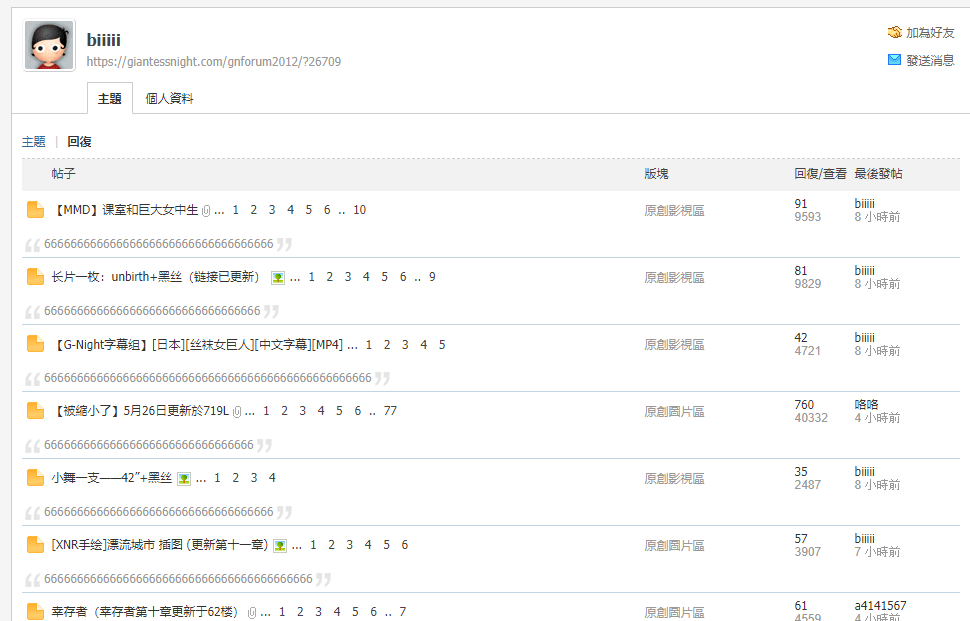

# 水帖檢舉拉

作者：浮世浮尘

TID：25222

<title>1</title> <link href="../Styles/Style.css" type="text/css" rel="stylesheet">

# 1

論壇甚麼時候要開始限制帳號的氾濫呢讓我們繼續看下去
一再一再一再的宣導
都在文裡寫得很清楚了
依然還是有這種死蟲子嘿
立刻斬除永刪帳號可以嗎?
明顯就是分身來洗分的
<ignore_js_op>

**2018-05-29_103037.png** *(30.95 KB, 下載次數: 3)*

[下載附件](forum.php?mod=attachment&aid=NzI2MTd8MGRiMjIyMDB8MTY3NDA2NzEzM3wxODIzMHwyNTIyMg%3D%3D&nothumb=yes)

2018-5-29 10:32 上傳

<title>2</title> <link href="../Styles/Style.css" type="text/css" rel="stylesheet">

# 2

感觉应该来点权限，比如啥刚注册一周不能说话，或者新用户一定要发多少字以上之类的东西。
最近乱水，刷分 还有打广告的都来了
看得难受 <title>3</title> <link href="../Styles/Style.css" type="text/css" rel="stylesheet">

# 3

这水得简直比贴吧还过分 <title>4</title> <link href="../Styles/Style.css" type="text/css" rel="stylesheet">

# 4

最近灌水的越来越多了，应该好好管理一下 <title>5</title> <link href="../Styles/Style.css" type="text/css" rel="stylesheet">

# 5

灌水的 说实话直接封ip好了，或者采用邀请注册的形式 <title>6</title> <link href="../Styles/Style.css" type="text/css" rel="stylesheet">

# 6

老实说,看到这种复读机一样的灌水发言,真的感觉很恶心人,想刷分靠这种手段是在做死.个人也感觉以后看到这样的人,直接封IP吧,只是要辛苦管理员大佬了. <title>7</title> <link href="../Styles/Style.css" type="text/css" rel="stylesheet">

# 7

这种恶意灌水的没什么好说的！封IPOK！但是管理员好像都很忙啊 <title>8</title> <link href="../Styles/Style.css" type="text/css" rel="stylesheet">

# 8

这种回复的还好 像那种开新帖水的简直恶心 <title>9</title> <link href="../Styles/Style.css" type="text/css" rel="stylesheet">

# 9

设了禁访1个月，感谢检举。
此人不在文章区我不太了解，但我也没把握文章区的都有看就是了...... <title>10</title> <link href="../Styles/Style.css" type="text/css" rel="stylesheet">

# 10

*本帖最後由 蜡下翁 於 2018-5-29 20:50 編輯*

6666666666666666666
这种情况禁不绝的，中国大陆经济的快速发展让大量的人脱贫，城市化的快速进行让乡土气息在互联网以新方式扎根。
gn作为一个中文论坛，又作为一个台湾论坛。在现在这种情况下必然会遭受大陆乡土互联网习俗的攻击。
因为gn所反感的水贴方式，在乡土互联网中大家都是争着老铁双击666刷屏的，而且通常情况是大家还很喜欢这样，发帖人不在乎内容只在乎流量，回帖人不在乎有无意义只想表达6666.二者相得益彰，双方都喜闻乐见。这和gn是完全相反的。
而且gn没有开放充值但却有等级限制也和传统的大陆乡土互联网模式格格不入。乡土互联网基本上想获得更多资源就是靠充钱氪金，而gn却没有这样一条道路所以他们才会采取最传统的刷屏法。
我觉得，如果gn想禁的话是绝对禁不完的。这是culture conflict层度的问题。关闭论坛新用户就是断掉新血液的输入，开启门来那这样的问题就不会禁绝。所以我觉得，只能说先麻烦管理员了和台湾朋友们了。管理员准备一下打大约3到5年长期战争的准备。台湾的小伙伴们可以下载一些像快手一样的乡土风情app，去适应一下。
最后.....................奥利给，66666666666.苏喂苏喂苏喂！想你想你想我emmmmmmmmmm........???? ???? ???? ???? ???? ???? ???? ???? ???? ???? ???? ???? ???? ???? ???? ???? ???? ???? ???? ???? ???? ???? ???? ???? ???? ???? ???? ???? ???? ???? ???? ????
<title>11</title> <link href="../Styles/Style.css" type="text/css" rel="stylesheet">

# 11

虽然有些看起来像是在水，但却是作者更新的动力。例如说一句“辛苦了”“做的很棒，支持”作者们也会更有动力，假如能提上一些建议那就更好了。但是对于这用毫无意义的66666666，看起来就毫无感情，进一个帖子往下一拉对着6按了几下，结果发现根本性质就是水帖。而有些甚至单独开个帖子讲些不相关的事情，个人认为这比前者更加过分。虽然这么说，但这种情况却难以避免，林子大了什么鸟都有。 <title>12</title> <link href="../Styles/Style.css" type="text/css" rel="stylesheet">

# 12

我上次看到一个直接表明自己在水的，反手就是一个举报。</ignore_js_op>