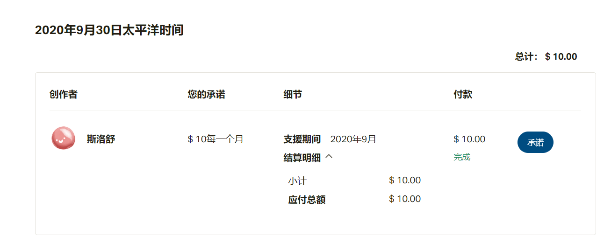

# 求一下Patreon避坑指南

作者：年轻即装逼

TID：29703

<title>1</title> <link href="../Styles/Style.css" type="text/css" rel="stylesheet">

# 1

刚刚绑定好了paypal，打算用来支持一下作者（想看涉图）。发现扣费是从太平洋时间（谷歌机翻）每月的1号开始扣钱的。假如我从月底开始付钱是不是有点亏了啊？刚刚支付成功就到下个月的支付了？此外，还有什么其他地方需要注意的的吗？例如自动续费之类的？
在论坛搜索一圈也没找到什么有效的经验之谈，特此发帖询问一下吧
<title>2</title> <link href="../Styles/Style.css" type="text/css" rel="stylesheet">

# 2

我之前也出现过这个情况，赞助了一个画师 <ignore_js_op>

**A1.png** *(52.28 KB, 下載次數: 0)*

[下載附件](forum.php?mod=attachment&aid=ODU3MDZ8M2Y3Y2M0ODh8MTY3NDA2NjI2NHwxODIzMHwyOTcwMw%3D%3D&nothumb=yes)

2020-10-21 14:10 上傳

第二天就.....
<title>3</title> <link href="../Styles/Style.css" type="text/css" rel="stylesheet">

# 3

是这样的，之前付钱就是这样了，因此不是特别喜爱的话，还是月初就做好准备，不然月初钱就给你划走了</ignore_js_op>