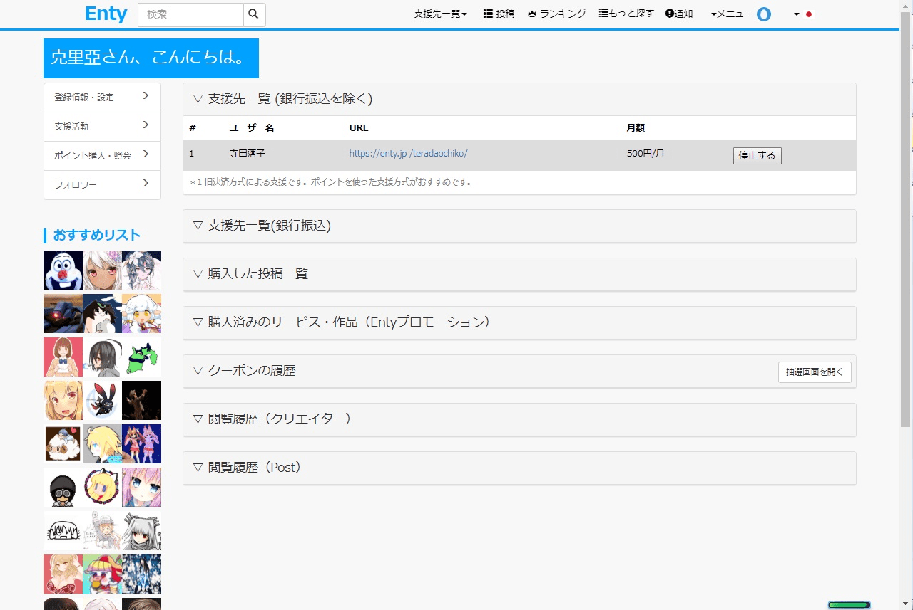
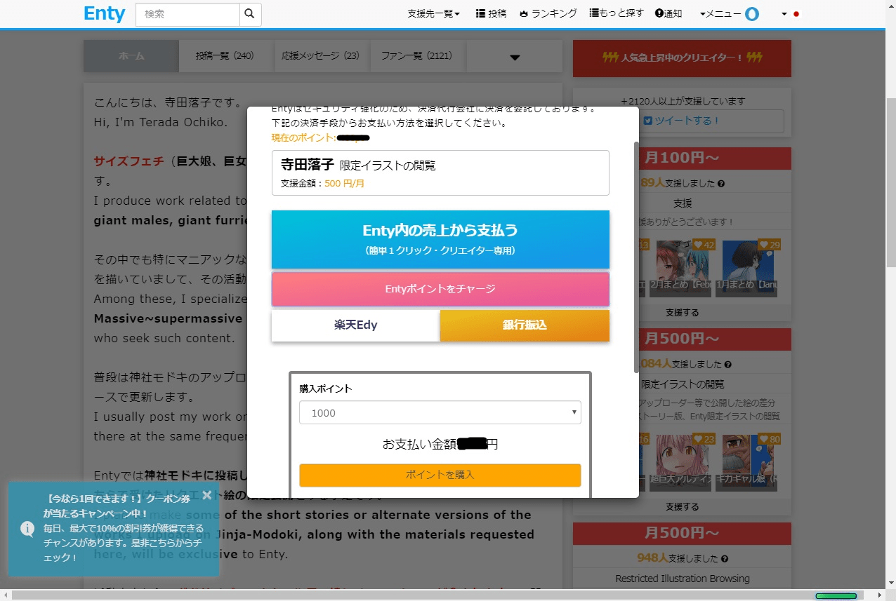

# 求助，enty如何退會

作者：(12345)

TID：27548

<title>1</title> <link href="../Styles/Style.css" type="text/css" rel="stylesheet">

# 1

_(:3」∠)_求論壇大佬問一下，enty如何退會不每月扣錢哇……這網站已經每月自動花我信用卡好幾個月了……
把賬號刪除都不行…… <title>2</title> <link href="../Styles/Style.css" type="text/css" rel="stylesheet">

# 2

官方FQA

關於停止支援，如果聯繫運營者的話，我們會盡快停止支援。（從我的頁面支持列表，它能夠主動支持停機）
從第2個月以後的付款日到10個工作日之前，如果聯繫運營的話，可以在當月退會。
付款之前取消的話，會有一部分無法返還的手續費（不是弊公司的手續費而是信用卡公司的手續費）。
對於當月中變更或者停止支援。根據付款的日期不同，可能會存在無法返還費用的情況。
敬請諒解以上的情況。
而且，問詢時，請務必把點擊頁面右上角的“我的頁面”出現的鏈接和支援的作者的鏈接一併告訴運營者。
另外，最近開始可以方便的停止支援，敬請期待。

实在不行上twitter@他们问问 <title>3</title> <link href="../Styles/Style.css" type="text/css" rel="stylesheet">

# 3

我之前也是怕會一直自動扣不知道怎麼停止或退會
所以不太想用這種沒想到也有人碰到了
這種一直自動扣的感覺很麻煩
如果語言又不通的話就更麻煩了

<title>4</title> <link href="../Styles/Style.css" type="text/css" rel="stylesheet">

# 4

记得好像在哪里能停止赞助的，不过说实话很坑，只要一停止就不能再看赞助限定了，不像patreon是赞助了就可以一个月内有效 <title>5</title> <link href="../Styles/Style.css" type="text/css" rel="stylesheet">

# 5

只要到個人設定.支援活動那裏就能退了
<ignore_js_op>

**1.jpg** *(178.94 KB, 下載次數: 0)*

[下載附件](forum.php?mod=attachment&aid=ODAyMDN8YTlmZTUxMTF8MTY3NDA2NjY1OXwxODIzMHwyNzU0OA%3D%3D&nothumb=yes)

2019-11-6 23:25 上傳

支援enty可以用他的點數儲值(但我還是用卡儲點)
需要買幾個月儲多少的量就好
<ignore_js_op>

**2.jpg** *(226.46 KB, 下載次數: 0)*

[下載附件](forum.php?mod=attachment&aid=ODAyMDR8MDM5M2JlNGZ8MTY3NDA2NjY1OXwxODIzMHwyNzU0OA%3D%3D&nothumb=yes)

2019-11-6 23:26 上傳

中間紅色就是儲點(黑色劃掉是儲的點數跟現有點數)</ignore_js_op></ignore_js_op>