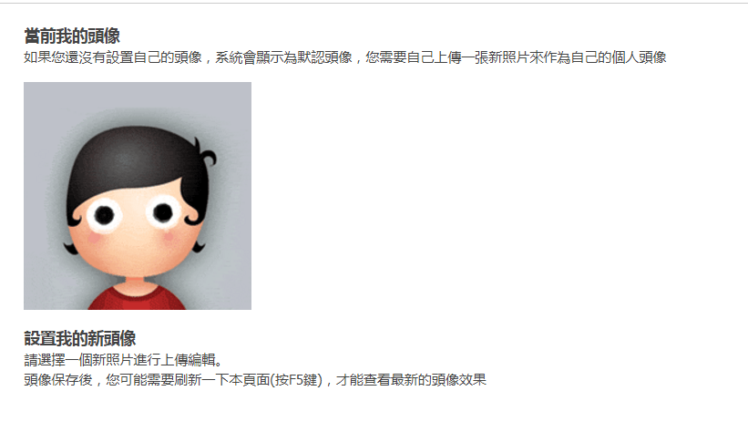

# 求助，为啥修改头像界面没有上传按钮

作者：滑煞人

TID：23506

<title>1</title> <link href="../Styles/Style.css" type="text/css" rel="stylesheet">

# 1

经测试，并不是网络的问题， <title>2</title> <link href="../Styles/Style.css" type="text/css" rel="stylesheet">

# 2

 <ignore_js_op>[EWGIVS@O8P1(_(C@L7HLM98.png](forum.php?mod=attachment&aid=Njg4ODR8MWJmMzA2Nzl8MTY3NDA2NzQxOHwxODIzMHwyMzUwNg%3D%3D&nothumb=yes) *(102.89 KB, 下載次數: 0)*

[下載附件](forum.php?mod=attachment&aid=Njg4ODR8MWJmMzA2Nzl8MTY3NDA2NzQxOHwxODIzMHwyMzUwNg%3D%3D&nothumb=yes)

2017-7-21 20:21 上傳  

</ignore_js_op> <title>3</title> <link href="../Styles/Style.css" type="text/css" rel="stylesheet">

# 3

补一张全界面图，vpn什么的也挂了（台湾啥的都试过） <title>4</title> <link href="../Styles/Style.css" type="text/css" rel="stylesheet">

# 4

 <ignore_js_op>[~V~~J8(G98~P3@OKC]{{2AK.png](forum.php?mod=attachment&aid=Njg4ODV8OWIyYzNmYWZ8MTY3NDA2NzQxOHwxODIzMHwyMzUwNg%3D%3D&nothumb=yes) *(292.92 KB, 下載次數: 0)*

[下載附件](forum.php?mod=attachment&aid=Njg4ODV8OWIyYzNmYWZ8MTY3NDA2NzQxOHwxODIzMHwyMzUwNg%3D%3D&nothumb=yes)

2017-7-21 20:22 上傳  

[![~V~~J8(G98~P3@OKC]{{2AK.png](img/b399b40a0080e3183ea6d753bc52185d.png "~V~~J8(G98~P3@OKC]{{2AK.png")](javascript:;)</ignore_js_op> <title>5</title> <link href="../Styles/Style.css" type="text/css" rel="stylesheet">

# 5

论坛早就不能换头像了，所以没有那个东西，等下一次论坛修复就行了 <title>6</title> <link href="../Styles/Style.css" type="text/css" rel="stylesheet">

# 6

> [das 發表於 2017-7-21 20:24](https://giantessnight.cf/gnforum2012/forum.php?mod=redirect&goto=findpost&pid=340618&ptid=23506)
> 论坛早就不能换头像了，所以没有那个东西，等下一次论坛修复就行了

好吧，虽然很遗憾，但还是谢谢了
<title>7</title> <link href="../Styles/Style.css" type="text/css" rel="stylesheet">

# 7

不用想了，就是没有的，我想换这个头像N年了 <title>8</title> <link href="../Styles/Style.css" type="text/css" rel="stylesheet">

# 8

看了楼上的频论才知道不能换，不过这个头像还好吧也不算太丑 <title>9</title> <link href="../Styles/Style.css" type="text/css" rel="stylesheet">

# 9

这是头像问题的第几贴啦。。 <title>10</title> <link href="../Styles/Style.css" type="text/css" rel="stylesheet">

# 10

头像问题不存在的 <title>11</title> <link href="../Styles/Style.css" type="text/css" rel="stylesheet">

# 11

想换换不了。。。 <title>12</title> <link href="../Styles/Style.css" type="text/css" rel="stylesheet">

# 12

头什么像？不存在的。 <title>13</title> <link href="../Styles/Style.css" type="text/css" rel="stylesheet">

# 13

看了这贴我去看了一下还真是 <title>14</title> <link href="../Styles/Style.css" type="text/css" rel="stylesheet">

# 14

要是能换我早就换了……
忍这个头像很多年了……