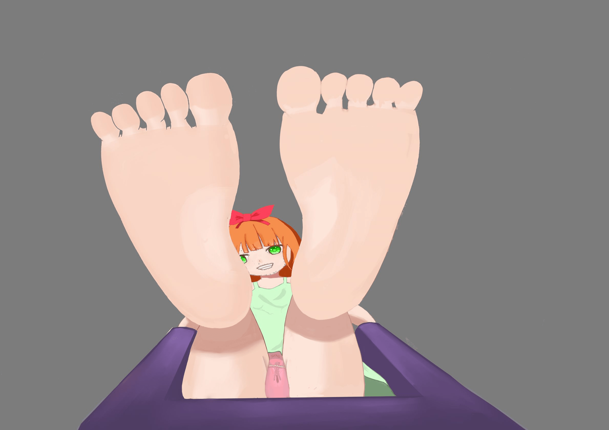
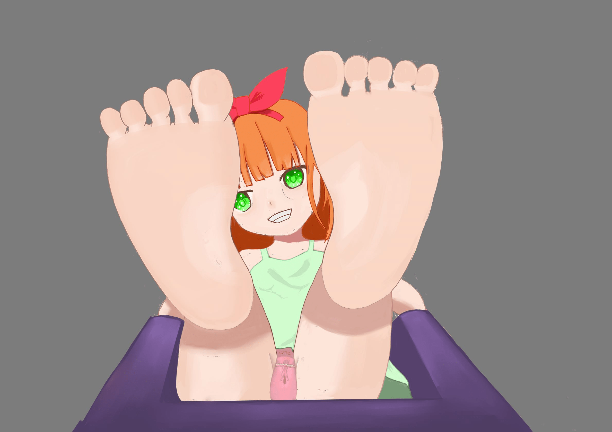
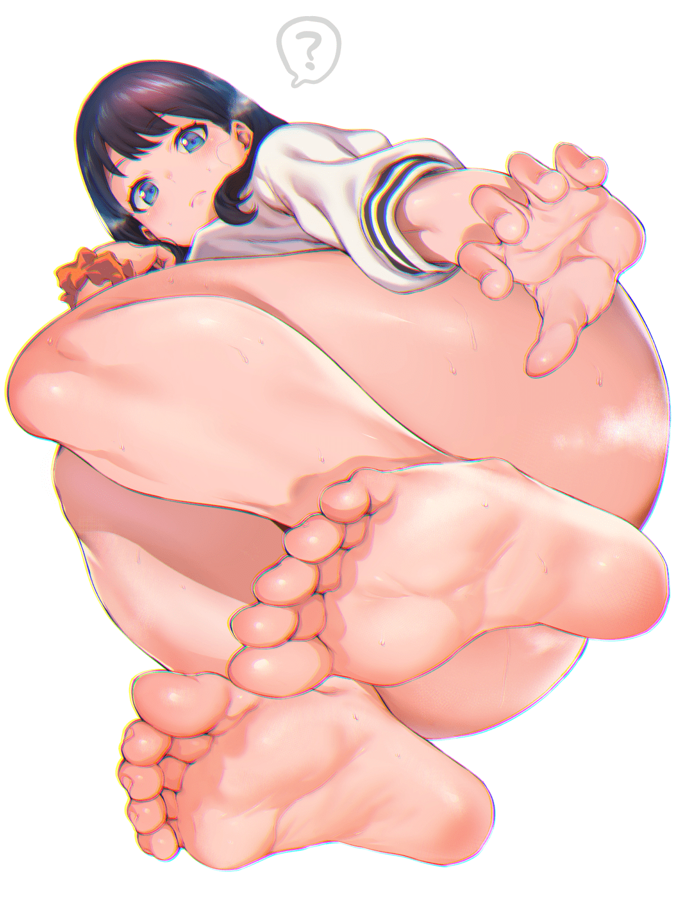
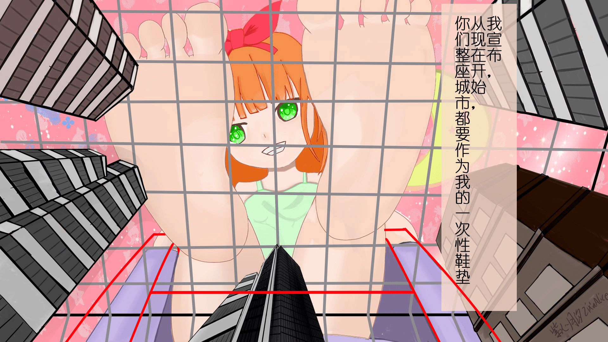

# 求救啊啊啊啊啊啊！绘画相关

作者：琉璃

TID：29538

<title>1</title> <link href="../Styles/Style.css" type="text/css" rel="stylesheet">

# 1

*本帖最後由 琉璃 於 2020-9-25 03:59 編輯*

背景大透视简直要命啊。想画个生活在笼子里城市视角，结果笼子的画法，gts的画法总感觉奇奇怪怪的。到底这种大透视要怎么画啊，有没有大佬画师指点一下，或者大佬们在画大透视的时候有什么参考书籍么？？
<ignore_js_op>

**新建画布2.jpg** *(117.19 KB, 下載次數: 0)*

[下載附件](forum.php?mod=attachment&aid=ODUyMzZ8ZDFhOGQxNWZ8MTY3NDA2NjMwMnwxODIzMHwyOTUzOA%3D%3D&nothumb=yes)

2020-9-25 03:46 上傳

<ignore_js_op>

**新建画布.jpg** *(137.18 KB, 下載次數: 0)*

[下載附件](forum.php?mod=attachment&aid=ODUyMzV8MmE3MGMzYTF8MTY3NDA2NjMwMnwxODIzMHwyOTUzOA%3D%3D&nothumb=yes)

2020-9-25 03:46 上傳

画个两个不同版本的，然而装城市的笼子画法成为了大难题，想要营造小小的城市里面。抬头看脚底的感觉。妹子则是踩在笼子上面。PS：由于删改次数太多，妹子抠出来后大图有点恐怖- -还未细化
原先不太满意的版本：[https:/](https://giantessnight.com/gnforum2012/forum.php?mod=viewthread&tid=29298&extra=)[/giantessnight.com/gnforu ... ad&tid=29298&extra=](https://giantessnight.com/gnforum2012/forum.php?mod=viewthread&tid=29298&extra=)这个版本总感觉椅子要倒了。是不是鱼眼透视会好些呢？
<title>2</title> <link href="../Styles/Style.css" type="text/css" rel="stylesheet">

# 2

一點個人的淺見
下圖可以用來參考仰角，然後..

<ignore_js_op>

**71362920_p0.jpg** *(1.23 MB, 下載次數: 0)*

[下載附件](forum.php?mod=attachment&aid=ODUyMzh8MjUwMDViYmF8MTY3NDA2NjMwMnwxODIzMHwyOTUzOA%3D%3D&nothumb=yes)

2020-9-25 10:43 上傳

如果還沒掌握好，不建議貿然使用魚眼透視

大樓配置很少是輻射狀的，反而是類似一線天那樣的天空空隙比較常見也比較好畫
<title>3</title> <link href="../Styles/Style.css" type="text/css" rel="stylesheet">

# 3

你就大胆画 画错了就用 气势去掩盖.jpg <title>4</title> <link href="../Styles/Style.css" type="text/css" rel="stylesheet">

# 4

我觉得画出那个意境就可以了，重要的是想法 <title>5</title> <link href="../Styles/Style.css" type="text/css" rel="stylesheet">

# 5

楼上几位说的很对，刚开始画透视，没必要太强求自己，按自己的想法大胆画。
你最初画的那张就挺好，你所说的看着椅子要倒了那是因为：
1，角度问题，上半身露出太多导致人物看起来过于往外倾斜。
2.  椅子过小，切记近大远小的原理，处于近处的椅子过小了（看着快装不下人了）
先把椅子调整好，如果不嫌麻烦建议把头部缩小一点。 <title>6</title> <link href="../Styles/Style.css" type="text/css" rel="stylesheet">

# 6

 <ignore_js_op>[144557jiceep4o4zaw2ezl.jpg](forum.php?mod=attachment&aid=ODUyNDF8NTA0ZmFhN2V8MTY3NDA2NjMwMnwxODIzMHwyOTUzOA%3D%3D&nothumb=yes) *(653.55 KB, 下載次數: 0)*

[下載附件](forum.php?mod=attachment&aid=ODUyNDF8NTA0ZmFhN2V8MTY3NDA2NjMwMnwxODIzMHwyOTUzOA%3D%3D&nothumb=yes)

2020-9-25 12:56 上傳  

</ignore_js_op> <title>7</title> <link href="../Styles/Style.css" type="text/css" rel="stylesheet">

# 7

推荐使用3D辅助，对透视太有帮助了 <title>8</title> <link href="../Styles/Style.css" type="text/css" rel="stylesheet">

# 8

唔 ，我又研究了一天发现想画的还就是四个消失点嘞，囧 视平线一个，小萝莉脑袋上一个 左右2个……  算了大胆画下吧 <title>9</title> <link href="../Styles/Style.css" type="text/css" rel="stylesheet">

# 9

建议用pofi无线人偶软件，这个软件好的地方就是透视比较准确，虽然大部分画的时候会夸张透视就是了</ignore_js_op></ignore_js_op></ignore_js_op>