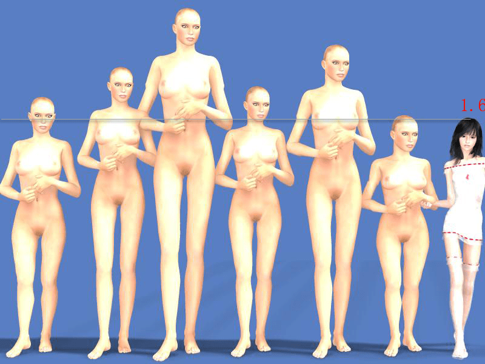

# 求教标高事情

作者：低调小神

TID：18480

<title>1</title> <link href="../Styles/Style.css" type="text/css" rel="stylesheet">

# 1

最近在写文，哪位大神可以把附件中的标高说给我？另外我还想要更多对比，20米以下全要（文章最高设定到20米），我没有概念，可能会因此不准确，也没有代入感。求教求教求教，谢谢大家。 <title>2</title> <link href="../Styles/Style.css" type="text/css" rel="stylesheet">

# 2

 <ignore_js_op>[标高.jpg](forum.php?mod=attachment&aid=NTAxMjJ8YWM2NjA1Nzh8MTY3NDA2ODAwMXwxODIzMHwxODQ4MA%3D%3D&nothumb=yes) *(252.73 KB, 下載次數: 13)*

[下載附件](forum.php?mod=attachment&aid=NTAxMjJ8YWM2NjA1Nzh8MTY3NDA2ODAwMXwxODIzMHwxODQ4MA%3D%3D&nothumb=yes)

2015-1-31 22:42 上傳  

</ignore_js_op> <title>3</title> <link href="../Styles/Style.css" type="text/css" rel="stylesheet">

# 3

[http://www.giantessnight.com/tools/gtscc.htm](http://www.giantessnight.com/tools/gtscc.htm)
身高的概念？用女巨人计算机算下就好了吧 <title>4</title> <link href="../Styles/Style.css" type="text/css" rel="stylesheet">

# 4

**才20米？真是不给力呀，缩小学院都是100米以上的差距** <title>5</title> <link href="../Styles/Style.css" type="text/css" rel="stylesheet">

# 5

同上，个人表示100米以下无爱 <title>6</title> <link href="../Styles/Style.css" type="text/css" rel="stylesheet">

# 6

我觉得40-50米差不多吧。。。