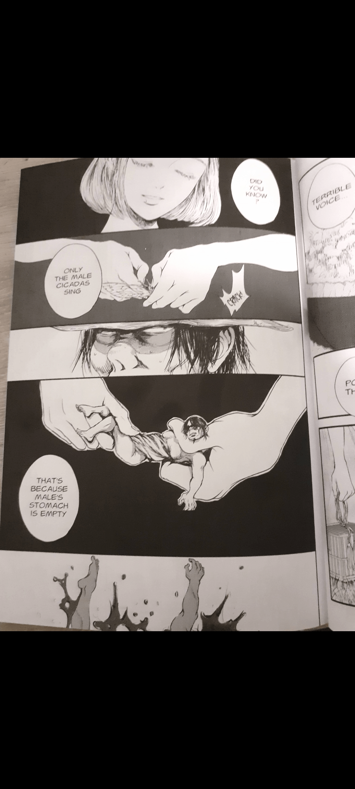

# 求漫画

作者：麻婆豆腐

TID：34344

<title>1</title> <link href="../Styles/Style.css" type="text/css" rel="stylesheet">

# 1

如图，求这漫画的名字，十分感谢
<title>2</title> <link href="../Styles/Style.css" type="text/css" rel="stylesheet">

# 2

 <ignore_js_op>[Screenshot_20221103-022242_Gallery.jpg](forum.php?mod=attachment&aid=MTAwMjExfDRiN2RkYmJmfDE2NzQwNjUyOTZ8MTgyMzB8MzQzNDQ%3D&nothumb=yes) *(721.11 KB, 下載次數: 3)*

[下載附件](forum.php?mod=attachment&aid=MTAwMjExfDRiN2RkYmJmfDE2NzQwNjUyOTZ8MTgyMzB8MzQzNDQ%3D&nothumb=yes)

2022-11-3 02:24 上傳  

</ignore_js_op> <title>3</title> <link href="../Styles/Style.css" type="text/css" rel="stylesheet">

# 3

*本帖最後由 d5q25x62 於 2022-11-3 20:48 編輯*

Tytuł: Pan Cykada
Tytuł oryginalny:Cicada-Man
Autor: Ryuko Iwabuchi
Gatunek: obyczajowy/okruchy życia
Liczba tomów: jednotomówka
Wydawca: Waneko
ISBN: 9788380967830
Data wydania: 2020
[簡介的網址](https://soundrive.pl/pl/article/2871/pan-cykada-piekno-i-smierc-w-poetyckiej-mandze)
這看起來是好幾個故事組成的繪本
跟GTS有關的可能就樓主那頁吧

<title>4</title> <link href="../Styles/Style.css" type="text/css" rel="stylesheet">

# 4

镇楼图这短短的几幅画面，不知道为什么让我联想到了进击的巨人的感觉。。。。 <title>5</title> <link href="../Styles/Style.css" type="text/css" rel="stylesheet">

# 5

这个画风，是不是很像一般的gts漫画了。就觉得，挺有意思..说不定真的不是呢..只是擦边的可能性