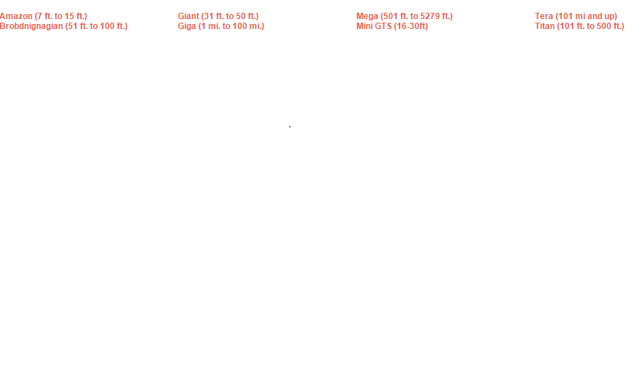

# 求答疑：gts大小判断

作者：hunj

TID：21244

<title>1</title> <link href="../Styles/Style.css" type="text/css" rel="stylesheet">

# 1

刚入论坛不久,想知道别人说的mini,mega,giga具体到米数上都是是什么size
<title>2</title> <link href="../Styles/Style.css" type="text/css" rel="stylesheet">

# 2

mini基本上看個人吧..大小差2~50倍都可以算是
mega比較少人在用，主要都是看到Giga(比較有感!?)
而Giga只要超過1千倍以上的**放大**就可以算了
樓主還少一個micro，縮小超過100倍以上就會看到了(基本上差250就可以了) <title>3</title> <link href="../Styles/Style.css" type="text/css" rel="stylesheet">

# 3

> [Jonas 發表於 2016-6-19 17:01](https://giantessnight.cf/gnforum2012/forum.php?mod=redirect&goto=findpost&pid=296914&ptid=21244)
> mini基本上看個人吧..大小差2~50倍都可以算是
> mega比較少人在用，主要都是看到Giga(比較有感!?)
> 而Giga只要 ...

感谢科普,虽然不太懂括号里是什么意思 <title>4</title> <link href="../Styles/Style.css" type="text/css" rel="stylesheet">

# 4

mini2-50倍太大了吧。。。我觉得一般mini的定义都不会超过1-10倍 就是高达那么高233
不然的话像日本的feet crush的gts大多是是30倍 难道这还是mini么
mega一般就是摩天大楼到腰部左右，到只有鞋跟那么高的倍数
Giga就是一脚一个城市到无限大嗯哼 这种一般都没互动了的
mini到mega之间还有一个阶段不知道叫什么名字。。。 <title>5</title> <link href="../Styles/Style.css" type="text/css" rel="stylesheet">

# 5

这样说更形象化了，也谢谢你的回答 <title>6</title> <link href="../Styles/Style.css" type="text/css" rel="stylesheet">

# 6

这是world上的大小，自己把ft算成英尺就行了，对你看英文有帮助 <title>7</title> <link href="../Styles/Style.css" type="text/css" rel="stylesheet">

# 7

 <ignore_js_op>[无标题.png](forum.php?mod=attachment&aid=NjE4MzV8YWU3ZWI4ZjR8MTY3NDA2ODAwOXwxODIzMHwyMTI0NA%3D%3D&nothumb=yes) *(7.93 KB, 下載次數: 8)*

[下載附件](forum.php?mod=attachment&aid=NjE4MzV8YWU3ZWI4ZjR8MTY3NDA2ODAwOXwxODIzMHwyMTI0NA%3D%3D&nothumb=yes)

2016-6-19 18:20 上傳  

</ignore_js_op> <title>8</title> <link href="../Styles/Style.css" type="text/css" rel="stylesheet">

# 8

很感谢你的图片十分具体竟然有如此众多的描述词,mi是mile的简写么? <title>9</title> <link href="../Styles/Style.css" type="text/css" rel="stylesheet">

# 9

> [Jonas 發表於 2016-6-19 17:01](https://giantessnight.cf/gnforum2012/forum.php?mod=redirect&goto=findpost&pid=296914&ptid=21244)
> mini基本上看個人吧..大小差2~50倍都可以算是
> mega比較少人在用，主要都是看到Giga(比較有感!?)
> 而Giga只要 ...

你没有说tera，而且貌似giga是几公里还是多少，tera则是10000公里甚至以上，地球在眼前像颗乒乓球那么大吧
<title>10</title> <link href="../Styles/Style.css" type="text/css" rel="stylesheet">

# 10

难道10000公里是100mi?[@das](https://giantessnight.cf/gnforum2012/home.php?mod=space&uid=18971) [@hunj](https://giantessnight.cf/gnforum2012/home.php?mod=space&uid=13403) <title>11</title> <link href="../Styles/Style.css" type="text/css" rel="stylesheet">

# 11

感觉又被科普了一番啊 <title>12</title> <link href="../Styles/Style.css" type="text/css" rel="stylesheet">

# 12

> [局促不安 發表於 2016-6-20 07:10](https://giantessnight.cf/gnforum2012/forum.php?mod=redirect&goto=findpost&pid=296996&ptid=21244)
> 难道10000公里是100mi?@das @hunj

什么鬼！？10000公里等于100000000米，这种换算你都不知道？
<title>13</title> <link href="../Styles/Style.css" type="text/css" rel="stylesheet">

# 13

> [局促不安 發表於 2016-6-20 07:10](https://giantessnight.cf/gnforum2012/forum.php?mod=redirect&goto=findpost&pid=296996&ptid=21244)
> 难道10000公里是100mi?@das @hunj

什么鬼！？10000公里等于100000000米，这种换算你都不知道？
<title>14</title> <link href="../Styles/Style.css" type="text/css" rel="stylesheet">

# 14

> [hunj 發表於 2016-6-20 18:07](https://giantessnight.cf/gnforum2012/forum.php?mod=redirect&goto=findpost&pid=297044&ptid=21244)
> 什么鬼！？10000公里等于100000000米，这种换算你都不知道？

误会呀！我是看6#的图片里tera是101mi. and up而阁下说的是10000公里以上,推出1mi.=100公里的
<title>15</title> <link href="../Styles/Style.css" type="text/css" rel="stylesheet">

# 15

只知道mini的话是蚂蚁到玩具大小？？？大概，，， <title>16</title> <link href="../Styles/Style.css" type="text/css" rel="stylesheet">

# 16

> [局促不安 發表於 2016-6-20 07:10](https://giantessnight.cf/gnforum2012/forum.php?mod=redirect&goto=findpost&pid=296996&ptid=21244)
> 难道10000公里是100mi?@das @hunj

10000公里是6213.7119224mi的哦
<title>17</title> <link href="../Styles/Style.css" type="text/css" rel="stylesheet">

# 17

好吧……果然是mile,非常感谢 <title>18</title> <link href="../Styles/Style.css" type="text/css" rel="stylesheet">

# 18

> [局促不安 發表於 2016-6-20 18:33](https://giantessnight.cf/gnforum2012/forum.php?mod=redirect&goto=findpost&pid=297047&ptid=21244)
> 误会呀！我是看6#的图片里tera是101mi. and up而阁下说的是10000公里以上,推出1mi.=100公里的
> ...

其实我也对这些大小什么的不太在行，我也就只知道这些了，你还是问问别的老司机吧
<title>19</title> <link href="../Styles/Style.css" type="text/css" rel="stylesheet">

# 19

> [hunj 發表於 2016-6-21 21:42](https://giantessnight.cf/gnforum2012/forum.php?mod=redirect&goto=findpost&pid=297183&ptid=21244)
> 其实我也对这些大小什么的不太在行，我也就只知道这些了，你还是问问别的老司机吧
> ...

感谢你的回复,问题已经解决了,谢了
<title>20</title> <link href="../Styles/Style.css" type="text/css" rel="stylesheet">

# 20

人们所说的gts和gtss是一回事吗?