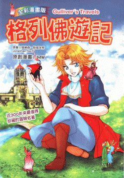

# 求蚱蜢大法眼鉴别

作者：nalu123

TID：11049

<title>1</title> <link href="../Styles/Style.css" type="text/css" rel="stylesheet">

# 1

跪求蚱蜢大鉴别
[http://www.nsbooks.com.tw/descr. ... 7&prod_id=p0064](http://www.nsbooks.com.tw/descr.asp?category_id=64&parent_id=7&prod_id=p0064) <title>2</title> <link href="../Styles/Style.css" type="text/css" rel="stylesheet">

# 2

 <ignore_js_op>[P0064.gif](forum.php?mod=attachment&aid=MjYyMjF8NTEzNGRkMDF8MTY3NDA2ODc0OHwxODIzMHwxMTA0OQ%3D%3D&nothumb=yes) *(235.69 KB, 下載次數: 2)*

[下載附件](forum.php?mod=attachment&aid=MjYyMjF8NTEzNGRkMDF8MTY3NDA2ODc0OHwxODIzMHwxMTA0OQ%3D%3D&nothumb=yes)

2011-9-25 00:06 上傳  

</ignore_js_op> <title>3</title> <link href="../Styles/Style.css" type="text/css" rel="stylesheet">

# 3

谁有机会带小孩去书店的儿童读物区都会大有收获。。。 <title>4</title> <link href="../Styles/Style.css" type="text/css" rel="stylesheet">

# 4

如果的確是放在兒童書架前的話，
沒有去翻的必要了吧？
應該都是說什麼友誼之類的鬼東西的。。。。。。
說來畫風倒是不錯 <title>5</title> <link href="../Styles/Style.css" type="text/css" rel="stylesheet">

# 5

用台中圖書館藏查詢了一下，台中有11本，10本已外借，1本不外借的正好在家附近，不過是放在兒童館內

明天先去書城(金石堂、諾貝爾等等)看看有沒有得翻，如果有書膜就只好看看能不能混進兒童館去翻翻看

[ *本帖最後由 小虎 於 2011-9-25 03:55 編輯* ] <title>6</title> <link href="../Styles/Style.css" type="text/css" rel="stylesheet">

# 6

我們手上有書作為資料，這本適用兒童閱讀的。

故事內容大人國篇的當然也算是。 <title>7</title> <link href="../Styles/Style.css" type="text/css" rel="stylesheet">

# 7

你可以去書店找了翻翻看，裡面沒有書膜。 <title>8</title> <link href="../Styles/Style.css" type="text/css" rel="stylesheet">

# 8

求大人神力显灵，让小人见识下……