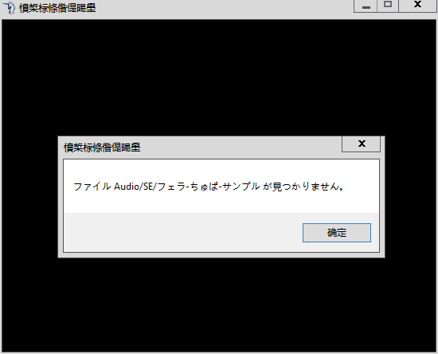

# 求解这个弹窗是怎么回事

作者：萌萌的四姨

TID：23495

<title>1</title> <link href="../Styles/Style.css" type="text/css" rel="stylesheet">

# 1

没存档
心态粉碎
本来折腾了半天好歹能玩了

<title>2</title> <link href="../Styles/Style.css" type="text/css" rel="stylesheet">

# 2

 <ignore_js_op>[360反馈意见截图16240205342361.png](forum.php?mod=attachment&aid=Njg4NTV8ZmNlM2ViZmZ8MTY3NDA2NzQ5MXwxODIzMHwyMzQ5NQ%3D%3D&nothumb=yes) *(12.44 KB, 下載次數: 0)*

[下載附件](forum.php?mod=attachment&aid=Njg4NTV8ZmNlM2ViZmZ8MTY3NDA2NzQ5MXwxODIzMHwyMzQ5NQ%3D%3D&nothumb=yes)

2017-7-19 17:10 上傳  

</ignore_js_op> <title>3</title> <link href="../Styles/Style.css" type="text/css" rel="stylesheet">

# 3

好像是一到cg就这样
可是原文件里也没有啊 <title>4</title> <link href="../Styles/Style.css" type="text/css" rel="stylesheet">

# 4

因为乱码问题导致音频文件不能读取……我猜的（你左上角一堆乱码）估计解压的时候原日语的音乐文件被解压成了乱码……或者是缺少原rpgmaker系统的音效文件 <title>5</title> <link href="../Styles/Style.css" type="text/css" rel="stylesheet">

# 5

> [紫色欧石楠 發表於 2017-7-19 17:21](https://giantessnight.cf/gnforum2012/forum.php?mod=redirect&goto=findpost&pid=340277&ptid=23495)
> 因为乱码问题导致音频文件不能读取……我猜的（你左上角一堆乱码）估计解压的时候原日语的音乐文件被解压成 ...

是SE文件夹里的，应该是缺了音频文件只能重新下了吗....
<title>6</title> <link href="../Styles/Style.css" type="text/css" rel="stylesheet">

# 6

一般来说不会缺的，怕是你没在日文环境下解压，至少你没在日语环境下运行，才会出现错误框都是乱码。
下个好压，解压时候代码页选择日语 <title>7</title> <link href="../Styles/Style.css" type="text/css" rel="stylesheet">

# 7

> [dajiangjiang 發表於 2017-7-19 20:19](https://giantessnight.cf/gnforum2012/forum.php?mod=redirect&goto=findpost&pid=340304&ptid=23495)
> 一般来说不会缺的，怕是你没在日文环境下解压，至少你没在日语环境下运行，才会出现错误框都是乱码。
> 下个 ...

好压上都找过了没有....网上也没有说的
<title>8</title> <link href="../Styles/Style.css" type="text/css" rel="stylesheet">

# 8

> [萌萌的四姨 發表於 2017-7-19 20:51](https://giantessnight.cf/gnforum2012/forum.php?mod=redirect&goto=findpost&pid=340309&ptid=23495)
> 好压上都找过了没有....网上也没有说的

压缩包，右键用好压打开，左击右上角的倒三角，代码页，再不会我就要动手了 <title>9</title> <link href="../Styles/Style.css" type="text/css" rel="stylesheet">

# 9

解压啊。用blan什么的解压工具，可以选择解压代码。至于其他的，我不知道 <title>10</title> <link href="../Styles/Style.css" type="text/css" rel="stylesheet">

# 10

要么丢包了，要么压坏了 <title>11</title> <link href="../Styles/Style.css" type="text/css" rel="stylesheet">

# 11

大概率是中文环境解压出来的文件乱码无法识别出来，系统环境设成日语环境应该就好了