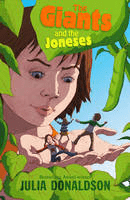

# 求高人解答

作者：nalu123

TID：10993

<title>1</title> <link href="../Styles/Style.css" type="text/css" rel="stylesheet">

# 1

童话一枚，不多说，上图。 <title>2</title> <link href="../Styles/Style.css" type="text/css" rel="stylesheet">

# 2

 <ignore_js_op>[9781405247603.jpg](forum.php?mod=attachment&aid=MjYxMzV8MjQxOWY1YmN8MTY3NDA2ODc1M3wxODIzMHwxMDk5Mw%3D%3D&nothumb=yes) *(9.82 KB, 下載次數: 2)*

[下載附件](forum.php?mod=attachment&aid=MjYxMzV8MjQxOWY1YmN8MTY3NDA2ODc1M3wxODIzMHwxMDk5Mw%3D%3D&nothumb=yes)

2011-9-16 18:28 上傳  

</ignore_js_op> <title>3</title> <link href="../Styles/Style.css" type="text/css" rel="stylesheet">

# 3

= =那封面上都写得多清楚了………… <title>4</title> <link href="../Styles/Style.css" type="text/css" rel="stylesheet">

# 4

指示不清楚。
乃要解答神馬? <title>5</title> <link href="../Styles/Style.css" type="text/css" rel="stylesheet">

# 5

确实
名字的话图上有了
地址我不知道 <title>6</title> <link href="../Styles/Style.css" type="text/css" rel="stylesheet">

# 6

> 原帖由 *wtman* 於 2011-9-16 20:41 發表 
> 指示不清楚。
> 乃要解答神馬?

一时手快，忘了打请求了，谁能找着这故事的在线阅读 <title>7</title> <link href="../Styles/Style.css" type="text/css" rel="stylesheet">

# 7

英文小说……情节貌似很有趣，你可以从网上买来看…… <title>8</title> <link href="../Styles/Style.css" type="text/css" rel="stylesheet">

# 8

查查有没有在线版的。 <title>9</title> <link href="../Styles/Style.css" type="text/css" rel="stylesheet">

# 9

查查有没有在线版的。
————————————
作者还活着，又不是超级畅销……哪位有闲情雅趣买来发到百度文库就有了∼ <title>10</title> <link href="../Styles/Style.css" type="text/css" rel="stylesheet">

# 10

价格:        ¥ 48.80        !~
大概是：Jumbeelia the young giantess loves to hear the old story about the iggly plop who climbed up the bimplestonk to the giants' land of Groil. Then, one day, she throws a bimple over the edge of Groil. Down, down, down Jumbeelia climbs--right down into the land of the iggly plops, where she discovers Colette, Poppy, and Stephen Jones; puts them into her canvas bag; and carries them back to Groil. Soon the children find themselves shut in her dollhouse, with no visible means of escape. With danger surrounding them at every turn, the children must use all their wits to survive and figure out a way to get back home. . . .
還有圖片……
來自卓越亞馬遜~
[http://www.amazon.cn/The-Giants- ... Julia/dp/0312379617](http://www.amazon.cn/The-Giants-and-the-Joneses-Donaldson-Julia/dp/0312379617)