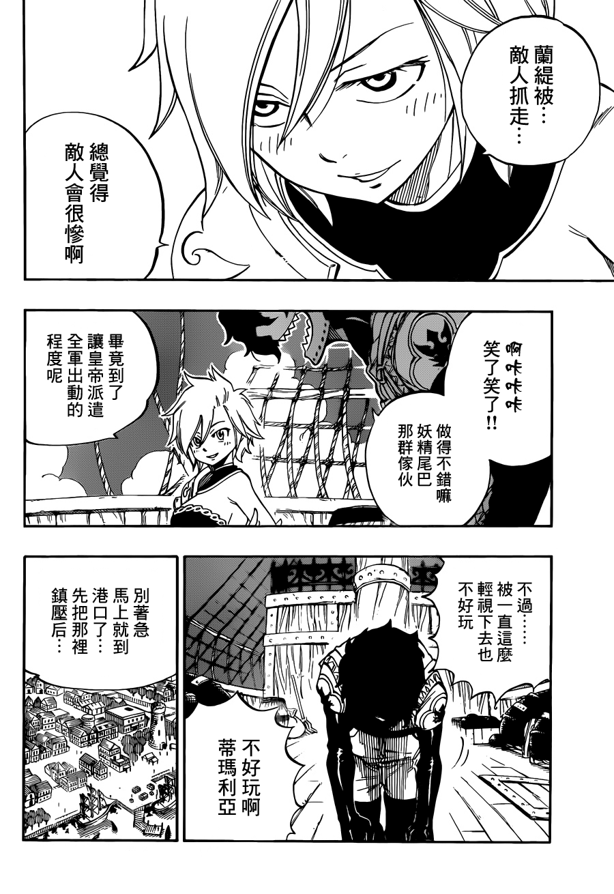
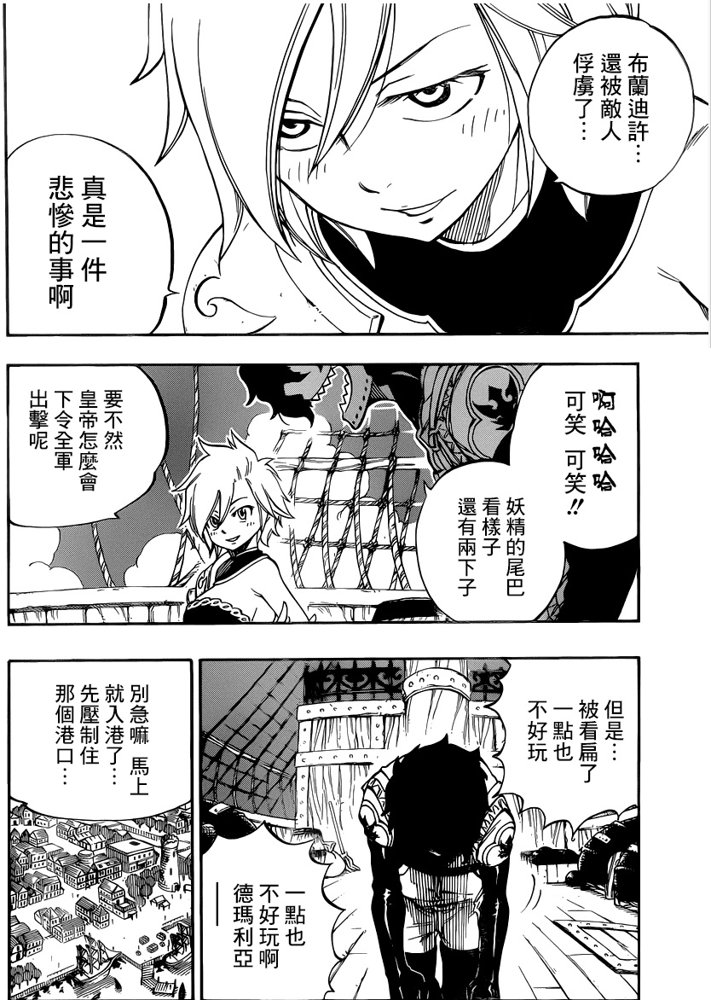

# 没错，又是关于某妖尾的

作者：月月月月食

TID：20089

<title>1</title> <link href="../Styles/Style.css" type="text/css" rel="stylesheet">

# 1

*本帖最後由 月食 於 2015-11-9 18:12 編輯*

<ignore_js_op>

**JOJO_012.png** *(237.13 KB, 下載次數: 2)*

[下載附件](forum.php?mod=attachment&aid=NTU5NTV8MWRjODlkYTh8MTY3NDA2ODgzOHwxODIzMHwyMDA4OQ%3D%3D&nothumb=yes)

2015-11-9 18:05 上傳

如第一格里的所言，把她抓走反而会更惨
结合她的能力，我想诸君大概就已经知道了吧。。

这提莫是真岛要发福利的预告啊！！！

<title>2</title> <link href="../Styles/Style.css" type="text/css" rel="stylesheet">

# 2

我看到被抓走時只覺得「好歹把手腳綁起來啊......」 <title>3</title> <link href="../Styles/Style.css" type="text/css" rel="stylesheet">

# 3

壮哉我大妖尾～ <title>4</title> <link href="../Styles/Style.css" type="text/css" rel="stylesheet">

# 4

*本帖最後由 CEW 於 2015-11-9 23:35 編輯*

翻譯的精準，意思似乎會差很多欸!
<title>5</title> <link href="../Styles/Style.css" type="text/css" rel="stylesheet">

# 5

 <ignore_js_op>[1132.jpg](forum.php?mod=attachment&aid=NTU5NTd8YzExNmFlZDl8MTY3NDA2ODgzOHwxODIzMHwyMDA4OQ%3D%3D&nothumb=yes) *(359.41 KB, 下載次數: 2)*

[下載附件](forum.php?mod=attachment&aid=NTU5NTd8YzExNmFlZDl8MTY3NDA2ODgzOHwxODIzMHwyMDA4OQ%3D%3D&nothumb=yes)

2015-11-9 23:33 上傳  

</ignore_js_op> <title>6</title> <link href="../Styles/Style.css" type="text/css" rel="stylesheet">

# 6

想不到喜欢妖尾的同好这么多！！！ <title>7</title> <link href="../Styles/Style.css" type="text/css" rel="stylesheet">

# 7

等了半天下面的图才发现并没有 <title>8</title> <link href="../Styles/Style.css" type="text/css" rel="stylesheet">

# 8

妖尾好啊……很好啊……福利啊…… <title>9</title> <link href="../Styles/Style.css" type="text/css" rel="stylesheet">

# 9

我也喜欢这种妖尾的   </ignore_js_op>