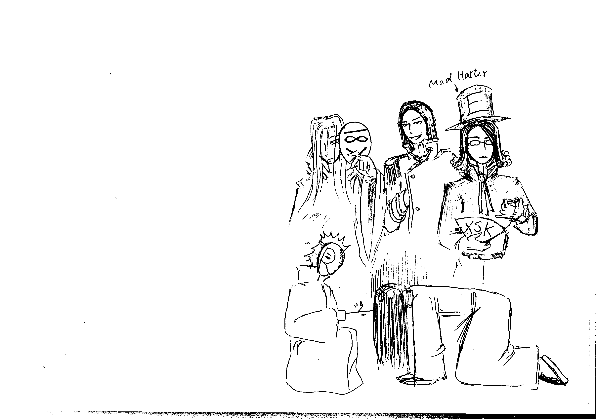

# 流浪人請進，L在等你

作者：RL

TID：8875

<title>1</title> <link href="../Styles/Style.css" type="text/css" rel="stylesheet">

# 1

看到了流浪人的預告，
我，射...不，畫了幾個主角的人設(先放上第一波)
但大、E、某十八叉、某R、某浪漫的桂公子(L)
文章出來(不要爛、不坑掉)要畫插圖再找我XD
以上！
L <title>2</title> <link href="../Styles/Style.css" type="text/css" rel="stylesheet">

# 2

 <ignore_js_op>[GN League.png](forum.php?mod=attachment&aid=MjIyMjN8Njg3OTcxZTl8MTY3NDA2ODgzM3wxODIzMHw4ODc1&nothumb=yes) *(78.12 KB, 下載次數: 1)*

[下載附件](forum.php?mod=attachment&aid=MjIyMjN8Njg3OTcxZTl8MTY3NDA2ODgzM3wxODIzMHw4ODc1&nothumb=yes)

2010-12-14 00:14 上傳  

</ignore_js_op> <title>3</title> <link href="../Styles/Style.css" type="text/css" rel="stylesheet">

# 3

.
我真的覺得人物設定有意呆利的味道，也有這種感覺的人可以請你們舉一下手嗎？ <title>4</title> <link href="../Styles/Style.css" type="text/css" rel="stylesheet">

# 4

代沟是无法逾越的。 <title>5</title> <link href="../Styles/Style.css" type="text/css" rel="stylesheet">

# 5

karas兄伤感了……

R兄和18爷的面具都很有趣的感觉~

话说18爷看起来很像史提尔啊XDD（18爷：哥明明是上条大妈……） <title>6</title> <link href="../Styles/Style.css" type="text/css" rel="stylesheet">

# 6

- -噗。。我看到XSK了。。 <title>7</title> <link href="../Styles/Style.css" type="text/css" rel="stylesheet">

# 7

> 原帖由 *eventually* 於 2010-12-14 10:19 發表 
> karas兄伤感了……
> 
> R兄和18爷的面具都很有趣的感觉~
> 
> 话说18爷看起来很像史提尔啊XDD（18爷：哥明明是上条大妈……）

大妈是我的好机油，你们不要抢 <title>8</title> <link href="../Styles/Style.css" type="text/css" rel="stylesheet">

# 8

我是刺猬头控…………

AC有句名言是什么来着……
”理一个刺猬头，包你一个波澜壮阔的人生！“ <title>9</title> <link href="../Styles/Style.css" type="text/css" rel="stylesheet">

# 9

十八叉子自詡為猥瑣的淫，這個形象太光明正大了 <title>10</title> <link href="../Styles/Style.css" type="text/css" rel="stylesheet">

# 10

刺猬头象征着钻头啊
头顶尖刺，手长钻头，眼发激光，身周皆是浮游炮，这才是突破天际的男子汉啊

我不是瞎说的

头顶尖刺，那是无论多少次碰壁也绝不回头的顽强
手长钻头，那是双手蕴含着打破一切陈腐的力量
眼发激光，那是绝不弯折清澈而犀利的眼神
身周皆是浮游炮，那是毫无失误控制复杂局面的集中力

[ *本帖最後由 sword0198 於 2010-12-14 21:16 編輯* ] <title>11</title> <link href="../Styles/Style.css" type="text/css" rel="stylesheet">

# 11

什么？！突然间我忽然不认识字了？！LZ发了什么我居然一点也看不懂？！
套用标准回帖格式：
LZ的图画的好好啊，加油哦！期待楼主大作的更新！ <title>12</title> <link href="../Styles/Style.css" type="text/css" rel="stylesheet">

# 12

你放在「今夜我們來談天」這一區，預計聖誕節要發的文的預告啊，
我可是很期待呢...
L <title>13</title> <link href="../Styles/Style.css" type="text/css" rel="stylesheet">

# 13

> 原帖由 *ruhtra* 於 2010-12-16 09:58 發表 
> 你放在「今夜我們來談天」這一區，預計聖誕節要發的文的預告啊，
> 我可是很期待呢...
> L

原来如此，LZ不明白“坑爹”的含义啊，之所以没放在原创文章区而是放在谈天区，就是因为“坑爹”的缘故啊
还有LZ貌似没理解我回复的含义，算了，我果然没什么幽默感 <title>14</title> <link href="../Styles/Style.css" type="text/css" rel="stylesheet">

# 14

除了RL
所有人都知道RL被坑了吧
你个天然R <title>15</title> <link href="../Styles/Style.css" type="text/css" rel="stylesheet">

# 15

> 原帖由 *流浪人* 於 2010-12-16 19:51 發表 
> 
> 原来如此，LZ不明白“坑爹”的含义啊，之所以没放在原创文章区而是放在谈天区，就是因为“坑爹”的缘故啊
> 还有LZ貌似没理解我回复的含 ...

不，就是因為知道所以更要給你壓力XD

還有...天然R是啥？=_=？