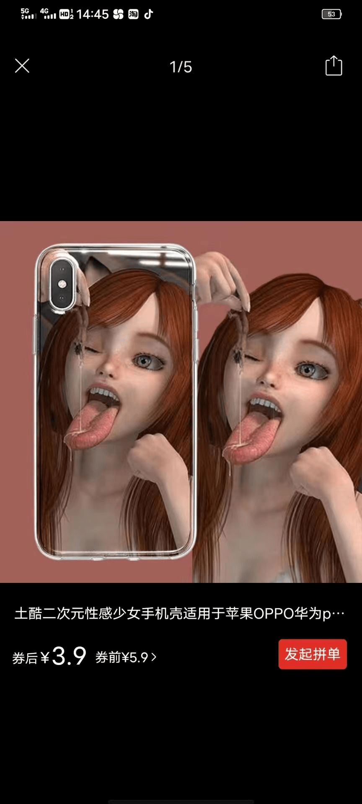

# 淘宝还有这玩意？

作者：MaHL

TID：33178

<title>1</title> <link href="../Styles/Style.css" type="text/css" rel="stylesheet">

# 1

长见识了                                                     
<title>2</title> <link href="../Styles/Style.css" type="text/css" rel="stylesheet">

# 2

 <ignore_js_op>[微信图片_20220430161052.jpg](forum.php?mod=attachment&aid=OTU4ODh8ZmRkYjU1N2R8MTY3NDA2NTU2OXwxODIzMHwzMzE3OA%3D%3D&nothumb=yes) *(110.77 KB, 下載次數: 2)*

[下載附件](forum.php?mod=attachment&aid=OTU4ODh8ZmRkYjU1N2R8MTY3NDA2NTU2OXwxODIzMHwzMzE3OA%3D%3D&nothumb=yes)

2022-4-30 16:13 上傳  

</ignore_js_op> <title>3</title> <link href="../Styles/Style.css" type="text/css" rel="stylesheet">

# 3

这组图好像挺出名的，我居然有在朋友圈的女生那里看见过，还有人用做头像，但应该她们只是单纯的觉得里面的女生可爱。 <title>4</title> <link href="../Styles/Style.css" type="text/css" rel="stylesheet">

# 4

233333,吃小人这个事情，女生说不好都幻想过。