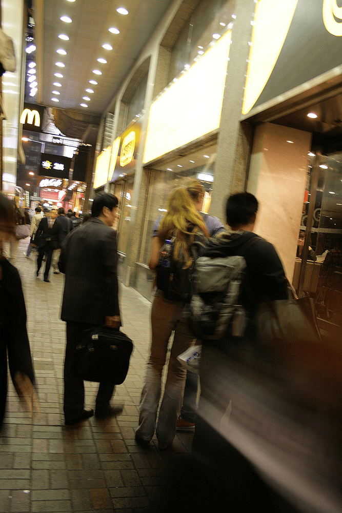

# 港澳之旅高大鬼妹

作者：Prophet

TID：10028

<title>1</title> <link href="../Styles/Style.css" type="text/css" rel="stylesheet">

# 1

這是在香港中環拍的,「係女仔睇鬼佬、男仔睇鬼妹」嘅好地方
我估計此女大約有188CM,是我在世界女排賽除外,見過最高的女人 <title>2</title> <link href="../Styles/Style.css" type="text/css" rel="stylesheet">

# 2

 <ignore_js_op>[117.jpg](forum.php?mod=attachment&aid=MjQzMDJ8ZTdmMDBlNmZ8MTY3NDA3MDE3NnwxODIzMHwxMDAyOA%3D%3D&nothumb=yes) *(200.08 KB, 下載次數: 22)*

[下載附件](forum.php?mod=attachment&aid=MjQzMDJ8ZTdmMDBlNmZ8MTY3NDA3MDE3NnwxODIzMHwxMDAyOA%3D%3D&nothumb=yes)

2011-4-18 22:50 上傳  

</ignore_js_op> <title>3</title> <link href="../Styles/Style.css" type="text/css" rel="stylesheet">

# 3

這兩個身材有些壯碩
第四張是個黑妞
 <title>4</title> <link href="../Styles/Style.css" type="text/css" rel="stylesheet">

# 4

很好很强大，真的很不错，尤其是一楼的两张 <title>5</title> <link href="../Styles/Style.css" type="text/css" rel="stylesheet">

# 5

看到西方女，虽然很有感觉，但比起东方女性，还是有些距离。但一楼的女孩很有东方女孩的可爱气质，大爱！
敢问楼主的“鬼妹”作何解释？

[ *本帖最後由 blm001 於 2011-4-18 23:16 編輯* ] <title>6</title> <link href="../Styles/Style.css" type="text/css" rel="stylesheet">

# 6

> 原帖由 *blm001* 於 2011-4-18 23:14 發表 
> 看到西方女，虽然很有感觉，但比起东方女性，还是有些距离。但一楼的女孩很有东方女孩的可爱气质，大爱！
> 敢问楼主的“鬼妹”作何解释？

一楼的都没看到脸，不知道是不是有的图片只有我没看到。。。

西方女人在港台叫“鬼妹”，在大陆叫“洋妞”。

高大女人跟女巨人还是有一些差别的吧，有专门的高大女人的论坛吗？ <title>7</title> <link href="../Styles/Style.css" type="text/css" rel="stylesheet">

# 7

香港人稱白種人前面加個鬼，
鬼佬--歐美男人,  鬼婆--歐美婦人,鬼妹--歐美女孩
而"架仔"  "架妹 " 是日本男孩女孩,因為日本人問話時,後面加個"ka",就是廣東話"架"這個音 <title>8</title> <link href="../Styles/Style.css" type="text/css" rel="stylesheet">

# 8

“鬼妹”是香港廣東叫的, 台灣人一般不懂,台灣國語一樣叫洋妞,
台語則有稱白種人為 a tuk ga <title>9</title> <link href="../Styles/Style.css" type="text/css" rel="stylesheet">

# 9

感谢楼上两位，听你们这么一说明白了，

[ *本帖最後由 blm001 於 2011-4-19 00:55 編輯* ] <title>10</title> <link href="../Styles/Style.css" type="text/css" rel="stylesheet">

# 10

百度有个高大女人贴吧，这个你应该知道吧 <title>11</title> <link href="../Styles/Style.css" type="text/css" rel="stylesheet">

# 11

話說，現在百度還有個東北小狠吧。。。。吧主的女朋友好像就是19X的高個子？ <title>12</title> <link href="../Styles/Style.css" type="text/css" rel="stylesheet">

# 12

咦？看到19X就不自觉联想到某淫…… <title>13</title> <link href="../Styles/Style.css" type="text/css" rel="stylesheet">

# 13

"鬼妹"/"鬼仔"這個稱呼是帶有貶意的，就像英語中的"Chinaman" (中國佬)用來稱呼中國人一樣，所以還是少用為妙。
這個稱呼的來源，可能跟"羅剎鬼"("羅剎"是清朝時對俄羅斯國的稱呼)和"日本鬼子"同類用詞有關。
這裡也有外國同好在，改用"西女"比較好一點。

[ *本帖最後由 LittleLamb 於 2011-4-20 13:55 編輯* ] <title>14</title> <link href="../Styles/Style.css" type="text/css" rel="stylesheet">

# 14

這幾個人都好高呀!! <title>15</title> <link href="../Styles/Style.css" type="text/css" rel="stylesheet">

# 15

看到19X第一时间没有想到身高而是...