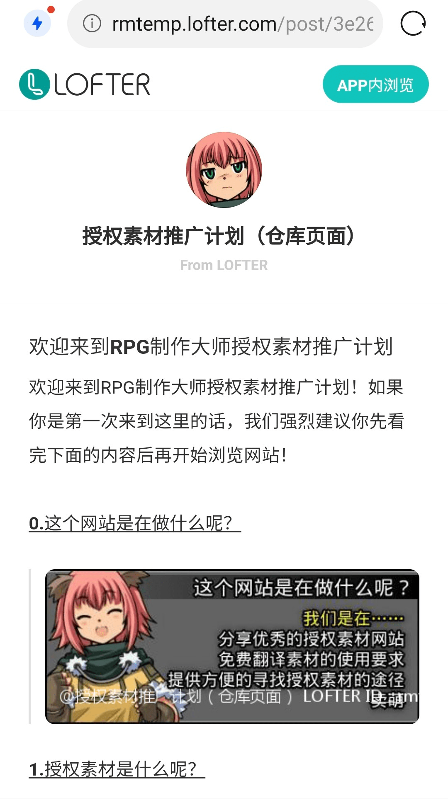

# 游戏区素材授权的一些想法

作者：可莉完蛋啦

TID：33956

<title>1</title> <link href="../Styles/Style.css" type="text/css" rel="stylesheet">

# 1

*本帖最後由 可莉完蛋啦 於 2022-8-17 11:27 編輯*

玩了游戏板块的一些游戏，也和一些国内的游戏创作者聊过，感觉游戏素材授权是个大问题。结合RPGMV论坛的一些做法，发现：
1.有些画师允许在rpgmv游戏制作中使用自己的素材，要求表明来源和非商用。
2.有些画师需要支付一定的报酬。
3.有些画师本身就是国内论坛里的，对游戏创作者使用自己素材也很赞同。
结合rpgmv论坛的做法，我们是否能创建一个gn游戏素材库，来源如下：
1.有些名气不是很大的gts画师，希望能扩大宣传面，能够免费将素材授权于gn的游戏创作中。
2.名气大的画师，比如寺田，是否能尝试支付一定的费用取得授权。
3.国内论坛画师免费授权。
以上素材限定在gn论坛内使用，且用以非盈利目的游戏创作。
只是一些初步的想法，轻喷轻喷。 <title>2</title> <link href="../Styles/Style.css" type="text/css" rel="stylesheet">

# 2

 <ignore_js_op>[Screenshot_20220817_112548~01.jpg](forum.php?mod=attachment&aid=OTg3MDZ8NjRkYjhhNDF8MTY3NDA2NTM5MHwxODIzMHwzMzk1Ng%3D%3D&nothumb=yes) *(247.3 KB, 下載次數: 0)*

[下載附件](forum.php?mod=attachment&aid=OTg3MDZ8NjRkYjhhNDF8MTY3NDA2NTM5MHwxODIzMHwzMzk1Ng%3D%3D&nothumb=yes)

2022-8-17 11:27 上傳  

</ignore_js_op> <title>3</title> <link href="../Styles/Style.css" type="text/css" rel="stylesheet">

# 3

我看一些游戏用了寺田的插画，但就是不知道有无授权。要是能够将寺田的插画授权搞下来，对游戏区是非常好的一件事情。 <title>4</title> <link href="../Styles/Style.css" type="text/css" rel="stylesheet">

# 4

好强啊，这个东西要是可以办成的话一定会很有用啊 <title>5</title> <link href="../Styles/Style.css" type="text/css" rel="stylesheet">

# 5

寺田自己本身就是做rpgmv游戏的，他的插画天然适合游戏的创作。若是能够建立一个授权的游戏素材库，将大大降低游戏创作者的门槛。只要你会一点rpgmv制作，配合寺田的素材图，就能产生一个很棒的小作品。 <title>6</title> <link href="../Styles/Style.css" type="text/css" rel="stylesheet">

# 6

其实用别人的插画来做CG确实会非常的棒 但是做游戏的时候你会发现 你会变成为了迎合CG来做剧情 而不是剧情来做CG

所以为此而言有利有弊 我个人是采用HS2根据剧情需求制作符合场景的CG 这样作者发挥空间也会大一些

不过若是能够获得大量免费可用的CG素材 那当然是再好不过了 <title>7</title> <link href="../Styles/Style.css" type="text/css" rel="stylesheet">

# 7

非盈利性质的游戏，基本可以无视那些规则 <title>8</title> <link href="../Styles/Style.css" type="text/css" rel="stylesheet">

# 8

所以确实需要更完备的规范体系了，但是难度这些..