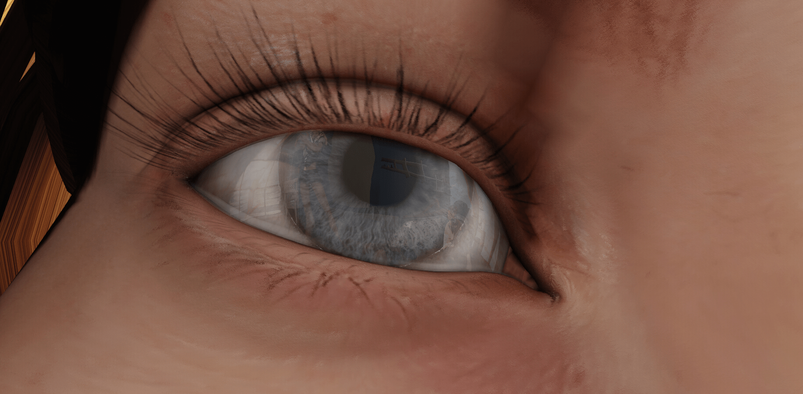

# 游戏的一些制作情况......

作者：Hola

TID：17579

<title>1</title> <link href="../Styles/Style.css" type="text/css" rel="stylesheet">

# 1

做游戏真不容易...做好游戏更不容易...
这20多天里又学到了不少知识，这个月结束之前肯定会再放出一个更新的，当然这应该也是这个游戏的最后一个更新了，几乎一个假期的时间都扔在了这个游戏上。
和最开始的速成版本相比更新的东西实在是太多了...
<ignore_js_op></ignore_js_op> **01.jpg** *(344.64 KB, 下載次數: 1)*

[下載附件](forum.php?mod=attachment&aid=NDU4MDN8NTkwNzlmODB8MTY3NDA2NzQyOHwxODIzMHwxNzU3OQ%3D%3D&nothumb=yes)

2014-8-18 00:53 上傳 
这是研究了一阵子的游戏脚本系统...
<ignore_js_op></ignore_js_op> **02.jpg** *(351.73 KB, 下載次數: 0)*

[下載附件](forum.php?mod=attachment&aid=NDU4MDR8NTI3N2JlMjB8MTY3NDA2NzQyOHwxODIzMHwxNzU3OQ%3D%3D&nothumb=yes)

2014-8-18 00:53 上傳 
所有的人物模型贴图全部重新制作和处理...游戏里有超过300份这种复杂程度的贴图，全都要一个一个修改...
<ignore_js_op></ignore_js_op> **03.jpg** *(939.77 KB, 下載次數: 0)*

[下載附件](forum.php?mod=attachment&aid=NDU4MDV8Yjg5NTM3NWJ8MTY3NDA2NzQyOHwxODIzMHwxNzU3OQ%3D%3D&nothumb=yes)

2014-8-18 00:53 上傳 
大量的工作= =现在游戏中的多边形数量已经达到了恐怖的268万面...
<ignore_js_op></ignore_js_op> **04.jpg** *(186.71 KB, 下載次數: 0)*

[下載附件](forum.php?mod=attachment&aid=NDU4MDZ8ZTJiYTkzNzZ8MTY3NDA2NzQyOHwxODIzMHwxNzU3OQ%3D%3D&nothumb=yes)

2014-8-18 00:53 上傳 
声音系统也是经过细致的设计...这一张图仅仅是胃中的音效...
<ignore_js_op></ignore_js_op> **05.jpg** *(1.57 MB, 下載次數: 1)*

[下載附件](forum.php?mod=attachment&aid=NDU4MDd8YmRkYTkxOTJ8MTY3NDA2NzQyOHwxODIzMHwxNzU3OQ%3D%3D&nothumb=yes)

2014-8-18 01:04 上傳 
贴图质量的变化...用到了很多引擎技术..比如这张注意舌头上的Bump Offset的效果，这个在很多大型游戏中都用到了这种技术
<ignore_js_op></ignore_js_op> **06.jpg** *(844.15 KB, 下載次數: 1)*

[下載附件](forum.php?mod=attachment&aid=NDU4MDh8NTlhZDgzOGR8MTY3NDA2NzQyOHwxODIzMHwxNzU3OQ%3D%3D&nothumb=yes)

2014-8-18 01:04 上傳 
当然还加入了一点动态的流体，不过这个太耗资源，所以并没加入太多..
<ignore_js_op></ignore_js_op> **07.jpg** *(1.37 MB, 下載次數: 0)*

[下載附件](forum.php?mod=attachment&aid=NDU4MDl8Y2RiNDMxMDh8MTY3NDA2NzQyOHwxODIzMHwxNzU3OQ%3D%3D&nothumb=yes)

2014-8-18 01:04 上傳 
加入了Detail Map效果的皮肤纹理
<ignore_js_op></ignore_js_op> **08.jpg** *(1.55 MB, 下載次數: 0)*

[下載附件](forum.php?mod=attachment&aid=NDU4MTB8NTA5OTc1YmZ8MTY3NDA2NzQyOHwxODIzMHwxNzU3OQ%3D%3D&nothumb=yes)

2014-8-18 01:04 上傳 
还使用了反射贴图...另外在游戏里制作反射真的很困难的说...UDK确实可以做到实时反射，不过用了实施反射后直接掉了10多帧，所以换成了贴图反射...
就放这些预告吧= =另外这里面的每个人都有**完整的**体内模型，包括消化系统和你懂得- -到时候你们还是自己探索吧
现在的质量快达到商业级别了...不过我还是决定做成Free to Play的...
另外又在贴吧见到了游戏的转载，而且下面还有一堆人问该怎么玩...我还是建议不要这么干...这个游戏我只发在GN和City，当然我也希望大家都来分享，但是转载请不要直接转下载地址，一定要附上原帖的链接，GN或者City的都无所谓，算是转载的一些基本道德吧...
因为这回加入了真正的18+内容，倒是也担心会被查水表呢- -
不管怎样，现在这个应该是GTS圈子里真实程度最高的游戏了吧...只是我还是没有解决掉动画系统，所以直接放弃了...

还有一件事....这游戏到底起啥名啊？
<title>2</title> <link href="../Styles/Style.css" type="text/css" rel="stylesheet">

# 2

*本帖最後由 ssn21 於 2014-8-18 01:51 編輯*

“完整体内模型” “贴图反射”= =+这话我可不能当没听见
期待新的皮肤纹理效果

另外，新的游戏脚本 268万面 全新人物模型 这么快搞定还真是谜一样的速度
感谢您所付出的时间与精力

真希望这游戏能让我电脑跑不动= =+

<title>3</title> <link href="../Styles/Style.css" type="text/css" rel="stylesheet">

# 3

> [ssn21 發表於 2014-8-18 01:39](https://giantessnight.cf/gnforum2012/forum.php?mod=redirect&goto=findpost&pid=232077&ptid=17579)
> 完整体内模型= =+这话我可不能当没听见
> 
> 新的游戏脚本 268万面 全新人物模型 这么快搞定还真是谜一样的速度 ...

其实场景还是没换的了...每个人的位置还是差不多，这回更新就是做的更加精细还有...更加精细...
不过让电脑跑不动这一点真是太容易了= =我只要把那些反射物体全都换成实时反射，再大幅度提高光照的质量还有细节显示的距离，估计上核弹都够呛了...
<title>4</title> <link href="../Styles/Style.css" type="text/css" rel="stylesheet">

# 4

遊戲名稱：老子來自GN <title>5</title> <link href="../Styles/Style.css" type="text/css" rel="stylesheet">

# 5

假期就要结束了呢 楼主加油
我大概九月份交完作业就轻松了 到时候要跟楼主学习一下喽 <title>6</title> <link href="../Styles/Style.css" type="text/css" rel="stylesheet">

# 6

只会用 RPG Maker 的渣渣膜拜一下。

在高三开学之前，我就努力地期待这一个更新咯 <title>7</title> <link href="../Styles/Style.css" type="text/css" rel="stylesheet">

# 7

 膜拜大神，跪舔大神啊~~~！！期待早点出来 <title>8</title> <link href="../Styles/Style.css" type="text/css" rel="stylesheet">

# 8

非常敬佩你的投入和对作品精益求精的追求！

我想问一下，如果把这类独立MAP或者类似的3D小游戏，作为商业作品销售，是否侵犯引擎的版权？
如果没有版权问题，我和欧美日本有现成的商业化平台，可以让你的付出得到足够的回报。

另外，我觉得你这个游戏在某些方面真的是做到了登峰造极，短期内不会有人超越的存在了！
不知道您今后还有多少时间和精力的投入，期待你未来的计划，如果有什么想法和需要帮忙的，尽管在这里告诉大家。 <title>9</title> <link href="../Styles/Style.css" type="text/css" rel="stylesheet">

# 9

> [xnr 發表於 2014-8-18 12:06](https://giantessnight.cf/gnforum2012/forum.php?mod=redirect&goto=findpost&pid=232099&ptid=17579)
> 非常敬佩你的投入和对作品精益求精的追求！
> 
> 我想问一下，如果把这类独立MAP或者类似的3D小游戏，作为商业 ...

版权方面，Epic还算是比较便宜的，用UDK制作免费游戏的话是不收取任何授权费的，制作商业游戏需要99.99美元的授权费，当然前提是游戏的总收入低于5000美元，超过5000美元，就要向Epic支付超过5000美金部分的25%作为授权费用，因为启动时几乎是零成本，所以吸引了很多小型游戏开发商和独立游戏制作人...

至于未来，那是有无限种可能的...比如虚幻4现在就提供直接对Oculus Rift的支持，再加上电影CG般逼真的渲染效果，只要肯下精力一定能得到更加惊人的效果...以后要是有精力，我应该会在去研究虚幻4的吧...

爱好应该最好的动力了，未来是无限的，不过目前的时间和精力还是有限的，毕竟- -还得上学啊

之前听了你的建议把游戏发到了City上，那边确实提供了一些帮助，比如帮忙找模型的和帮忙找音效的等等...不过那边基本都是搞U3D开发的，所以程序方面还是帮不上忙了...人物动画系统对于任何3D软件来说都是最复杂的那个部分了，这方面还得慢慢研究..而且要研究很久

有些东西起步很容易，但是做精做好就很困难，现在真的很佩服像Rockstar Games或者2K那样的开发商，那种开发游戏的态度
<title>10</title> <link href="../Styles/Style.css" type="text/css" rel="stylesheet">

# 10

大概什么时候会发出链接呢好期待啊，第一部作品玩了以后觉得很不错。 <title>11</title> <link href="../Styles/Style.css" type="text/css" rel="stylesheet">

# 11

随便问问，人物会动嘛 <title>12</title> <link href="../Styles/Style.css" type="text/css" rel="stylesheet">

# 12

> [1厘米小人 發表於 2014-8-18 18:58](https://giantessnight.cf/gnforum2012/forum.php?mod=redirect&goto=findpost&pid=232135&ptid=17579)
> 随便问问，人物会动嘛

仔细爬文吧，楼主反复强调很多遍了。。。。
<title>13</title> <link href="../Styles/Style.css" type="text/css" rel="stylesheet">

# 13

> [wxy112300 發表於 2014-8-18 15:03](https://giantessnight.cf/gnforum2012/forum.php?mod=redirect&goto=findpost&pid=232111&ptid=17579)
> 版权方面，Epic还算是比较便宜的，用UDK制作免费游戏的话是不收取任何授权费的，制作商业游戏需要99.99美 ...

看来你是吃定虚幻的引擎了，有没有考虑为了追加动作和互动效果，转战U3D？这方面能帮你的人更多。另外你追求极致的真实感是极好的，相信用虚幻4确实能达成这一目标。

但这样就不能走日系画风的了，如果你用U3D配合MMD的模型+动画，凭借你的技术，应该很容易做出高质量的GTS游戏。
在日本GTS圈内，我也能找到不少人才来帮助你，而且若走商业化路线，销售平台也有现成的。

换句话说，如果能顺利搭成一套游戏系统，剩下的就是场景、人物模型、互动内容的替换和补充了，应该能进入高产的快车道了吧？
如果能让你有额外的收入那就更好了，所以希望了解你未来的发展计划。

顺便问一下，等到虚幻4引擎的上手，时间上来看大概还要多久？
再次对你的匠心和深入研究的精神表示敬佩！
<title>14</title> <link href="../Styles/Style.css" type="text/css" rel="stylesheet">

# 14

> [xnr 發表於 2014-8-18 19:12](https://giantessnight.cf/gnforum2012/forum.php?mod=redirect&goto=findpost&pid=232139&ptid=17579)
> 看来你是吃定虚幻的引擎了，有没有考虑为了追加动作和互动效果，转战U3D？这方面能帮你的人更多。另外你 ...

U3D倒是真的没有太考虑过...以前尝试过一下，首先是不太喜欢那种画面渲染的效果，我个人更喜欢偏真实些的，U3D倒是更适合搞卡通；其次U3D太偏重程序了，Javascript和C#语言是确实不懂，目前掌握的就是一些基础的C和C++...就像我之前说过的，我不是一个程序员，现在给自己的定位是艺术方向的...影视后期软件我也比较擅长，比如那些Media Impact的特效视频，还有包括K姐的那些特效视频我其实都能独立合成出来，只是没演员= =（有演员也不好意思提出拍这种东西啊）
好吧，回到游戏上。UDK当初只是为了应付作业开始研究的，之前想要研究的是CryEngine3引擎，研究了一阵后来发现这个引擎在发布打包游戏这里实在太坑爹，就转战了虚幻，结果发现这个更容易上手，就当做业余爱好在继续研究了，从刚接触UDK到现在也有差不多3个月的时间，现在的这个游戏也是当做自己的练手作品了。

动画和互动这个也研究了一阵，做了一个小测试，成功导入了自己重新搞的人物的一部分绑定了骨骼的模型，结果遇到了更麻烦的问题，就是无论怎么修改也无法实现精确到每个面的碰撞检测，一般游戏无所谓，但是对于这种游戏来说那对效果的影响可是毁灭性的...（或者说是完美主义者的强迫症犯了...）尝试了几天全部失败了，所以最后决定在这个游戏里放弃动画效果，专心把静止场景做的更加出色。如果动画和碰撞检测都解决了，互动说白了就是事件触发器和动画系统间的互动，当一个事件被触发后程序再从动作库里加载相应的动作文件，基础的问题解决，做到互动其实并不是那么的困难了。

商业化的问题么...其实也暂时也没怎么考虑，但如果做出的东西质量真的过关了，有XNR大的支持商业化应该也不是难事...如果加入了动画系统，这种大型游戏的开发所耗费的时间和精力都是难以想象的...还有只是总觉得这种东西，不太适合也不好意思拿到台面上...这种爱好一直在秘密的隐藏着...也从没有人知道...

至于虚幻4的问题么...确实功能强大，问题是目前Epic没有对引擎做一丁点优化，做出的游戏基本没法玩，而且- -自己的电脑都跑不动，连开发机都没法跑那这游戏也是比较坑了...当初Epic承诺在6个月后推出优化版的引擎，也就是下个月了...关于虚幻4现在还在观望阶段...不过不出意外的话明年应该会开始研究的...
<title>15</title> <link href="../Styles/Style.css" type="text/css" rel="stylesheet">

# 15

*本帖最後由 xnr 於 2014-8-19 20:00 編輯*

> [wxy112300 發表於 2014-8-19 00:32](https://giantessnight.cf/gnforum2012/forum.php?mod=redirect&goto=findpost&pid=232190&ptid=17579)
> U3D倒是真的没有太考虑过...以前尝试过一下，首先是不太喜欢那种画面渲染的效果，我个人更喜欢偏真实些的 ...

如果你能跟CITY上的人才分工合作的话，或许他们会有一些办法解决你的问题。

另外，如果做出静态的场景切换，是否有难度？就是类似GAL那样的，没有动画，都是一幕一幕不同的静态动作。
那这样是否就相当于加载新地图了？如果可以的话，我想这样的游戏性也是足够的。

至于商业化，真的不必担心，又不是在国内销售，国外成人商品太多太多，我们这么小众不会引起外界注意的。

虚幻4的话，估计你做出来了我们也玩不起。。。如果他们能在动画系统上有强大支持的话，我愿意换新电脑玩你的游戏。
<title>16</title> <link href="../Styles/Style.css" type="text/css" rel="stylesheet">

# 16

> [xnr 發表於 2014-8-19 19:58](https://giantessnight.cf/gnforum2012/forum.php?mod=redirect&goto=findpost&pid=232281&ptid=17579)
> 如果你能跟CITY上的人才分工合作的话，或许他们会有一些办法解决你的问题。
> 
> 另外，如果做出静态的场景切 ...

静态场景切换并不难...不过这么做就有些蛋疼了...把3D游戏做成了GAL Game...太浪费了...
动画方面以后会慢慢研究的，不过这个游戏在学校就不会有什么进度了，再更新游戏的话最早也是要寒假了，如果动画问题能解决不如就重新制作了，所以这回应该就是这个游戏的最后一个版本...
不管怎样..多谢支持了~

<title>17</title> <link href="../Styles/Style.css" type="text/css" rel="stylesheet">

# 17

又看到了大神的游戏制作进度，非常心动啊，虽然第二版更新因为本人机器配置问题一直未能玩到，但是对于大神制作的这个游戏还是非常期待的，这是我玩过的最逼真最吸引我的gts游戏了，真的期待lz能够继续做下去，放出链接后一定会下载珍藏，等电脑升级后要好好爽爽，哈哈，游戏名字么，A Weekend With Big Beautyfal Girl ? A Tiny Man's Adventure ? <title>18</title> <link href="../Styles/Style.css" type="text/css" rel="stylesheet">

# 18

> [fuyuc 發表於 2014-10-5 23:27](https://giantessnight.cf/gnforum2012/forum.php?mod=redirect&goto=findpost&pid=236059&ptid=17579)
> 又看到了大神的游戏制作进度，非常心动啊，虽然第二版更新因为本人机器配置问题一直未能玩到，但是对于大神 ...

更新都出了好几个月了，您穿越时间线了。
<title>19</title> <link href="../Styles/Style.css" type="text/css" rel="stylesheet">

# 19

來朝聖
大大真是佛心來著
作品非常優秀而且願意分享給大家 <title>20</title> <link href="../Styles/Style.css" type="text/css" rel="stylesheet">

# 20

> [xnr 發表於 2014-10-6 00:03](https://giantessnight.cf/gnforum2012/forum.php?mod=redirect&goto=findpost&pid=236065&ptid=17579)
> 更新都出了好几个月了，您穿越时间线了。

oh……俺确实没仔细看帖子时间，以为lz又要继续出新的版本了呢，这个游戏实在是太诱人了，呵呵，俺的那个回帖大神们自动屏蔽吧：） <title>21</title> <link href="../Styles/Style.css" type="text/css" rel="stylesheet">

# 21

话说无论如何都期待第三次更新呢。。。什么今年明年无所谓啊，求更。 <title>22</title> <link href="../Styles/Style.css" type="text/css" rel="stylesheet">

# 22

楼主加油，天气最近转凉了，要注意适当休息，工作量虽大，但身体才是最重要的
<title>23</title> <link href="../Styles/Style.css" type="text/css" rel="stylesheet">

# 23

我坚持每天来论坛看看~终于我遇见了神！ <title>24</title> <link href="../Styles/Style.css" type="text/css" rel="stylesheet">

# 24

膜拜大神，跪舔大神啊~~~！！期待早点出来 <title>25</title> <link href="../Styles/Style.css" type="text/css" rel="stylesheet">

# 25

啊，技术宅……膜拜之Orz <title>26</title> <link href="../Styles/Style.css" type="text/css" rel="stylesheet">

# 26

佩服lz的毅力和执着。。
继续努力！ <title>27</title> <link href="../Styles/Style.css" type="text/css" rel="stylesheet">

# 27

膜拜大神！表示只学过一点3d Max。 <title>28</title> <link href="../Styles/Style.css" type="text/css" rel="stylesheet">

# 28

同膜拜，另外最近准备开始学习游戏制作相关的技术，LZ可否指点一二？ <title>29</title> <link href="../Styles/Style.css" type="text/css" rel="stylesheet">

# 29

技术宅拯救世界了，膜拜ing <title>30</title> <link href="../Styles/Style.css" type="text/css" rel="stylesheet">

# 30

等着下一次更新 啊 几年了 <title>31</title> <link href="../Styles/Style.css" type="text/css" rel="stylesheet">

# 31

看上去很好，什么时候会发出链接呢好期待啊 <title>32</title> <link href="../Styles/Style.css" type="text/css" rel="stylesheet">

# 32

仰望大佬_(:зゝ∠)_       <title>33</title> <link href="../Styles/Style.css" type="text/css" rel="stylesheet">

# 33

看图就知道大小应该要用g来了计算了吧，膜拜大佬 <title>34</title> <link href="../Styles/Style.css" type="text/css" rel="stylesheet">

# 34

看起来很厉害的样子，坐等大佬发链接 <title>35</title> <link href="../Styles/Style.css" type="text/css" rel="stylesheet">

# 35

楼主你真棒！（字数补丁~~~~~~~~~~~~ <title>36</title> <link href="../Styles/Style.css" type="text/css" rel="stylesheet">

# 36

楼主真是好人哦，好期待啊