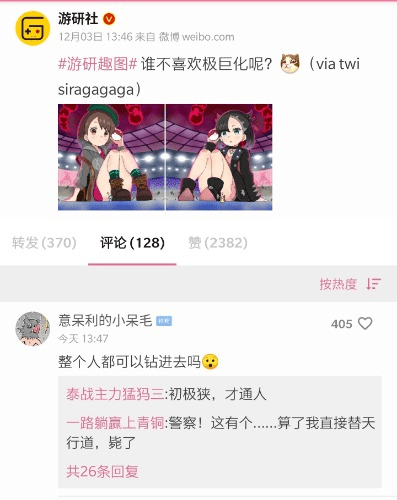

# 游研社今天的一个微博

作者：74Hisa

TID：27691

<title>1</title> <link href="../Styles/Style.css" type="text/css" rel="stylesheet">

# 1

转自推特 しらが (@siragagaga)： https://twitter.com/siragagaga?s=09 <title>2</title> <link href="../Styles/Style.css" type="text/css" rel="stylesheet">

# 2

 <ignore_js_op>[Screenshot_20191203-201146.jpg](forum.php?mod=attachment&aid=ODA0NjF8ZjRmMTVlNzl8MTY3NDA2NjY1M3wxODIzMHwyNzY5MQ%3D%3D&nothumb=yes) *(40.99 KB, 下載次數: 19)*

[下載附件](forum.php?mod=attachment&aid=ODA0NjF8ZjRmMTVlNzl8MTY3NDA2NjY1M3wxODIzMHwyNzY5MQ%3D%3D&nothumb=yes)

2019-12-3 20:12 上傳  

</ignore_js_op> <title>3</title> <link href="../Styles/Style.css" type="text/css" rel="stylesheet">

# 3

谁不喜欢极巨化呢╮(￣▽￣)╭ <title>4</title> <link href="../Styles/Style.css" type="text/css" rel="stylesheet">

# 4

我一直在期待著會長秘書極巨化的那一刻
不過這種夢想也隨著破關而破滅了... <title>5</title> <link href="../Styles/Style.css" type="text/css" rel="stylesheet">

# 5

[https://www.ptt.cc/bbs/C_Chat/M.1575436128.A.E61.html](https://www.ptt.cc/bbs/C_Chat/M.1575436128.A.E61.html)
Ptt也有了 相較IGN評分出來的時候真是有夠和平 <title>6</title> <link href="../Styles/Style.css" type="text/css" rel="stylesheet">

# 6

奉上大圖
貌似有不少人因極巨化的設定而開啟了GTS相關的腦洞呢
希望能藉此多拉一些人入圈