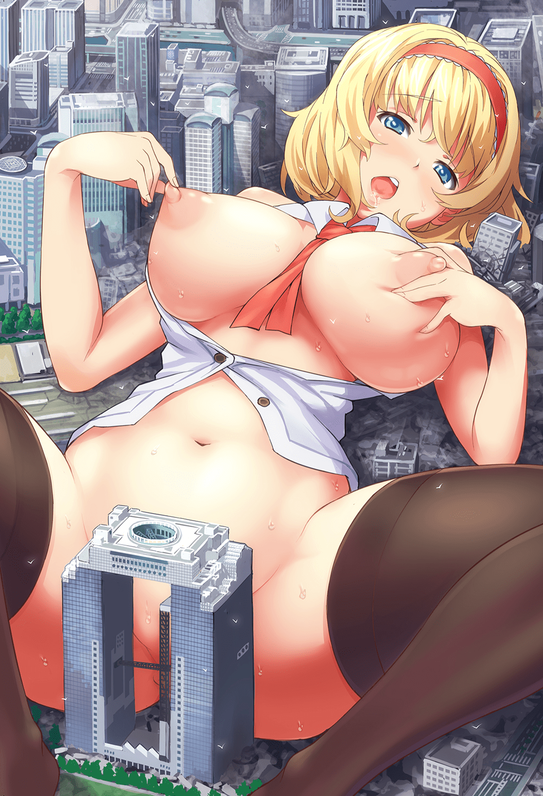

# 溫柔系的定義與可能性？

作者：琉璃

TID：22005

<title>1</title> <link href="../Styles/Style.css" type="text/css" rel="stylesheet">

# 1

小弟從入坑到現在gts派系一直都是溫柔系
然而自己也不得不承認.在看圖看文玩遊戲時.會有強烈感覺(你懂得)幾乎都是殘酷系
我想這是沒辦法的.畢竟gts本身就包含了女方對男方的統治.加上身為巨人造成破壞那幾乎是無法避免的
(尤其體型破千破萬的.光出現就幾乎是毀滅城市等級).
其中以無意識的破壞最佳.那種明明不是故意但可以如同呼吸般自然的毀滅小人世界.
以及發現後產生的強烈罪惡感及心裡描寫.這些都是gts中不可或缺的醍醐味

然而一旦殺人後.那gts還有轉為溫柔的可能嗎?我覺得是沒辦法.因為一殺害基本就很難扳回了
除非劇情用欺騙或迂迴的方式處理.不然光小人方的抗議大概就會逼死女巨人想溫柔對待的意願了
所以溫柔系gts如果不能殺害.那樣處理起來好像也只有用性愛這條路帶來劇情的高潮了?
(1mm生存指南的相處模式很讚.當然裡面多少也有無意識殺害路人的橋段

先換個話題好了.所謂溫柔系的定義到底在哪裡.還有哪些狀況屬於溫柔系?
你把小人眷養在箱庭內.把他們當心愛寵物.不殺害她們溫柔細心的照顧.某種程度也是溫柔
(但心裡打一開始就不把他們當人看.那種還未爆發的殘酷.算是溫柔皮殘酷骨)
把他們當對等又覺得哪兒不太對勁..小人反過來欺負女巨人是種反差萌拉.但總覺得這樣不太像gts了(跟喝白開水一樣).
個人覺得可以妥協的是巨人方能壓抑住破壞的慾望.小人方也可以接受巨人玩弄自己.這種雙方簽訂條約的相處
也就是說小人方覺得無法接受的話.那樣就不算是溫柔系女巨人了(應該是這樣嗎?
當然gts以奧特曼英雄的方式保護小人也是一種模式...老實說.我有點不太確定自己想表達啥了...

總而言之.想問問看大家對溫柔系的定義.跟自己能接受女巨人對自己做到什麼程度.或溫柔系女巨人要怎麼做才能有所突破(?)
說真的.對我而言女巨人終究只是嚕槍的配菜.想這些話題感覺好像想太遠了...

*附圖是p網黑烏龍老師的新刊でっかくなっちゃった！ <title>2</title> <link href="../Styles/Style.css" type="text/css" rel="stylesheet">

# 2

 <ignore_js_op>[59447553_p0.jpg](forum.php?mod=attachment&aid=NjUwMDV8MzM5ZTdjM2N8MTY3NDA2NzYzOHwxODIzMHwyMjAwNQ%3D%3D&nothumb=yes) *(951.45 KB, 下載次數: 13)*

[下載附件](forum.php?mod=attachment&aid=NjUwMDV8MzM5ZTdjM2N8MTY3NDA2NzYzOHwxODIzMHwyMjAwNQ%3D%3D&nothumb=yes)

2016-10-16 20:32 上傳  

</ignore_js_op> <title>3</title> <link href="../Styles/Style.css" type="text/css" rel="stylesheet">

# 3

以前和别人讨论大概意义就是“强迫小人做他们不喜欢的事情”就是残酷系了
而且温柔系和残酷系什么的我觉得不是很科学的分类，人的感情是不能一概论的，打个比方，我很喜欢我的哥哥，但是哥哥在学校被人欺负，我知道之后把欺负哥哥的家伙教训了一顿，那是温柔系还是残酷系呢？
温柔和残酷都是看对象，环境和心情的，我觉得这样的角色才算是比较真实，如果强行给角色打一个标签就会显得很生硬 <title>4</title> <link href="../Styles/Style.css" type="text/css" rel="stylesheet">

# 4

溫柔系 以不殺害 但可以惡作劇 和簡單的玩弄與調戲為主吧
就已"欺負"和以體型優勢的方式威脅和把小人當成玩具 卻不玩壞

另外巨大娘的話希望能把我當成寵物吧,當成寵物和玩具看待,可以用生命做威脅去服務她,但卻不會刻意的去殺害,這樣殘酷和溫柔之間的比例我認為很棒(比較偏抖S的溫柔系就是)

另外我個人看普通的AV之類的會感到噁心了,正常的女孩子也勾不起自己的慾望了........果然陷入得太深了,只對巨大娘產生興趣 <title>5</title> <link href="../Styles/Style.css" type="text/css" rel="stylesheet">

# 5

感觉对温柔系的定义每个人都很模糊吧。。。
说说我的看法吧，自从写了文章后感觉对温柔系和残酷系的定义有点头绪了。

我认为温柔系并不是指说小人反过来欺负女巨人。
原本gts就是占优势地位的，还有些mega，giga级别的在设定上更是可以随意支配小人。

我的感觉是温柔系与残酷系最主要的区别是没有彻底物品化的看待小人。

也许在文章里小人的生存状况很艰难，面对女巨人的无力感和屈辱感十分浓厚。
但即使体型差距再巨大，支配小人的欲望再强烈，依然觉得小人有存在并实现自己价值的权利。

女巨人也是人，也有七情六欲。为了满足性爱，破坏欲等需求时特别在体型很大的设定文章里肯定是会蹂躏或是消耗小人的。为了生存，小人们也只能难过的接受。
但是既然已经可以随意支配小人的生死了，为何要把人赶尽杀绝呢？

总之，就是一种，既然你已经是强大美丽完全碾压小人的存在，为何不能在满足你的欲望时，至少对被蹂躏者们心怀些许感激呢？
古代君王只要不是暴君，都尚且懂得爱惜民力。作为女巨人，面对可怜而可悲的小人们总该做出些能带来希望的举动吧。

如果女巨人做出的事情对于小人来说能够接受的话，而小人们能够认可女巨人。对他们来说女巨人虽然可怕，但还是能够接受她的所作所为。这就是温柔系女巨人的特点吧。。。（也就是所谓互相认可其存在价值吧）

<title>6</title> <link href="../Styles/Style.css" type="text/css" rel="stylesheet">

# 6

*本帖最後由 ckw 於 2016-10-16 23:00 編輯*

種族間不融是人類史上災難，人和GTS衝突其實也是種族問題。
體積差距很大，一根毛也能傷的地步也是無法避面。此時GTS觀點和人類滅螞蟻沒兩樣，視人是有意還是無意，但一般人都不會有罪惡感，因為是種常態。在螞蟻觀點，當然是壞事，但一切主導權不在蟻手上，和平是來自人類的善意。
像寵物般還是可以避面間接傷害，但寵物安好仍是取決人的善意，寵物自願被訓練雜技？所以溫柔，GTS破壞不破壞都是來自GTS本心，不是小人決定，人只是把感受反映給觀眾，人覺得好就好，壞就是壞。相反以小人主導，控制GTS，要GTS幹壞事但對人好就好事。
除非是共生互利關係，不然對GTS來說，人是可有可無，兩者一般不會平起平坐。不過共生互利好像沒甚麼漲力，得弄點甚麼危機。
實際上如何就要看作品的怎表現，血腥暴力、間接傷害作者是可以不寫出來（而且可以偷懶），用甚麼慶祝場面混過去也行。

說句真話……我那分沒人看的作文我想過要不要跳掉主角造成的間接傷害，但跳過好像表現不出空間感和力量感，間接傷害最後還是寫出來。 <title>7</title> <link href="../Styles/Style.css" type="text/css" rel="stylesheet">

# 7

其實有些時候還得看到底是對誰，而且還有女巨人的年齡以及生活閱歷，例如在我的絀作《巨母逆襲》和《農婦》中，設定是對兒子當然是有保護欲，而對一般的芸芸眾生，都已經小如塵埃，當然可以將壓在心裡已久的不滿完全釋放出來，特別是如農婦。 當然如果女巨人接觸的社會陽光面比較多，初期可能會比較小心，不過過了一段時間都會黑化成殘酷系。 <title>8</title> <link href="../Styles/Style.css" type="text/css" rel="stylesheet">

# 8

爱，因为爱一切皆有可能，我记得当年哪位大神写的红唇狩猎场就描绘的特别好 <title>9</title> <link href="../Styles/Style.css" type="text/css" rel="stylesheet">

# 9

[http://giantessnight.com/gnforum ... highlight=%E7%AE%B1](http://giantessnight.com/gnforum2012/forum.php?mod=viewthread&tid=19340&highlight=%E7%AE%B1)
可以参考这篇文章
箱庭シリーズ <title>10</title> <link href="../Styles/Style.css" type="text/css" rel="stylesheet">

# 10

我覺得文章的設定是男女百倍差的世界觀
這種的大概都會是溫柔系的
本來我是都喜歡
不過溫柔系的都有反差萌哈哈哈 <title>11</title> <link href="../Styles/Style.css" type="text/css" rel="stylesheet">

# 11

殘酷虐殺到膩了以後開始走溫柔路線也是種看點啊 <title>12</title> <link href="../Styles/Style.css" type="text/css" rel="stylesheet">

# 12

我个人觉得温柔系和残忍系是互通的。就是数量的事情。小人数量多了，妹子就会对饲养问题发愁，如果再加上几个捣乱的，再温柔的妹子也会起杀意的。因为小人那么多，不差你一个的原理吗。而再抖s的妹子，遇到只有一个小人，我觉得不会轻易的把对方杀死，毕竟死了就没了。 <title>13</title> <link href="../Styles/Style.css" type="text/css" rel="stylesheet">

# 13

i raf you——姐姐大人是魔女，里的妹妹虽然在游戏里前期对哥哥“各种折磨”，但是实际上不过是妹妹作为病娇的爱的表现形式，所在最后的good end里，姐姐又转化回温柔系，和缩小的哥哥很温柔的谈话和OOXX（这算符合你的第一个要求？）再有就是大家熟知的成惠也是同套路吧，缩学（温柔）日记（温柔向残酷转化）缩学2（残酷转换回温柔）
其次，个人感觉除了真正有“爱情要素”在里面的温柔系以外其他的就算不是残酷系，就是“伪温柔系”了。那种那男主很温柔然后像没看到或者踩虫子一样踩死其他mini的说她温柔？感觉不过是unaware 残酷系的另一种表现，伪温柔的话可能再加上一句ごんめんなさい（对不起），或者小哭脸？但是结果上还是谈不上温柔系，（以上都是各种看过的本子剧情经验），所以果然真正的温柔还是要有爱www，在我这个抖m看来，病娇的爱就算是做法残酷点，也算得上温柔系啦 <title>14</title> <link href="../Styles/Style.css" type="text/css" rel="stylesheet">

# 14

其实只要不是顺从本能的去破坏蹂躏应该就可以归到温柔系吧 能够自制玩弄的危险度