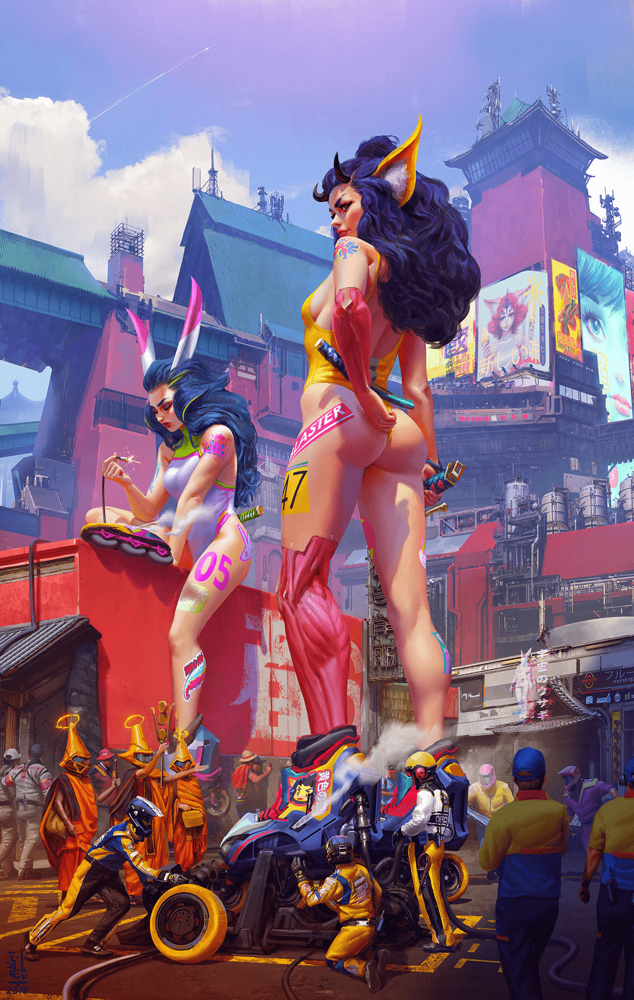

# 滑冰巨人-圈外擦边图

作者：深巷少女与猫

TID：27276

<title>1</title> <link href="../Styles/Style.css" type="text/css" rel="stylesheet">

# 1

在reddit上扫到一眼的擦边图

虽然追去图库网站（artstation）找了原作者：ibrahem swaid的画廊，可惜只有这一棵独苗

虽然只是题材擦边，但是脑洞我却很喜欢，下面换轮子的小人会让我联想到F1赛车换轮胎的场景
这种源自现实的幻象，很容易在脑内展开一个有趣的小故事

赞啊

<title>2</title> <link href="../Styles/Style.css" type="text/css" rel="stylesheet">

# 2

 <ignore_js_op>[滑冰巨人.jpg](forum.php?mod=attachment&aid=Nzk0NDV8ZjllMzU0NDV8MTY3NDA2Njc1NHwxODIzMHwyNzI3Ng%3D%3D&nothumb=yes) *(867.94 KB, 下載次數: 27)*

[下載附件](forum.php?mod=attachment&aid=Nzk0NDV8ZjllMzU0NDV8MTY3NDA2Njc1NHwxODIzMHwyNzI3Ng%3D%3D&nothumb=yes)

2019-8-19 22:14 上傳  

圈外画师的擦边作

</ignore_js_op> <title>3</title> <link href="../Styles/Style.css" type="text/css" rel="stylesheet">

# 3

非常不错的图画很想游行          <title>4</title> <link href="../Styles/Style.css" type="text/css" rel="stylesheet">

# 4

赞啊，图很不错，游行的画。 <title>5</title> <link href="../Styles/Style.css" type="text/css" rel="stylesheet">

# 5

突然有灵感了
打开word
干坐半天啥都没写出来
关掉word
