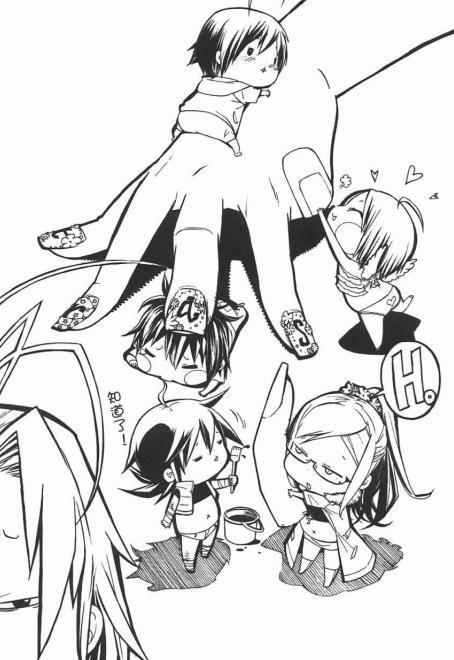

# 漫畫中出現的擦邊圖

作者：mengliul

TID：18850

<title>1</title> <link href="../Styles/Style.css" type="text/css" rel="stylesheet">

# 1

trash
第二卷
殺人鬼之夜中出現的溫馨插畫

手的主人是JK
<ignore_js_op>

**5228782.jpg** *(54.51 KB, 下載次數: 0)*

[下載附件](forum.php?mod=attachment&aid=NTE1ODF8ODRhMjQ3ZGJ8MTY3NDA2ODkyM3wxODIzMHwxODg1MA%3D%3D&nothumb=yes)

2015-4-20 20:53 上傳

<title>2</title> <link href="../Styles/Style.css" type="text/css" rel="stylesheet">

# 2

画风萌萌哒～     <title>3</title> <link href="../Styles/Style.css" type="text/css" rel="stylesheet">

# 3

萌系画风突然就没有感觉了。。。 <title>4</title> <link href="../Styles/Style.css" type="text/css" rel="stylesheet">

# 4

画风很萌...Q版的画风都这样... <title>5</title> <link href="../Styles/Style.css" type="text/css" rel="stylesheet">

# 5

小说本身好看吗？大概是讲什么的？ <title>6</title> <link href="../Styles/Style.css" type="text/css" rel="stylesheet">

# 6

对楼主无边无际的想象力佩服得五体投地 <title>7</title> <link href="../Styles/Style.css" type="text/css" rel="stylesheet">

# 7

我对楼主的想象力吓到了！ <title>8</title> <link href="../Styles/Style.css" type="text/css" rel="stylesheet">

# 8

(´･ω･`)毫无。。。。的说 <title>9</title> <link href="../Styles/Style.css" type="text/css" rel="stylesheet">

# 9

感谢楼主提供资源，要是附上手主人的图会更好 <title>10</title> <link href="../Styles/Style.css" type="text/css" rel="stylesheet">

# 10

确实很擦边唉唉。。。。 <title>11</title> <link href="../Styles/Style.css" type="text/css" rel="stylesheet">

# 11

真的是没看出什么所以然来。。</ignore_js_op>