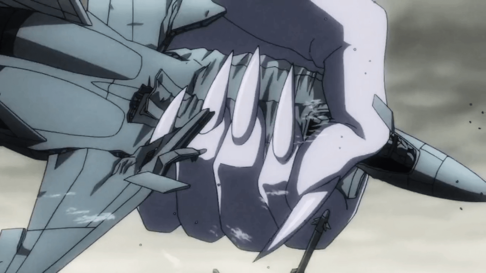

# 潮與虎 第二季動畫 第33話

作者：CEW

TID：21085

<title>1</title> <link href="../Styles/Style.css" type="text/css" rel="stylesheet">

# 1

*本帖最後由 CEW 於 2016-5-15 14:44 編輯*

5:00左右
 <title>2</title> <link href="../Styles/Style.css" type="text/css" rel="stylesheet">

# 2

 <ignore_js_op>[0235.jpg](forum.php?mod=attachment&aid=NjEzMzh8OTIxZjdjODB8MTY3NDA2ODAxNXwxODIzMHwyMTA4NQ%3D%3D&nothumb=yes) *(158.88 KB, 下載次數: 1)*

[下載附件](forum.php?mod=attachment&aid=NjEzMzh8OTIxZjdjODB8MTY3NDA2ODAxNXwxODIzMHwyMTA4NQ%3D%3D&nothumb=yes)

2016-5-15 14:36 上傳  

</ignore_js_op> <title>3</title> <link href="../Styles/Style.css" type="text/css" rel="stylesheet">

# 3

嗯。。。应该是第一季吧。。。第二季才出到13集 <title>4</title> <link href="../Styles/Style.css" type="text/css" rel="stylesheet">

# 4

这个在土豆上看要会员...... <title>5</title> <link href="../Styles/Style.css" type="text/css" rel="stylesheet">

# 5

> [hunj 發表於 2016-5-15 17:53](https://giantessnight.cf/gnforum2012/forum.php?mod=redirect&goto=findpost&pid=293744&ptid=21085)
> 嗯。。。应该是第一季吧。。。第二季才出到13集

因為故事是延續的，33話是從第一季到現在，也就是最新一話
<title>6</title> <link href="../Styles/Style.css" type="text/css" rel="stylesheet">

# 6

突然发现能免费看片子的地方不多了，有点方 <title>7</title> <link href="../Styles/Style.css" type="text/css" rel="stylesheet">

# 7

手机上还有优酷VIP版。。。
<title>8</title> <link href="../Styles/Style.css" type="text/css" rel="stylesheet">

# 8

我就想说  就看这手= = 手的主人能好看到哪去 <title>9</title> <link href="../Styles/Style.css" type="text/css" rel="stylesheet">

# 9

其实我是进来看哪里有33话的 <title>10</title> <link href="../Styles/Style.css" type="text/css" rel="stylesheet">

# 10

这个可真是古老的漫画改编的了。最后的妖怪真心是城市级别的怪物