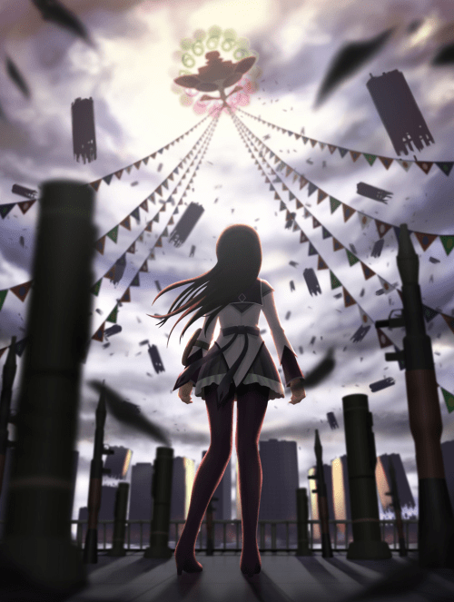

# 為什麼？

作者：廖雪松

TID：10333

<title>1</title> <link href="../Styles/Style.css" type="text/css" rel="stylesheet">

# 1

這是一個直指向論壇根基的問題————開一個玩笑。

其實，這個問題以前或許已經有前輩提出過，但是自己也不想慢慢ONE BY ONE地慢慢翻頁查找了。

那就是，為什麼論壇要美其名曰————
GIANTESS NIGHT(我承認，這是我打的最熟的兩個英文單詞）???
前面的單詞没話說，只說說後面。
可能，在下的英文水平翻譯出來是：
1.女巨人之夜2.女巨人夜場（出没之地？）3.女巨人夜晚4.女巨人黑夜（好像意思都差不多）……
為什麼DANTE大人要起這麼一個名字呢？

國外的網站有的叫：——城市、——俱樂部、——世界，等等。
或許，這就是不同文化造就的吧（没有關系）！
直接的與間接的，平實的與華麗的……
總之，論壇的名字就是好聽，就是上口，就是有意境，就是容易記住，就是不一樣！！！！（詞窮了……）

大家也來說說吧！！ <title>2</title> <link href="../Styles/Style.css" type="text/css" rel="stylesheet">

# 2

哇！！
居然是“今夜我們來談天”了！
不是“今天”麼？
是一直都這樣，還是…… <title>3</title> <link href="../Styles/Style.css" type="text/css" rel="stylesheet">

# 3

其实这名字的真正内涵是：
“女巨人，哦夜——” <title>4</title> <link href="../Styles/Style.css" type="text/css" rel="stylesheet">

# 4

呵呵~~哈哈！
流浪人君的——真的太精辟~
 真的，我笑到不行。
歡迎大家繼續發表高見！ <title>5</title> <link href="../Styles/Style.css" type="text/css" rel="stylesheet">

# 5

night含义可以代表安静,給人一种宁静的气氛,特别是那些会放松自己的人,可以给予一种境界的超越!

当然nigth指夜晚,也可以是晚上看天空的星星特别明亮吧,取这个名字或多或少都跟生活有关系的!

[ *本帖最後由 yudish 於 2011-6-10 18:32 編輯* ] <title>6</title> <link href="../Styles/Style.css" type="text/css" rel="stylesheet">

# 6

至黑之夜，光明白晝，惡徒將難逃法眼。
巨娘之夜，小人白晝，眾人必盡興而返。
就是這個意思。 <title>7</title> <link href="../Styles/Style.css" type="text/css" rel="stylesheet">

# 7

其实我也一直有个疑问
giantess的读音。
唉，我的英语不好，我一直都是读作“干踢死”
不知道读音准否。
如不准，
烦请哪位大神告知正确读音啊。

[ *本帖最後由 廖雪松 於 2011-6-10 19:16 編輯* ] <title>8</title> <link href="../Styles/Style.css" type="text/css" rel="stylesheet">

# 8

魔法少女之夜,不解釋 <title>9</title> <link href="../Styles/Style.css" type="text/css" rel="stylesheet">

# 9

这就和小圆里面为什么叫魔女之夜一个道理  <title>10</title> <link href="../Styles/Style.css" type="text/css" rel="stylesheet">

# 10

 <ignore_js_op>[55992149201105282143454203220075863_004.jpg](forum.php?mod=attachment&aid=MjQ3Nzh8MmM0ZDEzMTh8MTY3NDA2ODc4OHwxODIzMHwxMDMzMw%3D%3D&nothumb=yes) *(221.14 KB, 下載次數: 0)*

[下載附件](forum.php?mod=attachment&aid=MjQ3Nzh8MmM0ZDEzMTh8MTY3NDA2ODc4OHwxODIzMHwxMDMzMw%3D%3D&nothumb=yes)

2011-6-10 19:28 上傳  

</ignore_js_op> <title>11</title> <link href="../Styles/Style.css" type="text/css" rel="stylesheet">

# 11

看大多数帖子的发回帖时间就知道了，宅大部分都是夜行。

不读干踢死，读战替死。前五个字母也是一个词：吉安特 <title>12</title> <link href="../Styles/Style.css" type="text/css" rel="stylesheet">

# 12

giantess ['dʒaiəntes]
haha明白了 终于知道怎么读了
  <title>13</title> <link href="../Styles/Style.css" type="text/css" rel="stylesheet">

# 13

[http://tw.myblog.yahoo.com/giantess-night/](http://tw.myblog.yahoo.com/giantess-night/)

但丁成立論壇時順便有寫幾篇網誌
裡面就有寫拉

想要的…渴望的…只能在夢中擁有 "Night"的N是永遠無法實現夢想的"Never" 我願永住夢境國度… <title>14</title> <link href="../Styles/Style.css" type="text/css" rel="stylesheet">

# 14

12L:啊哈哈，原來如此么

雖然在下打不開那個鏈接，就讓在下大膽地妄想Rozen Maiden吧

如果只有夢中才能聽見——

那我就抱著這旋律溺死吧 <title>15</title> <link href="../Styles/Style.css" type="text/css" rel="stylesheet">

# 15

我猜大家夜里出来比较多的原因吧 <title>16</title> <link href="../Styles/Style.css" type="text/css" rel="stylesheet">

# 16

> 原帖由 *lovegts* 於 2011-6-10 22:23 發表 
> [http://tw.myblog.yahoo.com/giantess-night/](http://tw.myblog.yahoo.com/giantess-night/)
> 
> 但丁成立論壇時順便有寫幾篇網誌
> 裡面就有寫拉
> 
> 想要的…渴望的…只能在夢中擁有 "Night"的N是永遠無法實現夢想的"Never" 我願永住夢境國度…

.
我自己都忘記有這個blog了，真的。

裡面看起來超中二的！！我決定刪光光，保留你那一行當成新簽名檔。 <title>17</title> <link href="../Styles/Style.css" type="text/css" rel="stylesheet">

# 17

相當有趣的緣由

Night有著黑影的味道
相對主流文化，這種小團體永遠是影子一般的存在阿.... <title>18</title> <link href="../Styles/Style.css" type="text/css" rel="stylesheet">

# 18

感覺許多特殊的場景都是利用晚上來呈現的
沒想到一個詞能有這麼多的解釋 <title>19</title> <link href="../Styles/Style.css" type="text/css" rel="stylesheet">

# 19

生活？戲劇？英標？拆字遊戲？主流文化？旋律？簽名檔？…………
大家，真厲害！
未完待續……
歡迎！~