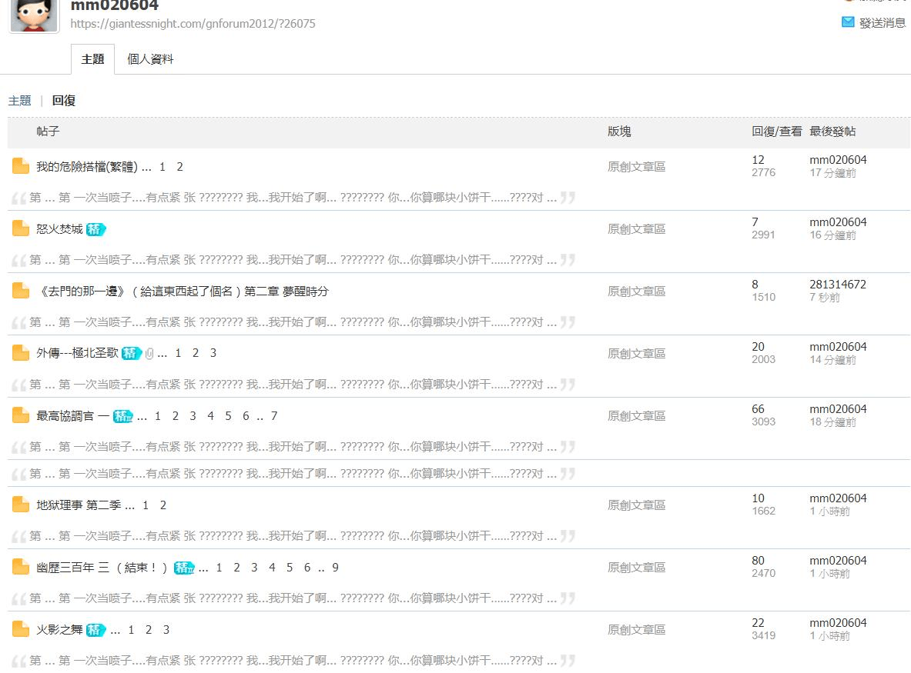

# 為什麽總是能看到有挖墳貼？能遏制嗎

作者：spacewolves

TID：24295

<title>1</title> <link href="../Styles/Style.css" type="text/css" rel="stylesheet">

# 1

2008年的都給挖上來了
不要這樣混積分吧
這不是第一次了
但是我看着真的是心煩
本來現在更新就少 看的就不過癮
又能看到挖墳的 心情太糟了

一點解決方式都沒有嗎？
例如 新人註冊不到24小時 禁止發帖
把之前的老帖子給鎖了 禁止任何人回復
如果老帖子有人想更新 可以私信管理員解鎖
都可以啊
<title>2</title> <link href="../Styles/Style.css" type="text/css" rel="stylesheet">

# 2

<ignore_js_op>

**3222629677.jpg** *(108.1 KB, 下載次數: 0)*

[下載附件](forum.php?mod=attachment&aid=NzAzMzB8ZjVkN2Q3OGF8MTY3NDA2NzI2OHwxODIzMHwyNDI5NQ%3D%3D&nothumb=yes)

2018-1-13 22:27 上傳

[https://giantessnight.com/gnforu ... p;username=mm020604](https://giantessnight.com/gnforum2012/home.php?mod=space&username=mm020604)

如此肆無忌憚的刷帖子
管理員呢？
<title>3</title> <link href="../Styles/Style.css" type="text/css" rel="stylesheet">

# 3

这个确实过分了 而且还是无营养的灌水 应该实施点惩罚才是 <title>4</title> <link href="../Styles/Style.css" type="text/css" rel="stylesheet">

# 4

记得Discuz有个“设置超过xx时间的帖子自动关闭”的操作 <title>5</title> <link href="../Styles/Style.css" type="text/css" rel="stylesheet">

# 5

而且是莫名其妙的评论内容…… <title>6</title> <link href="../Styles/Style.css" type="text/css" rel="stylesheet">

# 6

管理应该也很忙吧…
坟贴禁言反映过一次，好像是为了等一些有价值的评论才不开这个功能的。
感觉提高点举报的奖励挺好的，从发帖上限制有点难…
另外一些灌水处理了之后主题可以回到挖出来前的状态吗，比如从最新回复里移除什么的… <title>7</title> <link href="../Styles/Style.css" type="text/css" rel="stylesheet">

# 7

挖坟其实无过，发掘一些好的作品。用心写的评论也会是亮点。可恶的是灌水。 <title>8</title> <link href="../Styles/Style.css" type="text/css" rel="stylesheet">

# 8

还..还...直接....直接在版主的主题下灌水了......
虽然说能把一些很棒的文物弄出来，但是.......既不是观后感也不是有半点礼貌的回复。 <title>9</title> <link href="../Styles/Style.css" type="text/css" rel="stylesheet">

# 9

这次是我的锅，我来说两句
这件事的主要原因在于，我最近一直没有做过任何禁言、禁访的管理动作。一般来说，要做这种管理之前，得发一个带截图的管理公告，不知道你们是否知道。然后自从GN更新后，我的Safari一直不能上传图片，导致我一直对发管理公告持有尽量避免的态度，遇到有问题的会员都是仅扣除灌水所得积分，因此导致了这次的事件。
赞美Chrome，这次的举报我成功上传了截图，禁访了一个月，毕竟影响恶劣。
回复的权限限制不是我说了算的，得看铜锣和但大怎么看，我有空跟他们说下。
最后谢谢xxx99，一直以来为GN的管理和举报给予了很大的支持。 <title>10</title> <link href="../Styles/Style.css" type="text/css" rel="stylesheet">

# 10

挖坟的确很讨厌，找到以前的好贴自己看看就行了，非要评论一下让所有人都看到
不过也确实挖出了不少我没看过的帖子 <title>11</title> <link href="../Styles/Style.css" type="text/css" rel="stylesheet">

# 11

> [MattHC 發表於 2018-1-13 23:13](https://giantessnight.cf/gnforum2012/forum.php?mod=redirect&goto=findpost&pid=355177&ptid=24295)
> 记得Discuz有个“设置超过xx时间的帖子自动关闭”的操作

是180天，但是这180天只能有人回复就又是180天。 <title>12</title> <link href="../Styles/Style.css" type="text/css" rel="stylesheet">

# 12

挖坟这个东西我不觉得是坏事 不过可能在GN混了这么多年的老前辈什么文章都看过就会觉得有点烦人了 如果是像我这种半路入坑的萌新 偶尔会因为有人挖坟而看见很久以前写的好物就很开心 印象最深刻的就是有一次文章区那篇girls talk被挖出来了看了个爽 不过这位坏就坏在他挖坟是用无意义的回复在挖 而不是一些有意义的 评论的文字在挖 确实不好 <title>13</title> <link href="../Styles/Style.css" type="text/css" rel="stylesheet">

# 13

嚴格管理水帖
古墳封鎖
這是簡單的管理辦法
違法的人太多
管理的人太少
要不增加管理員數量
不然只能笑笑帶過
論壇的註冊機制或許也要重新加強驗證機制
避免亂創帳號
<title>14</title> <link href="../Styles/Style.css" type="text/css" rel="stylesheet">

# 14

> [迷途小喵 發表於 2018-1-14 02:24](https://giantessnight.cf/gnforum2012/forum.php?mod=redirect&goto=findpost&pid=355211&ptid=24295)
> 嚴格管理水帖
> 古墳封鎖
> 這是簡單的管理辦法

我記得GN以前還封過站禁止註冊呢。。。
老實說我以前也有發過有關挖墳的貼
我個人對挖墳沒啥特別大的反感 就是挖墳的全都是灌水的這點有很大問題
說真的我不太明白為啥GN會有人灌水 漫畫區資源大多都可以在網上找到 權限又不是灌一下水就馬上到
我也有舉報過這些人 就看結果如何了
<title>15</title> <link href="../Styles/Style.css" type="text/css" rel="stylesheet">

# 15

我觉得挖坟还好吧，现在新帖子本来就不多，最近两个月确实有人挖出了还不错的贴，而且众所周知论坛里的确有年更的神贴…………

但是灌水肯定是要严管的 <title>16</title> <link href="../Styles/Style.css" type="text/css" rel="stylesheet">

# 16

最近看到陌生的版首贴，点进去一看才发现是远古老坟，有点过分了</ignore_js_op>