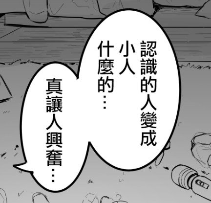

# 熟人gts化后對人態度的轉變，感覺很讓人興奮呀

作者：Courant

TID：32032

<title>1</title> <link href="../Styles/Style.css" type="text/css" rel="stylesheet">

# 1

最近看了不少相關作品，這種地位、身份、態度的改變和逆轉，似乎比單純的體型差距更能讓我興奮起來啊( •́ω•̀ )
壇友們在巨大娘方面更喜歡哪種關係呢？
（話說我漢化了karbo的作品，但沒有漫畫徽章，應該分享到哪個區比較好？） <title>2</title> <link href="../Styles/Style.css" type="text/css" rel="stylesheet">

# 2

 <ignore_js_op>[1d74a1dd1727c07f.png](forum.php?mod=attachment&aid=OTIwNjl8MjI2ZDI5YWR8MTY3NDA2NTc5M3wxODIzMHwzMjAzMg%3D%3D&nothumb=yes) *(78.35 KB, 下載次數: 8)*

[下載附件](forum.php?mod=attachment&aid=OTIwNjl8MjI2ZDI5YWR8MTY3NDA2NTc5M3wxODIzMHwzMjAzMg%3D%3D&nothumb=yes)

2021-11-8 19:51 上傳  

</ignore_js_op> <title>3</title> <link href="../Styles/Style.css" type="text/css" rel="stylesheet">

# 3

汉化作品可以直接发到「原创图片区」 <title>4</title> <link href="../Styles/Style.css" type="text/css" rel="stylesheet">

# 4

樓主這圖感覺在哪見過wwww 被まるしゃも大大啟發了新的感覺?? 最新作的確很讓人興奮~ <title>5</title> <link href="../Styles/Style.css" type="text/css" rel="stylesheet">

# 5

> ref45628 發表於 2021-11-8 21:54
> 樓主這圖感覺在哪見過wwww 被まるしゃも大大啟發了新的感覺?? 最新作的確很讓人興奮~ ...

yes，就是他新作中截的圖（男主叫高峰好容易出戲） <title>6</title> <link href="../Styles/Style.css" type="text/css" rel="stylesheet">

# 6

確實很不錯，尤其再被當垃圾或道具對待，縮小後加上原本關係的雙重對比

個人比較偏向原本有往來但不是很熟關係，鄰居和老師一類的

總覺得比家人或情侶等關係更帶感，不過親妹蠻熱門的，母系姐都偏少

<title>7</title> <link href="../Styles/Style.css" type="text/css" rel="stylesheet">

# 7

会温柔以待吗，如果真的发生了还是会希望被温柔地对待，然后找个没人的地方永远躲起来吧 <title>8</title> <link href="../Styles/Style.css" type="text/css" rel="stylesheet">

# 8

> 花丸一生推 發表於 2021-11-9 16:02
> 確實很不錯，尤其再被當垃圾或道具對待，縮小後加上原本關係的雙重對比
> 
> 個人比較偏向原本有往來但不是很熟 ...

懂得讓人落淚( ´•̥̥̥ω•̥̥̥` )，無論看了多少作品，這一套關係的對比還是很能觸動我 <title>9</title> <link href="../Styles/Style.css" type="text/css" rel="stylesheet">

# 9

熟人gts后态度转变可以，但是感觉还是温柔一点好