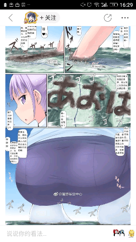

# 特殊屁好又一次被曝光了。

作者：dronoketer

TID：24610

<title>1</title> <link href="../Styles/Style.css" type="text/css" rel="stylesheet">

# 1

*本帖最後由 蜡下翁 於 2018-2-28 13:26 編輯*

论坛里大大翻译的寺田图被人放到微博和贴吧又一次引起热议了。跟过去不一样，这次被宣传的还是翻译版而不是原图。人们纷纷表示特殊屁好无法理解。而且这是寺田的图第几次被以猎奇图片的名义曝光了。好像圈内被热议的作品除了圆神草地球的那张以外全是寺田的图。其实发这贴的初衷是希望论坛内的一些人低调一点，这次被营销号宣传一波的图是论坛内的翻译所以我觉得八成是论坛内的人扩散的。而为什么我不希望宣传则是因为有前车之鉴。大概在2014还是2015年。贴吧里面有一个叫肛塞的贴吧，可以说是很繁荣了。（我并不关注0.0）但是伴随着有人对其的扩散宣传，尽管不知道是什么目的。但在短时间内吸引力大量观光团，例如帝吧观光团微博观光团之类的。一时间吧内的秩序被打乱，观光团水贴横行到处都是到此一游和冷嘲热讽。但更严重的是在曝光没多久肛塞吧就被封禁了。跟肛塞吧有相同命运的还有尸体吧女囚吧等等，都是在曝光后不久就被封禁的贴吧。虽然我们现在是在论坛内而不是贴吧，但多多少少还是要避点嫌的。以免发生什么emergency.
<title>2</title> <link href="../Styles/Style.css" type="text/css" rel="stylesheet">

# 2

 <ignore_js_op>[Screenshot_2018-02-27-16-29-36.png](forum.php?mod=attachment&aid=NzEwODR8OGY5M2E5NWV8MTY3NDA2NzE3M3wxODIzMHwyNDYxMA%3D%3D&nothumb=yes) *(208.57 KB, 下載次數: 49)*

[下載附件](forum.php?mod=attachment&aid=NzEwODR8OGY5M2E5NWV8MTY3NDA2NzE3M3wxODIzMHwyNDYxMA%3D%3D&nothumb=yes)

2018-2-27 16:30 上傳  

</ignore_js_op> <title>3</title> <link href="../Styles/Style.css" type="text/css" rel="stylesheet">

# 3

我是真的很怕一些爱作死的人，凡是非主流小众爱好群体，低调行事不作死，总是没错的。
而某些人偏偏不，就是喜欢广而告之，圈内的东西上B站，上微博，上贴吧；妄图得到整个二次元群体承认，还自以为是在「弘扬GTS文化」呢。
拜托，这圈子本质上就是R18性癖向，弘扬你的大头鬼，上街当众露吊是不是算弘扬人体艺术？ <title>4</title> <link href="../Styles/Style.css" type="text/css" rel="stylesheet">

# 4

gts本来就挺猎奇的，被好奇的人挖出来很正常啊 <title>5</title> <link href="../Styles/Style.css" type="text/css" rel="stylesheet">

# 5

宅文化包容力是很大的，但是里面的宅也有特别狭隘的。还是谨慎点好。
毕竟我觉的我们圈子里的人大部分在入宅前就已经喜欢gts了吧。 <title>6</title> <link href="../Styles/Style.css" type="text/css" rel="stylesheet">

# 6

感覺上要推廣也要先選過

寺田的作品在圈內口味也算偏重 到圈外還得了

<title>7</title> <link href="../Styles/Style.css" type="text/css" rel="stylesheet">

# 7

*本帖最後由 蜡下翁 於 2018-2-27 21:40 編輯*

我感觉不太好的，如果是寺田的原图暂且罢了，p站上大家都看得见的。但这一次是论坛内的翻译图被曝光，而且还是被微博是的营销号宣传了一波。感觉影响不是很好。 <title>8</title> <link href="../Styles/Style.css" type="text/css" rel="stylesheet">

# 8

确实，部分温柔系的图讲道理可能还是可以受到大众认可的，而这张作品寺田本身就是连gs那边都是有Sucatology的限制的，只能说分享出去的人可能不大正常 <title>9</title> <link href="../Styles/Style.css" type="text/css" rel="stylesheet">

# 9

很赞同上面几位的观点。
身为这张图片的翻译者，我......我应该去回帖吗（笑）
怎么说呢，人各有志吧，每个人喜欢的东西不一样吧。
圈外的人对我们有偏见也是正常的。
而且，日常生活中，我们也都是和他们一样的正常人。
我倒是想知道那个搬运图片的人是谁，居然连图片出处都不注明......
等等，注明了的话不是更糟么。
我很好奇，不搬运到隔壁论坛上（不仅不会受偏见，还可以赚积分），却搬运到贴吧里......
搬运的大神，你是有怎样清奇的脑回路？
只希望不要过多的被大众注意到，我只想自娱自乐啊orz。
总之，不论搬运谁的作品，请搬运到正确的地方。
如果自己作死，死的不止你一个人。 <title>10</title> <link href="../Styles/Style.css" type="text/css" rel="stylesheet">

# 10

其实看的话在那个博主里面还有一个舰娘的圈内本子截图。但跟寺田的图相比要正常多了，只感觉是足控。话说那个博主也是有八十万粉的，如果是圈内人的话我觉得对圈内作品还是应该筛选一下，以免有什么太大问题。 <title>11</title> <link href="../Styles/Style.css" type="text/css" rel="stylesheet">

# 11

讲真我们这种小圈子还是低调点好 <title>12</title> <link href="../Styles/Style.css" type="text/css" rel="stylesheet">

# 12

他们这是在引起上头的注意来毁灭我们的小小圈子啊…… <title>13</title> <link href="../Styles/Style.css" type="text/css" rel="stylesheet">

# 13

等他们看到寺田的扶她再惊讶不迟 <title>14</title> <link href="../Styles/Style.css" type="text/css" rel="stylesheet">

# 14

什麼網絡世界了，和以前不一樣了。已經開始嚴格控制網絡語言了，還作死？發個國外吃野味的圖片都被拘留審查。現在的網絡都是實名制，老老實實的待著吧。這也是我一直反對使用百度網盤的原因。 <title>15</title> <link href="../Styles/Style.css" type="text/css" rel="stylesheet">

# 15

我是觉得这种是还是越少人越好，小圈子的氛围也是很不错的，有的时候人多不一定是好事，感兴趣的自然就会来。再说这种东西拿到台面上说，不就是在当众讨论性癖吗_(´_`」 ∠)_ <title>16</title> <link href="../Styles/Style.css" type="text/css" rel="stylesheet">

# 16

低调点吧 人多了太乱 现在这样子挺好的 <title>17</title> <link href="../Styles/Style.css" type="text/css" rel="stylesheet">

# 17

伺服器又不在中國 怕啥
被牆就翻過來啊 真的要刁小圈子的話你們不知道要排到幾號嘞
<title>18</title> <link href="../Styles/Style.css" type="text/css" rel="stylesheet">

# 18

嗯，这也是我现在如此低调的原因 <title>19</title> <link href="../Styles/Style.css" type="text/css" rel="stylesheet">

# 19

这种癖好被太多的人发现，可能...会遭到名为恶意歧视的东西吧... <title>20</title> <link href="../Styles/Style.css" type="text/css" rel="stylesheet">

# 20

gts作为小众的性癖好，不太适合在公共场合露面，有部分人会认为猎奇甚至不解 <title>21</title> <link href="../Styles/Style.css" type="text/css" rel="stylesheet">

# 21

现在论坛被墙了。有加s这个小屏障应该还算安全。 <title>22</title> <link href="../Styles/Style.css" type="text/css" rel="stylesheet">

# 22

好羞涩啊你们。有小癖好不是很正常吗？ <title>23</title> <link href="../Styles/Style.css" type="text/css" rel="stylesheet">

# 23

分享出去的人只能说是脑子进水了.！ <title>24</title> <link href="../Styles/Style.css" type="text/css" rel="stylesheet">

# 24

还有一个魔物娘吧，有人非作死发到b吧去。遭遇冷嘲热讽
<title>25</title> <link href="../Styles/Style.css" type="text/css" rel="stylesheet">

# 25

小圈子就是小圈子，为什么一定要发出去让人知道呢´_>`无法黎姐
<title>26</title> <link href="../Styles/Style.css" type="text/css" rel="stylesheet">

# 26

低调才是王道，闷声发大财、、当年那几个资源很多的贴吧已经被喜欢管闲事的搞得家破人亡了 <title>27</title> <link href="../Styles/Style.css" type="text/css" rel="stylesheet">

# 27

低调点好 感觉 ngafgo其实也暴露过一次