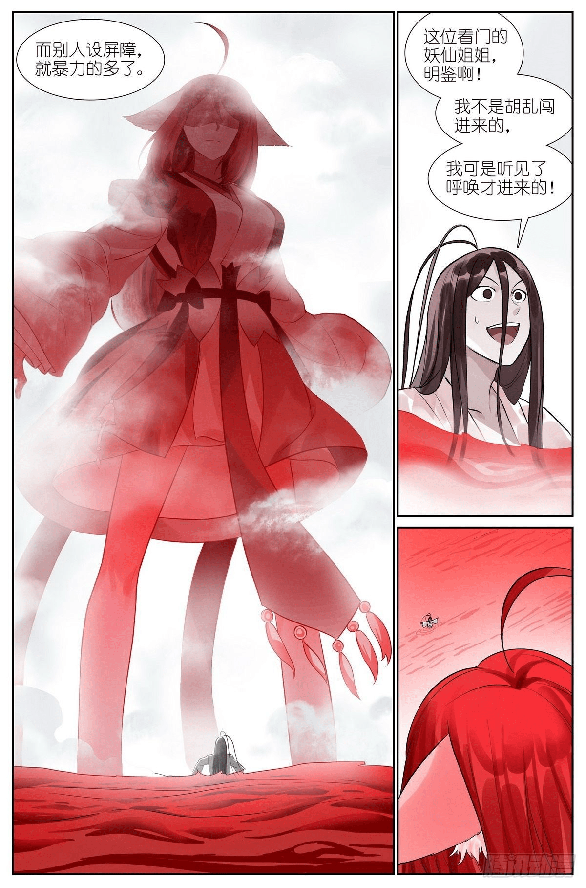

# 狐妖小红娘近期又有的擦边

作者：田棒棒

TID：32046

<title>1</title> <link href="../Styles/Style.css" type="text/css" rel="stylesheet">

# 1

或许，红红在精神世界里能变得更大？感觉这部漫画的作者很尊崇女性啊，期待中 <title>2</title> <link href="../Styles/Style.css" type="text/css" rel="stylesheet">

# 2

貌似我又猜对了一半
<title>3</title> <link href="../Styles/Style.css" type="text/css" rel="stylesheet">

# 3

 <ignore_js_op>[0.jpg](forum.php?mod=attachment&aid=OTIxMzZ8ZGEzYzc2OTd8MTY3NDA2NTc5MHwxODIzMHwzMjA0Ng%3D%3D&nothumb=yes) *(230.43 KB, 下載次數: 1)*

[下載附件](forum.php?mod=attachment&aid=OTIxMzZ8ZGEzYzc2OTd8MTY3NDA2NTc5MHwxODIzMHwzMjA0Ng%3D%3D&nothumb=yes)

2021-11-12 06:53 上傳  

</ignore_js_op> <title>4</title> <link href="../Styles/Style.css" type="text/css" rel="stylesheet">

# 4

> [田棒棒 發表於 2021-11-12 07:14](https://giantessnight.cf/gnforum2012/forum.php?mod=redirect&goto=findpost&pid=484742&ptid=32046)
> 又是精神的还是真的大？另外查过，其实设定法相天地有不少妖和人其实都会，用不用的问题。
> ...

其实没所谓的，本来漫画也是个虚幻投影，我们这个爱好也是同理，也不必计较其精神世界还是实体，有了投影，就有了亢奋点不是么