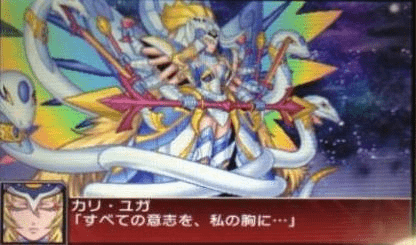

# 玩机战UX的意外惊喜

作者：lzmingzengcc

TID：14210

<title>1</title> <link href="../Styles/Style.css" type="text/css" rel="stylesheet">

# 1

因为本人是个机战迷，所以买了新的《超级机器人大战UX》，没想到打到最终boss时居然有意外之喜。根据战斗动画，话说这个该算是GIGA级的吧... <title>2</title> <link href="../Styles/Style.css" type="text/css" rel="stylesheet">

# 2

 <ignore_js_op>[UX boss.JPG](forum.php?mod=attachment&aid=MzM2MDR8NGQxMmY3OTN8MTY3NDA2ODE3MnwxODIzMHwxNDIxMA%3D%3D&nothumb=yes) *(21.67 KB, 下載次數: 5)*

[下載附件](forum.php?mod=attachment&aid=MzM2MDR8NGQxMmY3OTN8MTY3NDA2ODE3MnwxODIzMHwxNDIxMA%3D%3D&nothumb=yes)

2013-4-6 21:54 上傳  

</ignore_js_op> <title>3</title> <link href="../Styles/Style.css" type="text/css" rel="stylesheet">

# 3

回轉企鵝罐！ <title>4</title> <link href="../Styles/Style.css" type="text/css" rel="stylesheet">

# 4

我点进这个帖子的注意点在楼主头像上
啪嗒砰 好玩啊 当年玩的好爽 <title>5</title> <link href="../Styles/Style.css" type="text/css" rel="stylesheet">

# 5

[http://www.youtube.com/watch?v=XyzQHZYpSSQ](http://www.youtube.com/watch?v=XyzQHZYpSSQ)
=============
UX參戰作品很謎,奇怪(老任的陰謀) <title>6</title> <link href="../Styles/Style.css" type="text/css" rel="stylesheet">

# 6

[http://www.youtube.com/watch?v=cHFc8RwsmbY](http://www.youtube.com/watch?v=cHFc8RwsmbY) OG 2的AI 1

[http://www.youtube.com/watch?v=zKmbKILAK7I](http://www.youtube.com/watch?v=zKmbKILAK7I)   6:50秒  MX 的AI 1

這也是 GIGA級的~~
<title>7</title> <link href="../Styles/Style.css" type="text/css" rel="stylesheet">

# 7

在什么设备上玩的？ <title>8</title> <link href="../Styles/Style.css" type="text/css" rel="stylesheet">

# 8

哦哦哦哦哦哦！ux已经出了吗！不过没钱买3ds的说 <title>9</title> <link href="../Styles/Style.css" type="text/css" rel="stylesheet">

# 9

PC能玩吗 有点看不懂是个什么游戏 <title>10</title> <link href="../Styles/Style.css" type="text/css" rel="stylesheet">

# 10

看这个第一反映就是企鹅罐里面的女王了
话说机战是那个战旗类的游戏么
貌似见过的样子 <title>11</title> <link href="../Styles/Style.css" type="text/css" rel="stylesheet">

# 11

no 3ds <title>12</title> <link href="../Styles/Style.css" type="text/css" rel="stylesheet">

# 12

3DS很贵啊。。 特别是3DS还没破解 想玩游戏要花钱买 <title>13</title> <link href="../Styles/Style.css" type="text/css" rel="stylesheet">

# 13

表示很想玩 <title>14</title> <link href="../Styles/Style.css" type="text/css" rel="stylesheet">

# 14

giga级别的...有互动没？ <title>15</title> <link href="../Styles/Style.css" type="text/css" rel="stylesheet">

# 15

有点看不懂是个什么游戏 <title>16</title> <link href="../Styles/Style.css" type="text/css" rel="stylesheet">

# 16

来人，给楼主上MMD版企鹅罐大招重现版