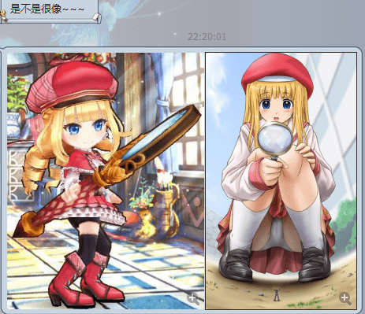
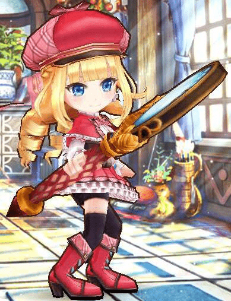
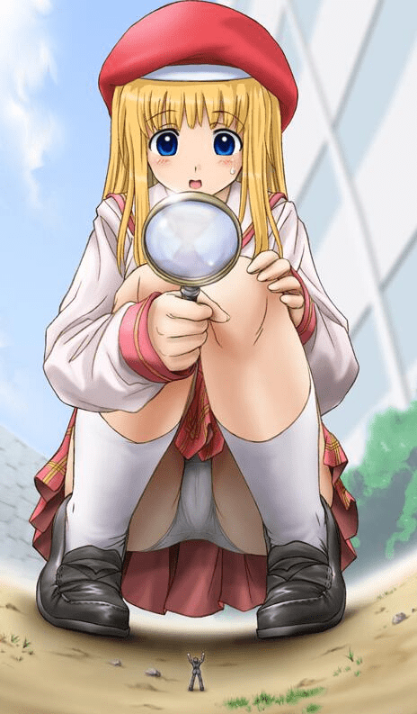
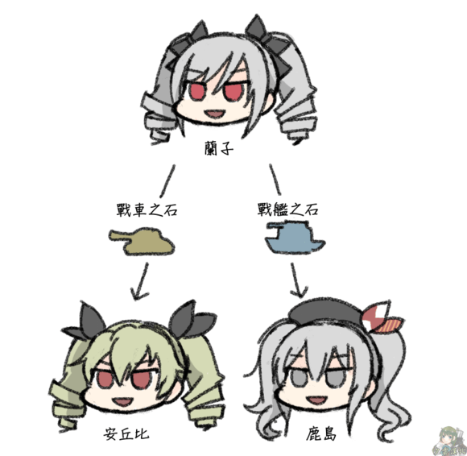

# 玩游戏突然出现了诚惠，到底是巧合还是制作团其实有癖好

作者：d1310871496

TID：22768

<title>1</title> <link href="../Styles/Style.css" type="text/css" rel="stylesheet">

# 1

无独有偶，虽然抽到了这只法师已经有些日子，每次看到就相当熟悉。终于在某次扯（bei）淡（liao）的时候真相了！
<ignore_js_op>

**QQ截图20170317225051.png** *(329.75 KB, 下載次數: 0)*

[下載附件](forum.php?mod=attachment&aid=NjcyNDR8MWQ3NTBhZjV8MTY3NDA2NzE3MXwxODIzMHwyMjc2OA%3D%3D&nothumb=yes)

2017-3-17 21:51 上傳

哎呀！！妈妈咪呀！！我勒个去去去去去去去！！！
看第一眼，的确很像的啊！
然后再看，这应该就是按照诚惠酱做的吧！！
再看，其实制作团设计这个的家伙一定有某种癖好吧！难道这张图就是他的G点嘛（我等纯洁的孩子根本不知道G点是何物...没错，就是这样）
<ignore_js_op>

**QQ图片20170317224914.jpg** *(48.79 KB, 下載次數: 0)*

[下載附件](forum.php?mod=attachment&aid=NjcyNDV8MmY2ZTRmYjZ8MTY3NDA2NzE3MXwxODIzMHwyMjc2OA%3D%3D&nothumb=yes)

2017-3-17 21:51 上傳

<ignore_js_op>

**QQ图片20170317224919.jpg** *(50.32 KB, 下載次數: 0)*

[下載附件](forum.php?mod=attachment&aid=NjcyNDZ8ZjRhNGRhM2F8MTY3NDA2NzE3MXwxODIzMHwyMjc2OA%3D%3D&nothumb=yes)

2017-3-17 21:51 上傳

我说其实这个东西就是一个人对吧 对吧 对吧对吧！！！！！
<ignore_js_op>

**QQ图片20170118153057.png** *(144.32 KB, 下載次數: 0)*

[下載附件](forum.php?mod=attachment&aid=NjcyNDd8ZmI1ZDAwNjl8MTY3NDA2NzE3MXwxODIzMHwyMjc2OA%3D%3D&nothumb=yes)

2017-3-17 21:57 上傳

<title>2</title> <link href="../Styles/Style.css" type="text/css" rel="stylesheet">

# 2

楼主这是啥游戏 <title>3</title> <link href="../Styles/Style.css" type="text/css" rel="stylesheet">

# 3

一個是城惠的日記 一個是過氣白貓 <title>4</title> <link href="../Styles/Style.css" type="text/css" rel="stylesheet">

# 4

人设撞车这种事情现在并不少见吧，类似的情况应该有不少的样子哦 <title>5</title> <link href="../Styles/Style.css" type="text/css" rel="stylesheet">

# 5

一点都不像啊，撞脸多的是 <title>6</title> <link href="../Styles/Style.css" type="text/css" rel="stylesheet">

# 6

我觉得...就光他的双钻头就和成惠区别挺大的=3= <title>7</title> <link href="../Styles/Style.css" type="text/css" rel="stylesheet">

# 7

噗...大人真的水了一帖...其实除了发色帽子瞳色最重点像的是放大镜吧233 <title>8</title> <link href="../Styles/Style.css" type="text/css" rel="stylesheet">

# 8

成惠的原型好像是RPG MAKER自带头像里的一个妹子？
而且看这图也就撞了红色贝雷帽+金发蓝眼而已。。。 <title>9</title> <link href="../Styles/Style.css" type="text/css" rel="stylesheet">

# 9

就一个帽子 放大镜和头发颜色，不足以说明什么啊 <title>10</title> <link href="../Styles/Style.css" type="text/css" rel="stylesheet">

# 10

> [yyy2436 發表於 2017-3-17 22:03](https://giantessnight.cf/gnforum2012/forum.php?mod=redirect&goto=findpost&pid=326445&ptid=22768)
> 楼主这是啥游戏

这个是叫做白猫的游戏→_→
<title>11</title> <link href="../Styles/Style.css" type="text/css" rel="stylesheet">

# 11

> [17298900095 發表於 2017-3-18 02:14](https://giantessnight.cf/gnforum2012/forum.php?mod=redirect&goto=findpost&pid=326464&ptid=22768)
> 一点都不像啊，撞脸多的是

在特定的角度还是可以看成一个人的，当然就看你认真不认真了 <title>12</title> <link href="../Styles/Style.css" type="text/css" rel="stylesheet">

# 12

> [foronly 發表於 2017-3-18 02:42](https://giantessnight.cf/gnforum2012/forum.php?mod=redirect&goto=findpost&pid=326465&ptid=22768)
> 我觉得...就光他的双钻头就和成惠区别挺大的=3=

所以不要看双钻头啊！！
<title>13</title> <link href="../Styles/Style.css" type="text/css" rel="stylesheet">

# 13

> [源青之绅 發表於 2017-3-18 09:06](https://giantessnight.cf/gnforum2012/forum.php?mod=redirect&goto=findpost&pid=326470&ptid=22768)
> 就一个帽子 放大镜和头发颜色，不足以说明什么啊

有什么不好，至少能说明她们有共同点
<title>14</title> <link href="../Styles/Style.css" type="text/css" rel="stylesheet">

# 14

> [餃子 發表於 2017-3-18 04:47](https://giantessnight.cf/gnforum2012/forum.php?mod=redirect&goto=findpost&pid=326467&ptid=22768)
> 成惠的原型好像是RPG MAKER自带头像里的一个妹子？
> 而且看这图也就撞了红色贝雷帽+金发蓝眼而已。。 ...

有那么夸张吗，为什么你们都这么认真。好吧 不像
<title>15</title> <link href="../Styles/Style.css" type="text/css" rel="stylesheet">

# 15

相似的太多了，楼主道破了真相， <title>16</title> <link href="../Styles/Style.css" type="text/css" rel="stylesheet">

# 16

> [餃子 發表於 2017-3-18 04:47](https://giantessnight.cf/gnforum2012/forum.php?mod=redirect&goto=findpost&pid=326467&ptid=22768)
> 成惠的原型好像是RPG MAKER自带头像里的一个妹子？
> 而且看这图也就撞了红色贝雷帽+金发蓝眼而已。。 ...

你忘了那么显眼的放大镜了吗
<title>17</title> <link href="../Styles/Style.css" type="text/css" rel="stylesheet">

# 17

> [C-aki 發表於 2017-3-18 18:43](https://giantessnight.cf/gnforum2012/forum.php?mod=redirect&goto=findpost&pid=326505&ptid=22768)
> 这个是叫做白猫的游戏→_→

所噶，楼主玩的是日服吗，虽然我没玩过这游戏但我记得国服不是停服了吗
<title>18</title> <link href="../Styles/Style.css" type="text/css" rel="stylesheet">

# 18

...

如果撇除繪師程度問題的話

[其實啊，如果撇除繪師本身的程度問題，尤菲和深海棲姬的特徵其實還挺相像的對吧？](http://i.imgur.com/ELYiI8o.jpg)

沒有啦，我想說的只是角色設計撞衫的情況並沒有那麼罕見

所以實在不必驚訝到這種程度...

雖然我想應該沒有人想知道，但尤菲(硬碟裡最早的著色檔是2011年)是我自己的自創角色，比艦娘(據WIKI所說是2013年)更早出現
<title>19</title> <link href="../Styles/Style.css" type="text/css" rel="stylesheet">

# 19

<ignore_js_op>

**45c3b236afc3793111ede6f0e3c4b74542a91110.jpg** *(167.62 KB, 下載次數: 0)*

[下載附件](forum.php?mod=attachment&aid=NjcyNjl8ZGU3OWNhMzF8MTY3NDA2NzE4MXwxODIzMHwyMjc2OA%3D%3D&nothumb=yes)

2017-3-19 01:40 上傳

<title>20</title> <link href="../Styles/Style.css" type="text/css" rel="stylesheet">

# 20

> [yyy2436 發表於 2017-3-19 01:04](https://giantessnight.cf/gnforum2012/forum.php?mod=redirect&goto=findpost&pid=326547&ptid=22768)
> 所噶，楼主玩的是日服吗，虽然我没玩过这游戏但我记得国服不是停服了吗
> ...

日服一个月前走向了奇怪的节奏无聊弃坑，现在玩的是台服，，刚好出到侦探一期。至于国服，貌似玩了5分钟。。。
<title>21</title> <link href="../Styles/Style.css" type="text/css" rel="stylesheet">

# 21

> [BAss926 發表於 2017-3-19 01:24](https://giantessnight.cf/gnforum2012/forum.php?mod=redirect&goto=findpost&pid=326548&ptid=22768)
> ...

撞衫当然不罕见，但是有一个躁动的心啊

当然，至于什么原创什么什么什么的，这种事情不关注不说的话不可能知道。世界上几十亿人，虽然有着不同的肤色 不同的语言 不同的环境，但是思想这个东西大体上还是想通的，比如一个鄙视的眼神流露出来的信息哪怕不用语言也能理解。

所以说，，，撞衫的话，就按照自己喜欢的角色去认知，然后自己再脑补一下。（当然，游戏里的怪物都比角色大就是了 偶尔有几个小的要死的怪物 玩起来还真是。。。愉悦）
<title>22</title> <link href="../Styles/Style.css" type="text/css" rel="stylesheet">

# 22

> [紫色欧石楠 發表於 2017-3-19 01:41](https://giantessnight.cf/gnforum2012/forum.php?mod=redirect&goto=findpost&pid=326549&ptid=22768)

他们是失散多练的姐妹，一个当老师，一个当偶像 一个，，，好吧 不知道干嘛的。
<title>23</title> <link href="../Styles/Style.css" type="text/css" rel="stylesheet">

# 23

这太强行了吧。。。。。。 <title>24</title> <link href="../Styles/Style.css" type="text/css" rel="stylesheet">

# 24

漫画的东东看起来就是头发颜色和眼睛颜色的区别咯 <title>25</title> <link href="../Styles/Style.css" type="text/css" rel="stylesheet">

# 25

啊啊啊。。不觉得特别像啊。。 <title>26</title> <link href="../Styles/Style.css" type="text/css" rel="stylesheet">

# 26

> [yyy2436 發表於 2017-3-17 22:03](https://giantessnight.cf/gnforum2012/forum.php?mod=redirect&goto=findpost&pid=326445&ptid=22768)
> 楼主这是啥游戏

這是白貓== 不是GT系列 太扯了 偵探法真像成惠
<title>27</title> <link href="../Styles/Style.css" type="text/css" rel="stylesheet">

# 27

现在难免会有撞车的人设，游戏动漫什么的太多了 <title>28</title> <link href="../Styles/Style.css" type="text/css" rel="stylesheet">

# 28

根本没多少地方相似...只能说幻视真是人类一个伟大的进步 <title>29</title> <link href="../Styles/Style.css" type="text/css" rel="stylesheet">

# 29

金发齐刘海，带着红色贝雷帽，我能给你找出来一堆。|･ω･｀) <title>30</title> <link href="../Styles/Style.css" type="text/css" rel="stylesheet">

# 30

人设撞车系列´_>`其实还是想太多了吧
<title>31</title> <link href="../Styles/Style.css" type="text/css" rel="stylesheet">

# 31

感觉 巧合吧 = =                             </ignore_js_op></ignore_js_op></ignore_js_op></ignore_js_op></ignore_js_op>