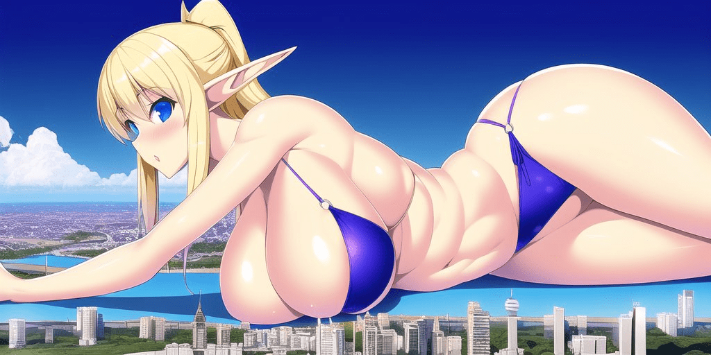

# 現在ai己經能做這麼棒的圖了嗎？

作者：houtizhidu

TID：34212

<title>1</title> <link href="../Styles/Style.css" type="text/css" rel="stylesheet">

# 1

剛剛在twitter上看見的，還真有感覺啊

這個人的twitter上還有更多的
<title>2</title> <link href="../Styles/Style.css" type="text/css" rel="stylesheet">

# 2

 <ignore_js_op>[FireShot Capture 032 - (1) ケロちゃん on Twitter_ _NovelAI最強じゃん… https__.png](forum.php?mod=attachment&aid=OTk2NTV8YjFjZTQ0NGJ8MTY3NDA2OTI4OHwxODIzMHwzNDIxMg%3D%3D&nothumb=yes) *(1.19 MB, 下載次數: 9)*

[下載附件](forum.php?mod=attachment&aid=OTk2NTV8YjFjZTQ0NGJ8MTY3NDA2OTI4OHwxODIzMHwzNDIxMg%3D%3D&nothumb=yes)

2022-10-4 23:40 上傳  

[ ケロちゃん on Twitter_ _NovelAI最強じゃん… https__.png")](javascript:;)</ignore_js_op> <ignore_js_op>[FireShot Capture 033 - (1) ケロちゃん (@sizesatouhaiizo) _ Twitter - twitter.com.png](forum.php?mod=attachment&aid=OTk2NTR8YmVkYTRmMmJ8MTY3NDA2OTI4OHwxODIzMHwzNDIxMg%3D%3D&nothumb=yes) *(1.94 MB, 下載次數: 6)*

[下載附件](forum.php?mod=attachment&aid=OTk2NTR8YmVkYTRmMmJ8MTY3NDA2OTI4OHwxODIzMHwzNDIxMg%3D%3D&nothumb=yes)

2022-10-4 23:40 上傳  

[ ケロちゃん (@sizesatouhaiizo) _ Twitter - twitter.com.png")](javascript:;)</ignore_js_op> <title>3</title> <link href="../Styles/Style.css" type="text/css" rel="stylesheet">

# 3

是的，乍一看确实很不错。
但ai作图质量永远都会小于人类画师的质量
（AI只会模仿人类画师的图片）
但细节上就（例如手或脚）需要更高强度的训练了 <title>4</title> <link href="../Styles/Style.css" type="text/css" rel="stylesheet">

# 4

要是能畫出跟小人互動的圖就更棒了 <title>5</title> <link href="../Styles/Style.css" type="text/css" rel="stylesheet">

# 5

*本帖最後由 Fid 於 2022-10-5 00:26 編輯*

[https://twitter.com/Muacca/status/1575770432468180992](https://twitter.com/Muacca/status/1575770432468180992)
AI從原本頂多畫背景.到現在調整畫人物能越畫越精細了
雖然畫小人和女巨人互動可能還不行.AI資料庫沒有足夠樣本供學習.但畫單圖已經沒問題

繼續累積下去和給AI學習.真的不是大手也沒有獨特畫風的中下級繪師
日子可能不好過.雖然可能會從學修圖開始?

<title>6</title> <link href="../Styles/Style.css" type="text/css" rel="stylesheet">

# 6

雖然AI的GTS圖在質方面
跟多數在追的畫師有一定的差距
但AI能靠量取勝啊

很多時候只要有70分就能讓我們爽上一兩天了
而AI的生產量
可說是給不挑食的人無盡的資源啊 <title>7</title> <link href="../Styles/Style.css" type="text/css" rel="stylesheet">

# 7

> [MonGreen 發表於 2022-10-4 23:50](https://giantessnight.cf/gnforum2012/forum.php?mod=redirect&goto=findpost&pid=517112&ptid=34212)
> 是的，乍一看确实很不错。
> 但ai作图质量永远都会小于人类画师的质量
> （AI只会模仿人类画师的图片）

也不一定呢。毕竟所谓的Machine Learning就是要让电脑用电脑的方式“学会”怎么画出人类看着开心的图画。

虽然目前来说，在不论任何艺术领域，非人都做不到创作出比人类创作出的更让人类满意的作品。但是发展空间还是有的。

毕竟用着Machine Learning，电脑可以更高效率的产出更多的作品，然后评价鉴赏作品的人总是比创作的人要多的。所以可能电脑可以快速的得到Feedback来让自己变得更优秀。

<title>8</title> <link href="../Styles/Style.css" type="text/css" rel="stylesheet">

# 8

> [nijack89 發表於 2022-10-5 00:40](https://giantessnight.cf/gnforum2012/forum.php?mod=redirect&goto=findpost&pid=517123&ptid=34212)
> 雖然AI的GTS圖在質方面
> 跟多數在追的畫師有一定的差距
> 但AI能靠量取勝啊

嗯，而且我最看好的是AI制作色色文章的能力。

明明现在的技术其实非常适合并擅长制作色色文章。但是几个大家的公司和项目都有不许色色的规定……

也有道理，毕竟每个公司的AI都是一个大整体，所以如果你去Open AI GPT-3的沙盒里生产大量的色色，整个整体都会被影响的更加色色。
<title>9</title> <link href="../Styles/Style.css" type="text/css" rel="stylesheet">

# 9

只能说，过不了几年，坛友们这方面的想法都能被实现吧 <title>10</title> <link href="../Styles/Style.css" type="text/css" rel="stylesheet">

# 10

AI作图目前最大的两个阻碍，一是学习的类型太单一且次数不够，很多细节在美术生眼里是禁不起推敲的。二是对电脑配置的要求极高，就算搞个4万多的顶配电脑也就勉强流畅运行，目前还是要服务器才能带的动 <title>11</title> <link href="../Styles/Style.css" type="text/css" rel="stylesheet">

# 11

就是对原画大手不怎么友好，或许以后平台专门买版权可能会好点。 <title>12</title> <link href="../Styles/Style.css" type="text/css" rel="stylesheet">

# 12

质量确实还行，话说有没有ai链接啊，我也想试一试
<title>13</title> <link href="../Styles/Style.css" type="text/css" rel="stylesheet">

# 13

最近在推上經常看到這個NovelAI的圖...

要說的是這個NovelAI的作圖是要收費的 最重要的是這個AI的學習對象是Danbooru 也就是盜圖網
所以在不少人看來這個AI就是收錢偷圖的東西
反正用這東西要小心 <title>14</title> <link href="../Styles/Style.css" type="text/css" rel="stylesheet">

# 14

我去，已经可以这样了吗，时代在进步啊～～～ <title>15</title> <link href="../Styles/Style.css" type="text/css" rel="stylesheet">

# 15

当然，你要把所有gts画师的画作放一块，然后自己调整让ai学习也不是不可以，但是么…… <title>16</title> <link href="../Styles/Style.css" type="text/css" rel="stylesheet">

# 16

对于原创画师影响很大吧。。对于一般嗨皮观众来说这玩意太强了。。强过头了。。
毕竟一般人对画的要求并没有那么高，特别我们这种小众爱好更是要求不高，能有就不错了 <title>17</title> <link href="../Styles/Style.css" type="text/css" rel="stylesheet">

# 17

> [咕咕的攸栗 發表於 2022-10-5 09:09](https://giantessnight.cf/gnforum2012/forum.php?mod=redirect&goto=findpost&pid=517147&ptid=34212)
> AI作图目前最大的两个阻碍，一是学习的类型太单一且次数不够，很多细节在美术生眼里是禁不起推敲的。二是对 ...

居然要用服务器才能带的动，这是最大的阻碍了至于在美术生眼里经不起推敲，对小众爱好还没有影响啦~~  

毕竟就上面这些AI作图就已经对很多人来说很实用了
<title>18</title> <link href="../Styles/Style.css" type="text/css" rel="stylesheet">

# 18

不亏是电脑计算的3D,这个空间感很棒 <title>19</title> <link href="../Styles/Style.css" type="text/css" rel="stylesheet">

# 19

[https://twitter.com/MDZZ_Main/media](https://twitter.com/MDZZ_Main/media)

[https://twitter.com/neu_hiroppe](https://twitter.com/neu_hiroppe)

[https://twitter.com/ai_size](https://twitter.com/ai_size)
這幾個都是用ai繪圖的，質量也是相當高啊

<title>20</title> <link href="../Styles/Style.css" type="text/css" rel="stylesheet">

# 20

 <ignore_js_op>[FeLoBhQXwAMdUX3.png](forum.php?mod=attachment&aid=OTk2Njh8ZDgwYzIwOGJ8MTY3NDA2OTMxNHwxODIzMHwzNDIxMg%3D%3D&nothumb=yes) *(557.82 KB, 下載次數: 2)*

[下載附件](forum.php?mod=attachment&aid=OTk2Njh8ZDgwYzIwOGJ8MTY3NDA2OTMxNHwxODIzMHwzNDIxMg%3D%3D&nothumb=yes)

2022-10-6 01:15 上傳  

</ignore_js_op> <ignore_js_op>[FeTPSwYaMAA7QjC.jpeg](forum.php?mod=attachment&aid=OTk2Njd8ZWNmMDljMWF8MTY3NDA2OTMxNHwxODIzMHwzNDIxMg%3D%3D&nothumb=yes) *(86.87 KB, 下載次數: 1)*

[下載附件](forum.php?mod=attachment&aid=OTk2Njd8ZWNmMDljMWF8MTY3NDA2OTMxNHwxODIzMHwzNDIxMg%3D%3D&nothumb=yes)

2022-10-6 01:15 上傳  

</ignore_js_op> <ignore_js_op>[FeTO0B9aEAYsxGG.jpeg](forum.php?mod=attachment&aid=OTk2NjZ8ZjU4YjhkNTN8MTY3NDA2OTMxNHwxODIzMHwzNDIxMg%3D%3D&nothumb=yes) *(54.13 KB, 下載次數: 1)*

[下載附件](forum.php?mod=attachment&aid=OTk2NjZ8ZjU4YjhkNTN8MTY3NDA2OTMxNHwxODIzMHwzNDIxMg%3D%3D&nothumb=yes)

2022-10-6 01:15 上傳  

</ignore_js_op> <ignore_js_op>[FeCCgFAXgAEVV2J.jpeg](forum.php?mod=attachment&aid=OTk2NjV8ODcwOGU5YzJ8MTY3NDA2OTMxNHwxODIzMHwzNDIxMg%3D%3D&nothumb=yes) *(385.12 KB, 下載次數: 2)*

[下載附件](forum.php?mod=attachment&aid=OTk2NjV8ODcwOGU5YzJ8MTY3NDA2OTMxNHwxODIzMHwzNDIxMg%3D%3D&nothumb=yes)

2022-10-6 01:15 上傳  

</ignore_js_op> <ignore_js_op>[FeOh-asXkAEk_Q3.jpeg](forum.php?mod=attachment&aid=OTk2NjR8MDdiNjcyMDZ8MTY3NDA2OTMxNHwxODIzMHwzNDIxMg%3D%3D&nothumb=yes) *(146.98 KB, 下載次數: 2)*

[下載附件](forum.php?mod=attachment&aid=OTk2NjR8MDdiNjcyMDZ8MTY3NDA2OTMxNHwxODIzMHwzNDIxMg%3D%3D&nothumb=yes)

2022-10-6 01:13 上傳  

</ignore_js_op> <ignore_js_op>[FeB9b07X0AATBuW.jpeg](forum.php?mod=attachment&aid=OTk2NjN8YWJmYTMzMzJ8MTY3NDA2OTMxNHwxODIzMHwzNDIxMg%3D%3D&nothumb=yes) *(326.58 KB, 下載次數: 2)*

[下載附件](forum.php?mod=attachment&aid=OTk2NjN8YWJmYTMzMzJ8MTY3NDA2OTMxNHwxODIzMHwzNDIxMg%3D%3D&nothumb=yes)

2022-10-6 01:13 上傳  

</ignore_js_op> <title>21</title> <link href="../Styles/Style.css" type="text/css" rel="stylesheet">

# 21

> [andywong29 發表於 2022-10-6 01:15](https://giantessnight.cf/gnforum2012/forum.php?mod=redirect&goto=findpost&pid=517198&ptid=34212)
> https://twitter.com/MDZZ_Main/media
> 
> https://twitter.com/neu_hiroppe

这质感也太棒了,我用关键字根本做不出这样的图,不知道可不可以分享关键字给我呢
<title>22</title> <link href="../Styles/Style.css" type="text/css" rel="stylesheet">

# 22

> [archer 發表於 2022-10-5 21:15](https://giantessnight.cf/gnforum2012/forum.php?mod=redirect&goto=findpost&pid=517182&ptid=34212)
> 居然要用服务器才能带的动，这是最大的阻碍了至于在美术生眼里经不起推敲，对小众爱好还没有影响啦~~  :d ...

其實不用 Nvidia的消費者顯卡已經能自己離線算圖了
最吃資源的是跑一大堆圖獲得模型的過程 但最後模型本身只有3、4GB上下 要用關鍵字產圖只要中高階電腦主機就夠了
Novel AI沒有公佈他們的模型 又比其他公開模型的品質穩幾倍才能這樣收費 但社群流通的模型遲早也會達到這種水準
現在已經有Lewd Diffusion 還有一堆Furry和彩虹小馬的變體 說真的Giantess Diffusion的出現也只是時間問題罷了

<title>23</title> <link href="../Styles/Style.css" type="text/css" rel="stylesheet">

# 23

> [咕咕的攸栗 發表於 2022-10-5 09:09](https://giantessnight.cf/gnforum2012/forum.php?mod=redirect&goto=findpost&pid=517147&ptid=34212)
> AI作图目前最大的两个阻碍，一是学习的类型太单一且次数不够，很多细节在美术生眼里是禁不起推敲的。二是对 ...

刚开始电脑不也是大头机么 慢慢发展成随身携带的手机了 这个估计以后发展可以用最小的内存画最多的图 后期可能用ai给他一个标题就能直接做一个番的程度也不是不可能
<title>24</title> <link href="../Styles/Style.css" type="text/css" rel="stylesheet">

# 24

> [archer 發表於 2022-10-5 21:12](https://giantessnight.cf/gnforum2012/forum.php?mod=redirect&goto=findpost&pid=517181&ptid=34212)
> 对于原创画师影响很大吧。。对于一般嗨皮观众来说这玩意太强了。。强过头了。。
> 毕竟一般人对画的要求并没 ...

真的 你要是把推特上啥画师画都喂给ai  真的能画出一模一样的画风来  更可怕的是ai是没有寿命的 等到这些画师没了之后ai 依然可以随意的画出他们的画风，。
<title>25</title> <link href="../Styles/Style.css" type="text/css" rel="stylesheet">

# 25

> [Fid 發表於 2022-10-5 00:24](https://giantessnight.cf/gnforum2012/forum.php?mod=redirect&goto=findpost&pid=517120&ptid=34212)
> https://twitter.com/Muacca/status/1575770432468180992
> AI從原本頂多畫背景.到現在調整畫人物能越畫越精 ...

其实ai最终的训练目标主要是理解自然语言~对于足够强的ai，只要提供的描述足够精确，理论上是可以创作出不输大佬的原创作品的
<title>26</title> <link href="../Styles/Style.css" type="text/css" rel="stylesheet">

# 26

> [狐乐 發表於 2022-10-5 03:43](https://giantessnight.cf/gnforum2012/forum.php?mod=redirect&goto=findpost&pid=517132&ptid=34212)
> 也不一定呢。毕竟所谓的Machine Learning就是要让电脑用电脑的方式“学会”怎么画出人类看着开心的图画。 ...

这种用户级的feedback目前好像还做不到吧~ai创作的每幅图像得到的评价会被返回用于训练吗？
<title>27</title> <link href="../Styles/Style.css" type="text/css" rel="stylesheet">

# 27

> [weizixuan 發表於 2022-10-5 11:23](https://giantessnight.cf/gnforum2012/forum.php?mod=redirect&goto=findpost&pid=517153&ptid=34212)
> 质量确实还行，话说有没有ai链接啊，我也想试一试

同问，坐等一个链接~不过像这样高水平的ai估计是要付费的，而且大概率不便宜。。。
<title>28</title> <link href="../Styles/Style.css" type="text/css" rel="stylesheet">

# 28

我去这么强了吗？最近有空得去看看。我觉得AI搞涩图对像我这种半拉子的画手会受益极大，可以更容易的实现想法。 <title>29</title> <link href="../Styles/Style.css" type="text/css" rel="stylesheet">

# 29

> [gtsssssssssssss 發表於 2022-10-6 22:15](https://giantessnight.cf/gnforum2012/forum.php?mod=redirect&goto=findpost&pid=517252&ptid=34212)
> 其实ai最终的训练目标主要是理解自然语言~对于足够强的ai，只要提供的描述足够精确，理论上是可以创作出 ...

還需要相當的時間給AI訓練學習.現在AI畫手部還不大行.還是要人去修正才能是合格的作品
提出敘述還要適當加入負面提示.才不會出現怪異與獵奇的作品

好的AI繪圖基本都收費.畢竟不是做公益的.但AI目前創造出來的作品
是沒有著作權的.還有侵權疑慮.畢竟做不到無中生有.有的AI繪圖是靠非法盜圖網的資料在學習

<title>30</title> <link href="../Styles/Style.css" type="text/css" rel="stylesheet">

# 30

找到了novelai官网地址和Twitter上一位作者分享的参数
[https://novelai.net/](https://novelai.net/)
[https://pastebin.com/9iSTDaNc](https://pastebin.com/9iSTDaNc)以及楼主截图中的作者地址
[https://twitter.com/sizesatouhaiizo/media](https://twitter.com/sizesatouhaiizo/media)
<title>31</title> <link href="../Styles/Style.css" type="text/css" rel="stylesheet">

# 31

……说实话我对ai绘画是彻底的在商用范畴持否定那个态度的 ai绘画基本都是利用盗版图片进行学习创作，最终的成品也只不过是踩在无数画师尸山血海上的去中心化的盗版罢了…… <title>32</title> <link href="../Styles/Style.css" type="text/css" rel="stylesheet">

# 32

> [gtsssssssssssss 發表於 2022-10-6 22:18](https://giantessnight.cf/gnforum2012/forum.php?mod=redirect&goto=findpost&pid=517254&ptid=34212)
> 这种用户级的feedback目前好像还做不到吧~ai创作的每幅图像得到的评价会被返回用于训练吗？
> ...

嗯，类似于这种用户点个赞，AI就能学习一点的能力还是很容易做到的。

当然，我也不是这个领域的专业，只是一直都喜欢在Youtube上听Two Minute Papers讲一讲而已。
<title>33</title> <link href="../Styles/Style.css" type="text/css" rel="stylesheet">

# 33

> archer 發表於 2022-10-5 21:12
> 对于原创画师影响很大吧。。对于一般嗨皮观众来说这玩意太强了。。强过头了。。
> 毕竟一般人对画的要求并没 ...

确实，有这个质量对于我这种要求不太高的人来说已经足够了，更何况还能量产 <title>34</title> <link href="../Styles/Style.css" type="text/css" rel="stylesheet">

# 34

现在的ai已经这么厉害了吗，感觉多少有点离谱了… <title>35</title> <link href="../Styles/Style.css" type="text/css" rel="stylesheet">

# 35

AI的正确用法应该是辅助绘画
画师输入一个草稿然后AI生成半成品
然后再反复修正直到生成满意的图之后再人工修正出最终结果
画画大量的时间除了用在起稿外就是上色了
如果能作为一个表现概念的工具用还是很棒的
画师倒不是真的都会失业