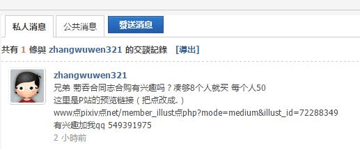
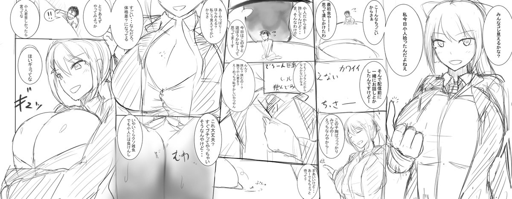

# 現在流行私下暗號購買了？

作者：xxx99

TID：26271

<title>1</title> <link href="../Styles/Style.css" type="text/css" rel="stylesheet">

# 1

為什麽不大大方方的發一個帖子
而是一個個私下發消息呢？
有這個必要嗎？
<ignore_js_op>

**110235832712.jpg** *(18.46 KB, 下載次數: 0)*

[下載附件](forum.php?mod=attachment&aid=NzYwOTZ8NjEyMTI2MTd8MTY3NDA2NjkwMHwxODIzMHwyNjI3MQ%3D%3D&nothumb=yes)

2019-1-10 23:58 上傳

<title>2</title> <link href="../Styles/Style.css" type="text/css" rel="stylesheet">

# 2

怕公開發文會有屁孩來亂吧
也可能是他本人就是來釣魚的所以不敢公開發文

倒是你 是不能先用私訊反問對方嗎 <title>3</title> <link href="../Styles/Style.css" type="text/css" rel="stylesheet">

# 3

*本帖最後由 葬儀社 於 2019-1-11 22:50 編輯*

讓我們先從合購這個行為談起.例子就舉...恩~幾個月前在某QQ群裡有人在招寺田老師的fantia支援+翻譯年(月)套組好了
寺田老師的fantia一個月的支援月費是500日圓轉換成人民幣大概32元.台幣約略是145元.然後成員我們先估算10人(扣除其他人力支出.如招集ˊ人(匯款).翻譯等等)就好
(節省轉換的複雜度.以下以台幣為計算單位)
然後過程中會牽扯到幾個點
1.幫忙匯款與信用卡手續費(6%-4%)
也許你會想大家都是同好.幫個忙匯款又不用花多少功夫或時間.但人家幫你處理事情(如果人多就更麻煩了).又不是欠你什麼債.更不用說過程中可能還牽扯到很多東西之類的(*可能要辦複數帳號.申辦教學).給點小錢體諒別人的辛苦.我個人覺得是必要的.且必要時這些錢還可以堆下來另外處理.至於這些費用一個人一個月算給個50好了.差不多就一個雞排的價錢.不貴不貴

2.翻譯
這個就牽扯到很多東西了.不過基本起意是良好的.畢竟寺田老師蠻多圖都有配文的.如果有人順便可以翻譯好.那用起來一定更爽(?)
關鍵是這工作該找誰呢.理論上要找到是不困難.版上就不少大佬了.私下聊聊溝通溝通說不一定就成了甚至你不會日語都可以DIY.只要不嫌累都可以.不過基於過去翻譯的經驗.最好還是找專業又有意願的上吧(被打
另外除了翻譯本身外.還牽扯到嵌字跟修圖.天下沒有白吃的午餐.想要看得懂得中文字.好歹花些代價.也不用說得太複雜.一個月每人給個30-50.也不算過分.就差不多一塊雞(ry

這樣算下來一個月大概是142(月費)+50(手續費)+50(翻譯)共242元.人民幣大概55元.要說貴.對學生黨來說是有一點.不過對有工作的人來說應該不算什麼.當然跟但大每月所支出的營運費用一比就更不算什麼了

好了.以上都是廢話.

數字金額談完了.我們來說過程中關鍵的利潤.預先設定招集人=匯款人.1人賺40(50-10(匯款手續費)).純付款成員共10人.那麼這位招集者一個月就可拿到400塊.這樣看下來.突然會不會有種"耶~感覺好像挺好賺的喔~".然後基於經濟槓桿只要加入的人越多.賺得就會越多.這樣問題就來了.先前提到額外給的這50元是體諒招集人(匯款人)辛苦的工本費.但突然發現錢可以拿得這麼多.自然會有人覺得"哇幹.這麼好賺我也要!!".爭議就來了.道德倫理責任這些我們姑且都不談.就舉幾個比較實際的方法來解決

1.多的錢存下來當基金:一個月四百塊的利潤.召集人(匯款人)拿兩百算差不多.剩下的錢可以存積下來當未來買圖的費用.大家都知道繪師是接案子賺錢的.IRY的MM系列就是靠本身的人脈與錢請人畫出本子.寺田很多圖也是別人請他畫出來的.所以如果有野心.想要存錢請日本繪師畫個自己喜歡角色的GTS圖其實也不一定是妄想.當然以上只是一個舉例方案而已.

2.自主降低收取金額.一個人多收50元太多.那就自己降少一點就好了.1人20-30元.就算堆到20人賺得也不算多.也就比較少人會說話啦

翻譯組也一樣可以這樣處理.原則上述的問題雖然不一定可以找到完美解.畢竟人都是自私的.召集人覺得自己賺點錢不為過.底下人可能覺得為啥我得多付錢.想找到平衡點其實很難.但我覺得只要金額數據公開.每個月貼張"信用卡匯款紀錄".證明自己有做事.基本上也不會有人故意挑毛病

到這裡為止.都算是理想狀態的合購流程

那麼不合理的合購是怎麼一回事呢?(關鍵字:gtslove)聰明一點其實打一開始就知道.我只要付一人份的月費.然後把圖傳給其他人才是最划算的.不但花的錢少又能造福一堆人.何樂而不為呢?的確這麼做是正確的.從合理性來說.但就情感方面.不就扭曲了最初支援繪師的心意嗎?而且如果有心的話.其實你還可以透過其他管道將錢完整給到寺田老師的戶頭裡.所以即便你只辦一個帳號收一次圖.你還可以把10人份的fantia支援資金給寺田老師.畢竟142塊與1420塊給予的分量是完全不同的.簡述解決這個問題的方法有很多.簡單說三個

1.透過其他管道將匯集的錢給繪師
2.將收取的費用大幅降低.多餘的款項透過其他管道給予
3.(更直接的)將多餘的錢集資做其他事情(委託作畫etc)

都能直接且實際的幫助到繪師.至少比嘴巴說要支援.結果實際上是(恩恩...哈哈...呼呼.你懂得)之類的髒髒事來的好.而且要實行真的不難.只要匯款人把信用卡帳單貼出來給大家看就好了(給不出來就奇怪了).雖說不一定能完全制止自肥.但至少比什麼都沒給強得多.而且有效的控管資金.也能讓版上的翻譯人員多更多的動力.

為啥要私下暗號合購.都說這了.我覺得有點腦子的人都知道為什麼.但人都是懶惰的.只要我花錢拿到我想要的資源不就好了.管他付錢的人是怎麼做
但有時就會因為這種想法.讓真正付出辛勞的人拿不到應有的報酬.只要多一個疑問.多一道手續.多一個人的監督.就能避免這類自肥的情況發生.如果你有心想讓gts圈變得更好的話(笑

*上述簡單個人感想.想噴隨意.最後附上慣例的奶子圖

<ignore_js_op>

**DsR0_liUcAAbgR8.jpg** *(143.79 KB, 下載次數: 0)*

[下載附件](forum.php?mod=attachment&aid=NzYxMTN8MmMwNjdjMDZ8MTY3NDA2NjkwMHwxODIzMHwyNjI3MQ%3D%3D&nothumb=yes)

2019-1-11 22:45 上傳

<title>4</title> <link href="../Styles/Style.css" type="text/css" rel="stylesheet">

# 4

> [葬儀社 發表於 2019-1-11 22:46](https://giantessnight.cf/gnforum2012/forum.php?mod=redirect&goto=findpost&pid=394049&ptid=26271)
> 讓我們先從合購這個行為談起.例子就舉...恩~幾個月前在某QQ群裡有人在招寺田老師的fantia支援+翻譯年(月)套 ...

嗯嗯 原來如此啊奶圖好好看！
<title>5</title> <link href="../Styles/Style.css" type="text/css" rel="stylesheet">

# 5

事实上隔壁 GL 做的更过分，50开团，两人就能凑齐，还不限制参团人数，最后用这些钱买一份，多出来的钱全都变成了站长的运营费。

基于这个事实，如果说能够出现一个50参团，收集到的资金全部都用来买本子，或者只抽取少量佣金的中间人，那么从结果来讲对于作者来说还是有益的。

当然，合购这种事情本身对于创作者来说是一种损害，但就像女权主义强调的所谓我可以骚你不可以扰一样，你自然可以骚，但是你不能保证大街上的雄性动物全都是正人君子，改变不了环境，就只能改变自己。

举例并不恰当，但是希望能够理解我的意思。

<title>6</title> <link href="../Styles/Style.css" type="text/css" rel="stylesheet">

# 6

我是发信息的本人。
首先这不是钓鱼,是确确实实想找人合购这个本子。至于拿扫描版400元是从macrophiliafan那里谈的，他们有一本多下来的实体书，对方给的价格是这样的1000日元（62.78）*1.2+100元（排队费）+（60）运费+扫描费（2*84）。
对于为什么不发公开贴，是因为最新的众筹公开贴是好久以前的了，再考虑到菊吞这么小众的口味，我还不如直接去私下找人筹款，筹款人我也是在菊吞相关的帖子下面找一些看起来比较有兴趣的回复来私发的，以免口味不合导致对方不适。
另外菊吞是小众中的小众口味了，而且日系的菊吞资源更是少之又少，所以难得有这么一个合同志我蛮想看看的。虽然作者隐隐有发布dl版的意思，但是这种合同志牵扯的利益关系多，有不发dl版本的可能性，再加上小众口味更可能没人主动扫，所以我才想着找人付费扫本的。
我也是第一次搞这种重酬，完全没有任何想坑你们钱的意思，大家喜欢，愿意花钱的话就一起买，不喜欢就当没看见得了。</ignore_js_op></ignore_js_op>