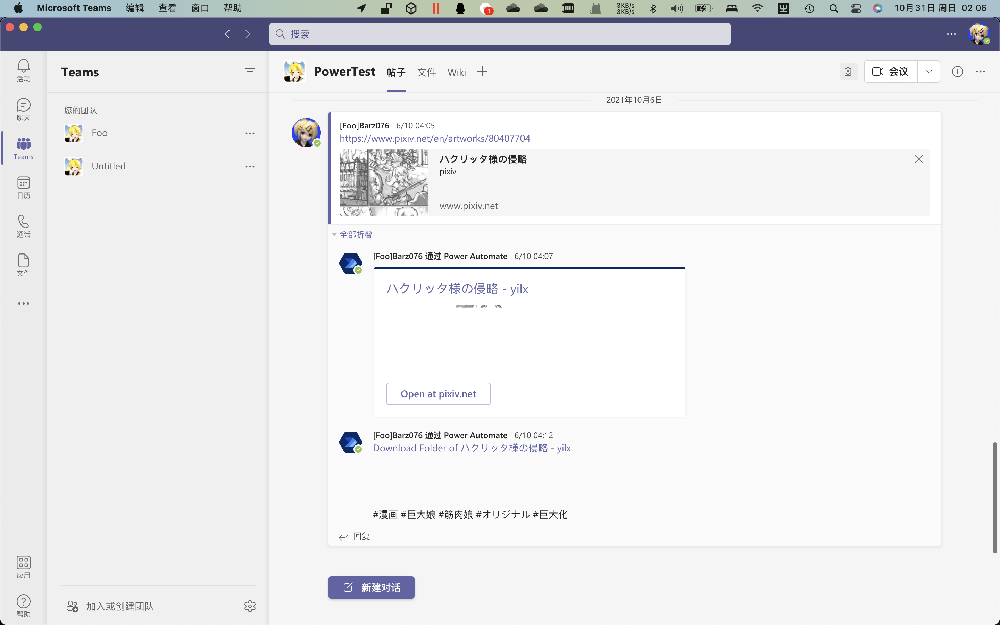

# 用 Microsoft 365 活动 GTS 圈子！（不务正业）

作者：Foobarz

TID：31969

<title>1</title> <link href="../Styles/Style.css" type="text/css" rel="stylesheet">

# 1

首先插播一条鸽子警告： [https://giantessnight.com/gnforum2012/forum.php?mod=redirect&goto=findpost&ptid=31875&pid=483098](https://giantessnight.com/gnforum2012/forum.php?mod=redirect&goto=findpost&ptid=31875&pid=483098)

macOS 版的 RPG Maker MV 不再兼容 macOS BigSur 了，结果就是用 Mac 打开测试项目的话会报错打不开，所以就只有开 Windows 虚拟机改了。（然后电池急速耗尽（x））

* * *

所以 Microsoft 365 是个啥玩意？

你就当是微软把 Office OneDrive Microsoft Teams 以及其它的服务之类的打包卖的服务就行了 ： [https://www.microsoft.com/zh-cn/microsoft-365/business](https://www.microsoft.com/zh-cn/microsoft-365/business)

比如 [Lcxzyr 的 GiantessPan](https://giantessnight.com/gnforum2012/forum.php?mod=viewthread&tid=31594) 其中一条线路用的就是 OneDrive for Business，我之前也用过好几次 Microsoft Forms 来着。我觉得这时候比较有用的就是 Teams 和 OneDrive for Business 了。

OneDrive for Business 用的是 [https://组织名称.sharepoint.com](https://组织名称.sharepoint.com) 这样的域名，貌似还没有像个人版的 onedrive.live.com 一样被墙过的记录。以及也不太可能会像百度网盘或者 QQ 群文件那样隔三差五给你和谐一把。（除非你想在 FBI Open Door 之间疯狂试探）

Microsoft Teams 的话，用起来大概就和一个小号 QQ 差不多，还能和 OneDrive 或者 Power Automate 之类的服务扩展。
<ignore_js_op>

**截屏2021-10-31 02.06.40.png** *(681.4 KB, 下載次數: 0)*

[下載附件](forum.php?mod=attachment&aid=OTE5NzJ8MTNhZjE3MjR8MTY3NDA2NTgwMXwxODIzMHwzMTk2OQ%3D%3D&nothumb=yes)

2021-10-31 02:06 上傳

例如我刚开始用的时候写了一个用 Power Automate 自动下载 Pixiv 图片的脚本，然后还是没人用（x）。

* * *

所以这个要怎么用？

以电子邮件注册成为来宾的话，就能使用包括 Teams 在内的一部分功能了，例如查看组织的 SharePoint 网站和 OneDrive 一类的。
如果想自己有一个（OneDrive 或者 SharePoint 网站）的话，就要有许可证了，这个大多数时候要掏一笔钱。（[定价在这。](https://www.microsoft.com/zh-cn/microsoft-365/business/compare-all-microsoft-365-business-products)）
至于我嘛，除了我自己是掏了钱的，还从 Lcxzyr 等四处学来了白嫖大法嫖了几个许可证。不过白嫖的嘛，肯定没有自己买的那么稳……

因为添加来宾和用户只能是管理员自己加（第三方应用也能关联自助注册，但是我不会写鸭），所以还是先看看各位有没有兴趣了。

<title>2</title> <link href="../Styles/Style.css" type="text/css" rel="stylesheet">

# 2

“ Lcxzyr 的 GiantessPan 其中一条线路用的就是 OneDrive for Business”

事实上，两条线路都是ODfB</ignore_js_op>