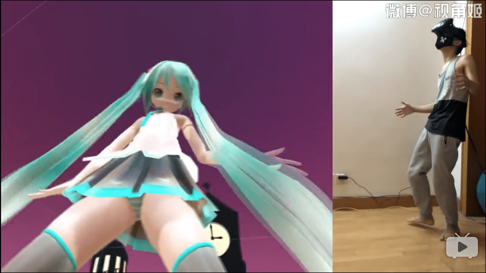
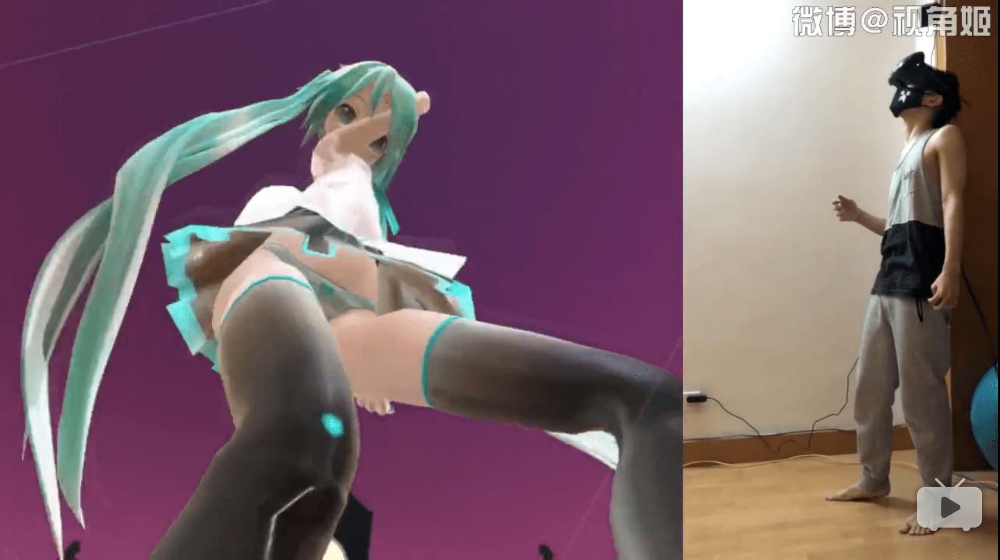

# 用VR观看身临其境的巨大化MMD

作者：兵长有双增高鞋

TID：21683

<title>1</title> <link href="../Styles/Style.css" type="text/css" rel="stylesheet">

# 1

用VR观看身临其境的巨大化MMD
游戏名：MocuMocuDance
bilibili.com/video/av6006520/

通过导入MMD模型和动作模型以及歌曲就可以创建出一个真实的MMD舞台，可以自由调节模型大小
现在的VR设备诸如HTC vive 或者oculus通过这样简单的软件都可以达到如此效果了，将来简直不敢想象。
不过未来是否会出真正意义上的GTS VR游戏还是难以预测，不过看来至少可以打擦边球爽一爽

啊，现在就想入手一部VR设备体验一下

<title>2</title> <link href="../Styles/Style.css" type="text/css" rel="stylesheet">

# 2

 <ignore_js_op>[屏幕快照 2016-08-26 22.58.01.png](forum.php?mod=attachment&aid=NjMzODJ8ZTk2YWViMDl8MTY3NDA2NzUwN3wxODIzMHwyMTY4Mw%3D%3D&nothumb=yes) *(1.68 MB, 下載次數: 35)*

[下載附件](forum.php?mod=attachment&aid=NjMzODJ8ZTk2YWViMDl8MTY3NDA2NzUwN3wxODIzMHwyMTY4Mw%3D%3D&nothumb=yes)

2016-8-26 23:00 上傳  

</ignore_js_op> <ignore_js_op>[屏幕快照 2016-08-26 22.58.25.png](forum.php?mod=attachment&aid=NjMzODF8Zjk2OGI2MDB8MTY3NDA2NzUwN3wxODIzMHwyMTY4Mw%3D%3D&nothumb=yes) *(1.58 MB, 下載次數: 3)*

[下載附件](forum.php?mod=attachment&aid=NjMzODF8Zjk2OGI2MDB8MTY3NDA2NzUwN3wxODIzMHwyMTY4Mw%3D%3D&nothumb=yes)

2016-8-26 22:59 上傳  

</ignore_js_op> <title>3</title> <link href="../Styles/Style.css" type="text/css" rel="stylesheet">

# 3

啊哈哈，视角姬...我昨天发群里忘记丢上来了...
顺便一提，mocumocudance应该是同人软件，目前的物理引擎和原作差很多呢... <title>4</title> <link href="../Styles/Style.css" type="text/css" rel="stylesheet">

# 4

看起来好像很不错啊，，只是不是3D的- - <title>5</title> <link href="../Styles/Style.css" type="text/css" rel="stylesheet">

# 5

只差沒感覺了
太棒了! 害我也想買個VR回家 <title>6</title> <link href="../Styles/Style.css" type="text/css" rel="stylesheet">

# 6

我想知道VR设备到底都需要什么？ <title>7</title> <link href="../Styles/Style.css" type="text/css" rel="stylesheet">

# 7

这个昨天好像有人发过了，这个男的的动作很夸张，而且据说帮他摄像的是他妹妹 <title>8</title> <link href="../Styles/Style.css" type="text/css" rel="stylesheet">

# 8

某宝买个谷歌cardboard二代纸盒，二十块钱上下，加个手机下好橙子vr的app就能体验了 <title>9</title> <link href="../Styles/Style.css" type="text/css" rel="stylesheet">

# 9

楼主并没有生理反应，目测实际一般 <title>10</title> <link href="../Styles/Style.css" type="text/css" rel="stylesheet">

# 10

这个看了。。这个游戏不错 还可以变大。。就是不知道还有没有其他人物可以选择 <title>11</title> <link href="../Styles/Style.css" type="text/css" rel="stylesheet">

# 11

四脚鸡啊，视频是越来越bt了。 <title>12</title> <link href="../Styles/Style.css" type="text/css" rel="stylesheet">

# 12

四脚鸡啊（滑稽）听说他的视频是他妹妹拍的（滑稽x3） <title>13</title> <link href="../Styles/Style.css" type="text/css" rel="stylesheet">

# 13

不错不错，就是没钱买vive <title>14</title> <link href="../Styles/Style.css" type="text/css" rel="stylesheet">

# 14

现在VR猖獗的时代H游戏都已经进军VR领域了 <title>15</title> <link href="../Styles/Style.css" type="text/css" rel="stylesheet">

# 15

这个人就是视角姬，哔哩哔哩上可以找到他的水平，都很正常（shenshi）的的 <title>16</title> <link href="../Styles/Style.css" type="text/css" rel="stylesheet">

# 16

这种感觉肯定很爽，很真实，可是现在没有这样的mmd吧，以后有了绝对会试一试的