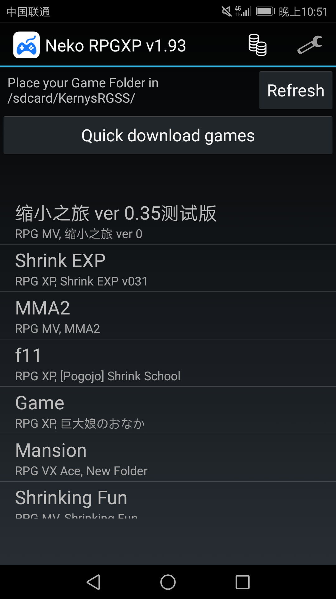
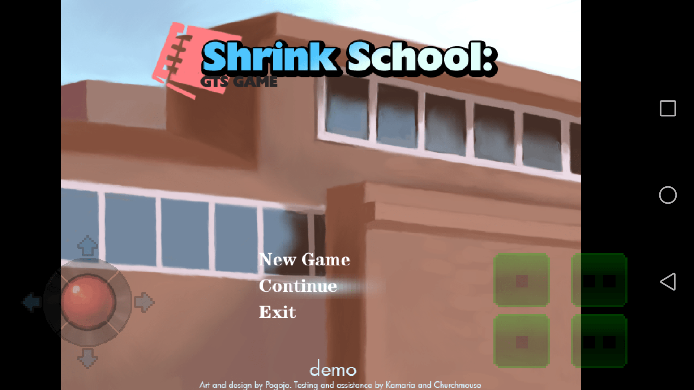

# 用安卓手机可以玩的游戏讨论

作者：dacky508

TID：24872

<title>1</title> <link href="../Styles/Style.css" type="text/css" rel="stylesheet">

# 1

大家一起聊聊手机可以玩的游戏吧，先说我玩过的，最近用nekorpg模拟器在安卓手机玩游戏，发现rpgxp和vx制作的很多都能玩，如图
<ignore_js_op>

**Screenshot_20180406-225124.png** *(228.45 KB, 下載次數: 0)*

[下載附件](forum.php?mod=attachment&aid=NzE4MjZ8NDljZTEyOWF8MTY3NDA2NzE4NHwxODIzMHwyNDg3Mg%3D%3D&nothumb=yes)

2018-4-6 22:54 上傳

游戏界面基本上就这样
<ignore_js_op>

**Screenshot_20180406-225151.png** *(332.42 KB, 下載次數: 0)*

[下載附件](forum.php?mod=attachment&aid=NzE4Mjd8ODhiMWM5NTB8MTY3NDA2NzE4NHwxODIzMHwyNDg3Mg%3D%3D&nothumb=yes)

2018-4-6 22:54 上傳

除此之外，貌似在论坛就见过vr哈比娘可以在手机上玩了，所以想和大家聊聊，还有哪些游戏可以用nekorpg模拟的，或者是可以独立运行的？

<title>2</title> <link href="../Styles/Style.css" type="text/css" rel="stylesheet">

# 2

【沙发啊我的】我的VR哈比娘似乎用手机玩不了，打开是能打开就是没法点击（开了重力感应）。额，好像需要一些设备比如什么眼睛。还有楼主这个游戏缩小学校我怎么从来没有见过，是新游嘛？ <title>3</title> <link href="../Styles/Style.css" type="text/css" rel="stylesheet">

# 3

> [年轻即装逼 發表於 2018-4-6 23:18](https://giantessnight.cf/gnforum2012/forum.php?mod=redirect&goto=findpost&pid=367341&ptid=24872)
> 【沙发啊我的】我的VR哈比娘似乎用手机玩不了，打开是能打开就是没法点击（开了重力感应）。额，好像需要一 ...

那个游戏我之前发在论坛里但被人告知作者不希望分享。。所以删除处理了 <title>4</title> <link href="../Styles/Style.css" type="text/css" rel="stylesheet">

# 4

我印象里哈比娘那个社团的小樱4部曲系列好像也可以在安卓上运行（不过不知道论坛流通的是不是有安卓版）
还有我之前发的一个UCOP2，那个作者也很贴心给了安卓版
<title>5</title> <link href="../Styles/Style.css" type="text/css" rel="stylesheet">

# 5

手机上也能找到这种游戏的吗。。。 <title>6</title> <link href="../Styles/Style.css" type="text/css" rel="stylesheet">

# 6

我就知道缩学可以，其他不知道。 <title>7</title> <link href="../Styles/Style.css" type="text/css" rel="stylesheet">

# 7

> [caruana 發表於 2018-4-7 01:10](https://giantessnight.cf/gnforum2012/forum.php?mod=redirect&goto=findpost&pid=367374&ptid=24872)
> 手机上也能找到这种游戏的吗。。。

我一直用手机……电脑用不上</ignore_js_op></ignore_js_op>