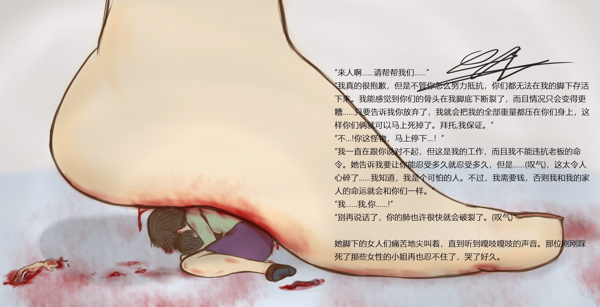

# 由yamumil大佬的一张图引发的感想

作者：jack369605

TID：28844

<title>1</title> <link href="../Styles/Style.css" type="text/css" rel="stylesheet">

# 1

*本帖最後由 jack369605 於 2020-6-6 18:20 編輯*

前段时间在Pixiv发现的大佬yamumil，画风很舒服，内容也比较有意思，而且在介绍里还有剧情，简直太对我等图文并茂党的胃口了。其中有这么一张图，对我触动很大，我把它的介绍翻译出来放在了图片里。
行刑的妹子为了保护自己和家人，不得不慢慢地踩死脚下的母女，简直残酷，但是不知道为何看的心潮澎湃。
巨人妹子说“我需要钱，否则我和我的家人的命运就会和你们一样”，被迫在幕后主使或者环境的压力下踩死缩小的人，而且她出来的也是不情愿和痛苦，这样更符合正常人的心理。（ps:各种作品经常会出现巨大娘抖s的情况，甚至有虐杀的快感，感觉有点突兀，这个图的描写可谓是比较写实了）。
而被缩小的母女为了生存只能向巨人妹子乞求，即使能换来同情，却也逃脱不了死亡的命运。而且从地上的血迹和断肢可以知道这个妹子已经踩死过其他人了。在这种极度恐怖的气氛下，母亲只能做到乞求和愤怒，却无法保护自己和孩子，最后只能在越来越大的压力下绝望地死去。她在混乱中可能无法理解巨人妹子说的老板和钱什么的，但从“我…我，你…！”中可以看出，她也知道妹子不会停下来了，而且妹子也是被迫的。
在这种矛盾下，呈现出了这样一副揪心的画面，虽然在我们看来更多的是刺激就是了。有感而发，说说自己的感想。如果巨人妹子和家人最终还是被缩小，并且到了相同的环境下，她会不会想起死在她脚下的人们呢？我觉得很可能会想“或许这就是报应吧…”

从此就入了这个作者的坑，所以把他p站感觉不错的作品都拔下来了，有剧情的都翻译出来放在图里，悄咪咪的发出来给大家看看吧，很优秀的作者（虽然更新有点慢）。30张图大概十张有翻译，翻了挺久的，毕竟有意思嘛。
[https://pan.baidu.com/s/1k-uX9PRGdkLPtw04w88mhw](https://pan.baidu.com/s/1k-uX9PRGdkLPtw04w88mhw)
提取码:2490
自己看就行了，请不要转载

<title>2</title> <link href="../Styles/Style.css" type="text/css" rel="stylesheet">

# 2

 <ignore_js_op>[the sorrowful execution 1.jpg](forum.php?mod=attachment&aid=ODMzMDZ8M2YzZDZmZGF8MTY3NDA2NjQzNXwxODIzMHwyODg0NA%3D%3D&nothumb=yes) *(992.96 KB, 下載次數: 10)*

[下載附件](forum.php?mod=attachment&aid=ODMzMDZ8M2YzZDZmZGF8MTY3NDA2NjQzNXwxODIzMHwyODg0NA%3D%3D&nothumb=yes)

2020-6-6 17:48 上傳  

</ignore_js_op> <title>3</title> <link href="../Styles/Style.css" type="text/css" rel="stylesheet">

# 3

我的感觉和楼主一样，这种带有更深层次矛盾的剧情，和巨大娘结合起来，更让我冲的起来。顺便，感谢楼主的翻译。