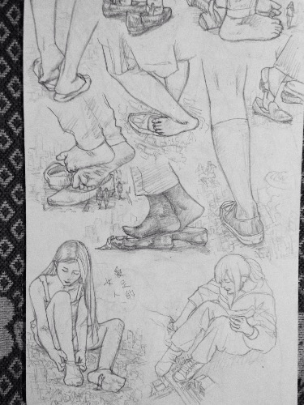

# 画女生之讨论

作者：EIec

TID：22160

<title>1</title> <link href="../Styles/Style.css" type="text/css" rel="stylesheet">

# 1

最近真的奇离古怪的
很久不来论坛了
最近就想说些事
结果花了一个星期拟了n次稿
长篇大论的还是不知怎么说好
结果论坛上不了了又这样落了一个星期
现在能上了还是不知道怎么说才妥当
想来想去
长话短说最好

最近回顾了一下二年来画的画（应该三年了吧）
感慨万千
忽然想起论坛的文章区
一直以来看的文章
感觉与高中生的我口味难以相合
嗯
主要是因为大家文章的设定与内容与我日常生活难以产生共鸣
嗯说白了就是很难代入
（是不是我的口味太独特了啊⋯⋯）
我曾经也想试着写过来展示一下自己的风格
但是发现我打字真的好垃圾
内容都想到后面去了
字还没打完
打完字了
后面的内容都忘了
⋯⋯
总之
我好像什么都不行
唯有作画一下
额发现扯远了
希望各位能为我任性一次
写一下有中国中学生元素的题材吧
也不知道怎么说好
设定大概就如图所示
基本上
就是希望少一些写日式的长筒袜
短裙衬衫什么的
其实中国的蓝白校服也是挺漂亮的
（你们或许是没什么感觉吧）
袜子也可以尝试一下中国学生经常穿的船袜短袜
嗯
说太多了
打字好累
总之拜托各位考虑一下

<title>2</title> <link href="../Styles/Style.css" type="text/css" rel="stylesheet">

# 2

 <ignore_js_op>[image.jpg](forum.php?mod=attachment&aid=NjU1OTd8MmY2ZGNkY2N8MTY3NDA2NzE5N3wxODIzMHwyMjE2MA%3D%3D&nothumb=yes) *(55.86 KB, 下載次數: 5)*

[下載附件](forum.php?mod=attachment&aid=NjU1OTd8MmY2ZGNkY2N8MTY3NDA2NzE5N3wxODIzMHwyMjE2MA%3D%3D&nothumb=yes)

2016-11-15 00:54 上傳  

</ignore_js_op> <ignore_js_op>[image.jpg](forum.php?mod=attachment&aid=NjU2MDN8Mzc2Y2RmZTN8MTY3NDA2NzE5N3wxODIzMHwyMjE2MA%3D%3D&nothumb=yes) *(70.37 KB, 下載次數: 13)*

[下載附件](forum.php?mod=attachment&aid=NjU2MDN8Mzc2Y2RmZTN8MTY3NDA2NzE5N3wxODIzMHwyMjE2MA%3D%3D&nothumb=yes)

2016-11-15 01:11 上傳  

</ignore_js_op> <ignore_js_op>[image.jpg](forum.php?mod=attachment&aid=NjU2MDJ8OWUxMWI4YTR8MTY3NDA2NzE5N3wxODIzMHwyMjE2MA%3D%3D&nothumb=yes) *(58.71 KB, 下載次數: 4)*

[下載附件](forum.php?mod=attachment&aid=NjU2MDJ8OWUxMWI4YTR8MTY3NDA2NzE5N3wxODIzMHwyMjE2MA%3D%3D&nothumb=yes)

2016-11-15 01:10 上傳  

</ignore_js_op> <ignore_js_op>[image.jpg](forum.php?mod=attachment&aid=NjU2MDF8ZmQzMjZkZGN8MTY3NDA2NzE5N3wxODIzMHwyMjE2MA%3D%3D&nothumb=yes) *(54.1 KB, 下載次數: 6)*

[下載附件](forum.php?mod=attachment&aid=NjU2MDF8ZmQzMjZkZGN8MTY3NDA2NzE5N3wxODIzMHwyMjE2MA%3D%3D&nothumb=yes)

2016-11-15 01:09 上傳  

</ignore_js_op> <ignore_js_op>[image.jpg](forum.php?mod=attachment&aid=NjU2MDB8MWEzOGQ4NjJ8MTY3NDA2NzE5N3wxODIzMHwyMjE2MA%3D%3D&nothumb=yes) *(55.16 KB, 下載次數: 3)*

[下載附件](forum.php?mod=attachment&aid=NjU2MDB8MWEzOGQ4NjJ8MTY3NDA2NzE5N3wxODIzMHwyMjE2MA%3D%3D&nothumb=yes)

2016-11-15 00:55 上傳  

</ignore_js_op> <ignore_js_op>[image.jpg](forum.php?mod=attachment&aid=NjU1OTl8OTJkMTBiOTJ8MTY3NDA2NzE5N3wxODIzMHwyMjE2MA%3D%3D&nothumb=yes) *(55.71 KB, 下載次數: 6)*

[下載附件](forum.php?mod=attachment&aid=NjU1OTl8OTJkMTBiOTJ8MTY3NDA2NzE5N3wxODIzMHwyMjE2MA%3D%3D&nothumb=yes)

2016-11-15 00:55 上傳  

</ignore_js_op> <ignore_js_op>[image.jpg](forum.php?mod=attachment&aid=NjU1OTh8MGU1ZWVhNjh8MTY3NDA2NzE5N3wxODIzMHwyMjE2MA%3D%3D&nothumb=yes) *(50.45 KB, 下載次數: 5)*

[下載附件](forum.php?mod=attachment&aid=NjU1OTh8MGU1ZWVhNjh8MTY3NDA2NzE5N3wxODIzMHwyMjE2MA%3D%3D&nothumb=yes)

2016-11-15 00:54 上傳  

</ignore_js_op> <title>3</title> <link href="../Styles/Style.css" type="text/css" rel="stylesheet">

# 3

奇怪怎么图渣成这样
再试试 <title>4</title> <link href="../Styles/Style.css" type="text/css" rel="stylesheet">

# 4

 <ignore_js_op>[image.jpg](forum.php?mod=attachment&aid=NjU2MDd8NDRkZDA0MDN8MTY3NDA2NzE5N3wxODIzMHwyMjE2MA%3D%3D&nothumb=yes) *(55.71 KB, 下載次數: 4)*

[下載附件](forum.php?mod=attachment&aid=NjU2MDd8NDRkZDA0MDN8MTY3NDA2NzE5N3wxODIzMHwyMjE2MA%3D%3D&nothumb=yes)

2016-11-15 01:23 上傳  

</ignore_js_op> <ignore_js_op>[image.jpg](forum.php?mod=attachment&aid=NjU2MDV8YjAzMTVmM2R8MTY3NDA2NzE5N3wxODIzMHwyMjE2MA%3D%3D&nothumb=yes) *(55.86 KB, 下載次數: 5)*

[下載附件](forum.php?mod=attachment&aid=NjU2MDV8YjAzMTVmM2R8MTY3NDA2NzE5N3wxODIzMHwyMjE2MA%3D%3D&nothumb=yes)

2016-11-15 01:22 上傳  

</ignore_js_op> <title>5</title> <link href="../Styles/Style.css" type="text/css" rel="stylesheet">

# 5

我无能为力了
是不是谈天区发图质量不好
图片区的图质量好点？ <title>6</title> <link href="../Styles/Style.css" type="text/css" rel="stylesheet">

# 6

怎么说呢。我觉得大部分在gn的创作者可能都已经过了高中的阶段了吧。到了大学甚至社会人阶段可能很难再能构思高中时期背景的文章了吧。因此就目前看到的来说还是大学、社会以及非日常题材的创作更多一些，这方面也比较好展开，设定也更方便。嗯我是这么觉得的。着装方面就是仁者见仁智者见智了吧，就我个人而言，与看了多年的运动装相比，我肯定是渴望看到不同的着装的，当然运动装也未尝不可，只是已经不再新鲜（也少了一些play=3=）船袜短袜的文章我好像是见到过的0 0
不得不说就现在来讲中国中学生题材的创作确实少（而且回想起来几乎全是学习啊！）（话说回来cg17大大的《缩小的我与恶魔的毕业考试》不就是高中题材嘛！）能有的话也肯定感觉比较新颖吧...大概。
突然想起来某部中国高中题材的galgame=3= <title>7</title> <link href="../Styles/Style.css" type="text/css" rel="stylesheet">

# 7

虽然说从初中就开始步入gts了，但是我现在已经大学毕业不再是骚年了，高中真美好 <title>8</title> <link href="../Styles/Style.css" type="text/css" rel="stylesheet">

# 8

嘛，大家不怎么画/写运动装应该主要是因为露出度不够吧。。。
船袜很常见吗。。。没怎么注意到 <title>9</title> <link href="../Styles/Style.css" type="text/css" rel="stylesheet">

# 9

船袜确实挺常见的。。。但是毫无美感啊……果然袜子还是应该包住整个脚才好看 <title>10</title> <link href="../Styles/Style.css" type="text/css" rel="stylesheet">

# 10

画的真好啊。。喜爱学生妹应该还是有不少。但是估计都是学生吧。。像我们这些30多岁的人 大多喜欢成熟的了。。 <title>11</title> <link href="../Styles/Style.css" type="text/css" rel="stylesheet">

# 11

我觉得楼主画的相当好啊...如果在数位板上画可能图片质量就上去了吧 <title>12</title> <link href="../Styles/Style.css" type="text/css" rel="stylesheet">

# 12

> foronly 發表於 2016-11-15 01:41
> 怎么说呢。我觉得大部分在gn的创作者可能都已经过了高中的阶段了吧。到了大学甚至社会人阶段可能很难再能构 ...

你说的没错，看了这么多文章
我发现你们基本都是步入社会的成年人了
描述的女人一般都是性感又骚的女人⋯⋯
这个有点不适应⋯⋯ <title>13</title> <link href="../Styles/Style.css" type="text/css" rel="stylesheet">

# 13

> seelenerve 發表於 2016-11-15 17:19
> 我觉得楼主画的相当好啊...如果在数位板上画可能图片质量就上去了吧

这个，现在这里画画不是重点哈哈
我只是大概的把我的喜好用图画表达出来了
但是我没用过电脑画画啊 <title>14</title> <link href="../Styles/Style.css" type="text/css" rel="stylesheet">

# 14

> [414215152 發表於 2016-11-15 17:54](https://giantessnight.cf/gnforum2012/forum.php?mod=redirect&goto=findpost&pid=314652&ptid=22160)
> 这个，现在这里画画不是重点哈哈
> 我只是大概的把我的喜好用图画表达出来了
> 但是我没用过电脑画画啊 ...

安啦，你的程度要轉戰電繪綽綽有餘
軟體就PhotoShop、SAI或CLIP PAINT STUDIO隨便挑一個，把照下來的圖匯進去當草稿，開空白圖層，然後用鋼筆工具拉貝茲曲線疊到手稿輪廓上
至於你的寫作困擾，看起來很大一部份是糾結在造型..........那樣練畫畫比較實用吧
<title>15</title> <link href="../Styles/Style.css" type="text/css" rel="stylesheet">

# 15

图色差好蛋，都看不太清楚呐楼主 <title>16</title> <link href="../Styles/Style.css" type="text/css" rel="stylesheet">

# 16

> caoshuhao123456 發表於 2016-11-15 07:50
> 虽然说从初中就开始步入gts了，但是我现在已经大学毕业不再是骚年了，高中真美好 ...

对。清纯的高中真的不错，现在我也即将离开它了 <title>17</title> <link href="../Styles/Style.css" type="text/css" rel="stylesheet">

# 17

> 餃子 發表於 2016-11-15 10:34
> 嘛，大家不怎么画/写运动装应该主要是因为露出度不够吧。。。
> 船袜很常见吗。。。没怎么注意到 ...

那是因为你都关注日本的女生去了啦！
朋友⋯⋯
我身边的女生十有八九是穿船袜的啊 <title>18</title> <link href="../Styles/Style.css" type="text/css" rel="stylesheet">

# 18

> kraistain 發表於 2016-11-15 12:28
> 船袜确实挺常见的。。。但是毫无美感啊……果然袜子还是应该包住整个脚才好看 ...

额
不用超出鞋子的袜子都可以啊
不过还是各有所爱吧 <title>19</title> <link href="../Styles/Style.css" type="text/css" rel="stylesheet">

# 19

> liziming007 發表於 2016-11-15 13:36
> 画的真好啊。。喜爱学生妹应该还是有不少。但是估计都是学生吧。。像我们这些30多岁的人 大多喜欢成熟的了 ...

是啊
我也是这么想
是不是我的年龄偏低了
还在幻想清纯少女风啊
<title>20</title> <link href="../Styles/Style.css" type="text/css" rel="stylesheet">

# 20

> 3213213210 發表於 2016-11-15 20:46
> 安啦，你的程度要轉戰電繪綽綽有餘
> 軟體就PhotoShop、SAI或CLIP PAINT STUDIO隨便挑一個，把照下來的圖匯 ...

电脑什么的什么都听不懂啊
其实画漫画我也试过
不如说我早就幻想过好几次画个漫画来震惊gts界了⋯⋯
结果现在还是这个鸟样
主要是开始画第一集的时候就没耐心了
一心想着跳到高潮部分
前面与gts无关的事情瞬间就不想画了
然后⋯⋯
就这么不了了之了
<title>21</title> <link href="../Styles/Style.css" type="text/css" rel="stylesheet">

# 21

> 我只是路过 發表於 2016-11-15 22:09
> 图色差好蛋，都看不太清楚呐楼主

好吧
过会再在图片区试试看 <title>22</title> <link href="../Styles/Style.css" type="text/css" rel="stylesheet">

# 22

全部帖子回复完毕！！ <title>23</title> <link href="../Styles/Style.css" type="text/css" rel="stylesheet">

# 23

> [414215152 發表於 2016-11-15 23:59](https://giantessnight.cf/gnforum2012/forum.php?mod=redirect&goto=findpost&pid=314703&ptid=22160)
> 电脑什么的什么都听不懂啊
> 其实画漫画我也试过
> 不如说我早就幻想过好几次画个漫画来震惊gts界了⋯⋯

只要有心絕對不難啊，我很確定我給出的名詞只要善用搜索引擎五分鐘內可以搞懂 <title>24</title> <link href="../Styles/Style.css" type="text/css" rel="stylesheet">

# 24

會覺得校服的美好 ，是因為還有那種對校園的憧憬吧，看到校服會想起很多回憶，高中真美好，如何在追女生但又嘗試失敗的種種滋味，也是一種甘甜呢………喔  好像說太多了 hhhh <title>25</title> <link href="../Styles/Style.css" type="text/css" rel="stylesheet">

# 25

very good i like it
非常好我喜歡它 <title>26</title> <link href="../Styles/Style.css" type="text/css" rel="stylesheet">

# 26

> 3213213210 發表於 2016-11-16 00:22
> 只要有心絕對不難啊，我很確定我給出的名詞只要善用搜索引擎五分鐘內可以搞懂 ...

嗯好吧
话说朋友你可以用PS吗
我刚刚又翻到几张以前画的不错的小短漫
可以的话想拍给你PS看看试试效果
拜托啦 <title>27</title> <link href="../Styles/Style.css" type="text/css" rel="stylesheet">

# 27

> [414215152 發表於 2016-11-19 22:43](https://giantessnight.cf/gnforum2012/forum.php?mod=redirect&goto=findpost&pid=315114&ptid=22160)
> 嗯好吧
> 话说朋友你可以用PS吗
> 我刚刚又翻到几张以前画的不错的小短漫

我有最新版PS......你要我幫忙作成電繪圖嗎?
我是OK拉，正好累積經驗也不錯
<title>28</title> <link href="../Styles/Style.css" type="text/css" rel="stylesheet">

# 28

幼儿园就开始画GTS，到现在还不如你画的好 <title>29</title> <link href="../Styles/Style.css" type="text/css" rel="stylesheet">

# 29

> 3213213210 發表於 2016-11-19 23:34
> 我有最新版PS......你要我幫忙作成電繪圖嗎?
> 我是OK拉，正好累積經驗也不錯
> ...

对
拜托你了
我一直都是这样手机拍再传上去
太别扭了
我很少接触过电脑
但也很想看看像日本漫画那样的效果
找个时间再拍
我会尽量拍好点 <title>30</title> <link href="../Styles/Style.css" type="text/css" rel="stylesheet">

# 30

> [414215152 發表於 2016-11-20 23:26](https://giantessnight.cf/gnforum2012/forum.php?mod=redirect&goto=findpost&pid=315280&ptid=22160)
> 对
> 拜托你了
> 我一直都是这样手机拍再传上去

那就等你的圖囉，看是直接放在這個討論串還是私訊都可以
反正我拿到圖應該也要處理很久，細節到時候再討論就好
<title>31</title> <link href="../Styles/Style.css" type="text/css" rel="stylesheet">

# 31

国内的校服，看上去很有亲切感呀 <title>32</title> <link href="../Styles/Style.css" type="text/css" rel="stylesheet">

# 32

画的是真心好。想起来自己的启蒙GTS经历之一，就是一位初中女同学，动人心魄的丝袜脚，小松糕凉鞋。。。那时候年轻啊，没有记录下来 <title>33</title> <link href="../Styles/Style.css" type="text/css" rel="stylesheet">

# 33

突然想起来一个说法：有两种类型的小说容易引起读者兴趣：与日常生活非常接近的，与日常非常遥远的。
不过……高中的日常真的很难写啊，回家被父母看着，在学校被老师看着，到宿舍还有全校的同学看着，个人隐私基本没有，再神奇的日常都经不起连续三年的重复又重复
但这么一说突然激起我的兴趣了？也许哪天试试写一下日常纪念一下刚过去的高中生活也不错？（有生之年，嗯） <title>34</title> <link href="../Styles/Style.css" type="text/css" rel="stylesheet">

# 34

。。。感觉主要是流行日式校服之后再看国内的运动服就总觉得不是一个年代的。。。 <title>35</title> <link href="../Styles/Style.css" type="text/css" rel="stylesheet">

# 35

画风很喜欢，希望坚持，支持 <title>36</title> <link href="../Styles/Style.css" type="text/css" rel="stylesheet">

# 36

我个人觉得船袜真的好难看。。。就从服装搭配的角度来说 <title>37</title> <link href="../Styles/Style.css" type="text/css" rel="stylesheet">

# 37

画风还是不错的,比较喜欢 <title>38</title> <link href="../Styles/Style.css" type="text/css" rel="stylesheet">

# 38

我个人也是喜欢性感的熟女，高跟黑丝之类的，但是船袜呀，高中妹子哇之类的也很不错，但是一般这样的话都是走温柔线路的吧，可能没有其他线路那么刺激。。。所以可能文章比较少。。。。
另外楼主画的真的不错，妹子画的很清纯，足部也很漂亮。。让人想起了青涩的高中时代，哈哈(ಡωಡ)hiahiahia