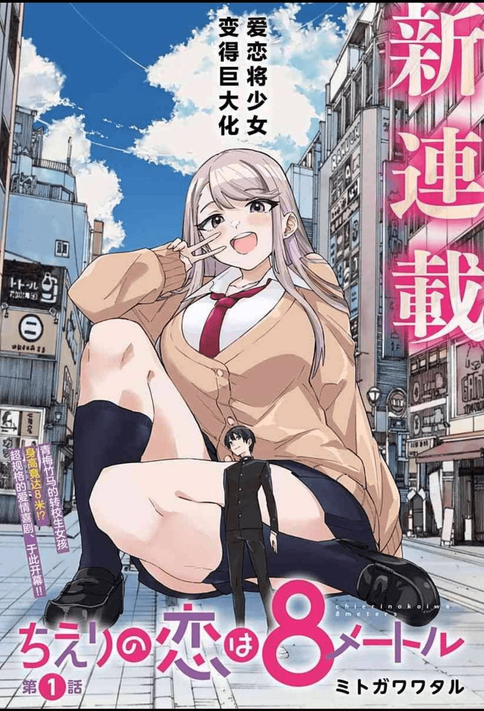
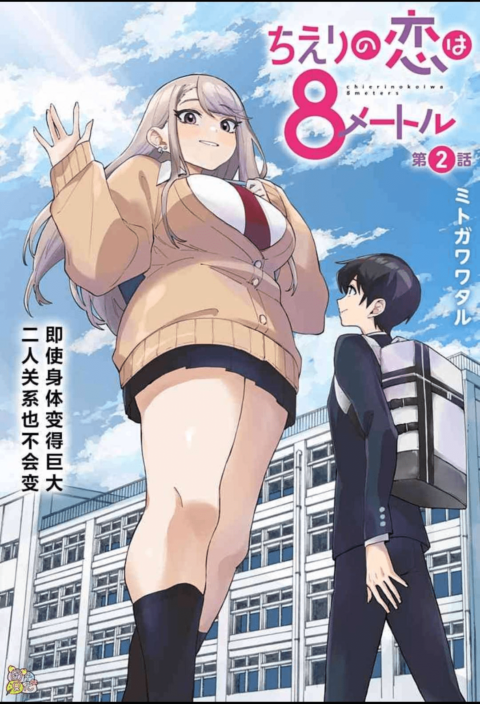
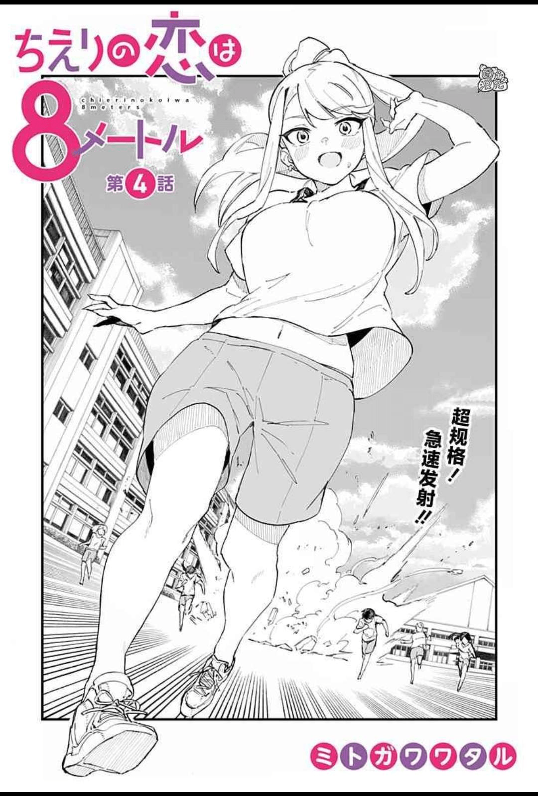
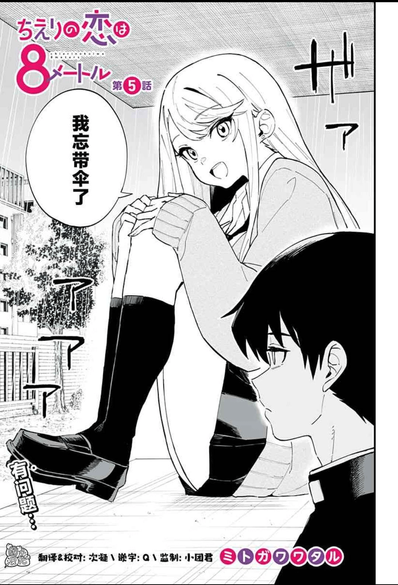

# 画风很棒的新连载《智惠梨的爱情高达8米》

作者：丸子

TID：34339

<title>1</title> <link href="../Styles/Style.css" type="text/css" rel="stylesheet">

# 1

好像刚开连载时在论坛里看到过有人提起，现在有汉化组开坑，已经做了5话了。
虽然作者可能不是圈内人，内容也只是表漫擦边球的水平，但是作画真的非常精细，在巨大娘漫画中算是比例把控非常顶尖的了，看得出来作者的用心，还是非常值得关注的
动漫之家：[https://manhua.dmzj.com/zhihulidaqgdbami](https://manhua.dmzj.com/zhihulidaqgdbami)
<ignore_js_op>

**IMG_20221031_172551_01.jpg** *(193.48 KB, 下載次數: 0)*

[下載附件](forum.php?mod=attachment&aid=MTAwMTkzfGE3NzBhNDRlfDE2NzQwNjkyNTd8MTgyMzB8MzQzMzk%3D&nothumb=yes)

2022-10-31 17:31 上傳

<ignore_js_op>

**IMG_20221031_172907_01.jpg** *(172.64 KB, 下載次數: 0)*

[下載附件](forum.php?mod=attachment&aid=MTAwMTk0fGMyNjQ0OGNmfDE2NzQwNjkyNTd8MTgyMzB8MzQzMzk%3D&nothumb=yes)

2022-10-31 17:31 上傳

<ignore_js_op>

**IMG_20221031_173018_01.jpg** *(176.8 KB, 下載次數: 0)*

[下載附件](forum.php?mod=attachment&aid=MTAwMTk1fDY3MWEyZDdhfDE2NzQwNjkyNTd8MTgyMzB8MzQzMzk%3D&nothumb=yes)

2022-10-31 17:31 上傳

<ignore_js_op>

**IMG_20221031_173021_01.jpg** *(189.29 KB, 下載次數: 0)*

[下載附件](forum.php?mod=attachment&aid=MTAwMTk2fGY1NTg3OTI2fDE2NzQwNjkyNTd8MTgyMzB8MzQzMzk%3D&nothumb=yes)

2022-10-31 17:31 上傳

<ignore_js_op>

**IMG_20221031_173023_01.jpg** *(197.3 KB, 下載次數: 0)*

[下載附件](forum.php?mod=attachment&aid=MTAwMTk3fDJkN2Q2MGJifDE2NzQwNjkyNTd8MTgyMzB8MzQzMzk%3D&nothumb=yes)

2022-10-31 17:31 上傳

<title>2</title> <link href="../Styles/Style.css" type="text/css" rel="stylesheet">

# 2

> [田棒棒 發表於 2022-10-31 17:55](https://giantessnight.cf/gnforum2012/forum.php?mod=redirect&goto=findpost&pid=518665&ptid=34339)
> 估计就跟那个小岛大女什么的一样，过不了二十话就会被腰斩吧

这个人气上的很快，而且意外的非常耐看，我有预感这是那种能动画化的存在
<title>3</title> <link href="../Styles/Style.css" type="text/css" rel="stylesheet">

# 3

> titiwong 發表於 2022-10-31 19:46
> 这个人气上的很快，而且意外的非常耐看，我有预感这是那种能动画化的存在
> ...

每一话的内容太少了，想动画化怎么也得30话之后了，而且要人气够足才行。 <title>4</title> <link href="../Styles/Style.css" type="text/css" rel="stylesheet">

# 4

只有纯爱的话后面剧情很难画下去呢 <title>5</title> <link href="../Styles/Style.css" type="text/css" rel="stylesheet">

# 5

霍，看的还是挺不错的。这就去看一下。感谢楼主！ <title>6</title> <link href="../Styles/Style.css" type="text/css" rel="stylesheet">

# 6

这漫画非常的可爱，纯爱yyds！我肯定会一直支持下去的 <title>7</title> <link href="../Styles/Style.css" type="text/css" rel="stylesheet">

# 7

8米，就是1.60米的五倍，那位巨大浅见弘子是40米?刚好也是8米的五倍 <title>8</title> <link href="../Styles/Style.css" type="text/css" rel="stylesheet">

# 8

已经追了好久了不过题材恋爱喜剧有可能会被限制 <title>9</title> <link href="../Styles/Style.css" type="text/css" rel="stylesheet">

# 9

谢谢推荐！很不错，画风很细腻，很喜欢</ignore_js_op></ignore_js_op></ignore_js_op></ignore_js_op></ignore_js_op>