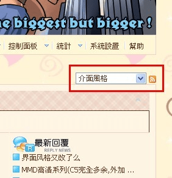

# 界面风格又改了么

作者：無間道

TID：11015

<title>1</title> <link href="../Styles/Style.css" type="text/css" rel="stylesheet">

# 1

话说今天改了才发现，原来缩小学院的界面名字叫苹果树下啊。。。
你妹哪有那么高的苹果树啊！（掀桌
PS：深夜打字漏了一个。。。

[ *本帖最後由 shendanxiaogui 於 2011-9-18 23:35 編輯* ] <title>2</title> <link href="../Styles/Style.css" type="text/css" rel="stylesheet">

# 2

.
蘋果樹是一種感覺，一種概念。就像牛頓當初領悟了真理那樣，蘋果樹帶給我們至高的平靜與最終的救贖。

所以蘋果樹你看不到，但祂依然存在。

--
回到正題，不覺得新風格其實也很不錯嗎？
估計以前沒幾個人挑這個風格當預設用。 <title>3</title> <link href="../Styles/Style.css" type="text/css" rel="stylesheet">

# 3

新的界面很漂亮啊 <title>4</title> <link href="../Styles/Style.css" type="text/css" rel="stylesheet">

# 4

新的界面。。额，怎么说呢！感觉看起来有点变扭。 <title>5</title> <link href="../Styles/Style.css" type="text/css" rel="stylesheet">

# 5

從最初就是用這個風格的路過
這風格整體視覺觀感比較舒服

 不過看不到原本的少女了還是有點寂寞qwq

[ *本帖最後由 s21117307 於 2011-9-19 02:33 編輯* ] <title>6</title> <link href="../Styles/Style.css" type="text/css" rel="stylesheet">

# 6

這界面風格可以隨意的更改嗎? <title>7</title> <link href="../Styles/Style.css" type="text/css" rel="stylesheet">

# 7

> 原帖由 *CEW* 於 2011-9-19 08:59 發表 
> 這界面風格可以隨意的更改嗎?

.
如下圖

<ignore_js_op>

**未命名.jpg** *(25.82 KB, 下載次數: 0)*

[下載附件](forum.php?mod=attachment&aid=MjYxNzB8MGU5ZmIyZTV8MTY3NDA2ODc1M3wxODIzMHwxMTAxNQ%3D%3D&nothumb=yes)

2011-9-19 10:32 上傳

可以自由更換十多種風格。 <title>8</title> <link href="../Styles/Style.css" type="text/css" rel="stylesheet">

# 8

好像是V姐的风格呀。 <title>9</title> <link href="../Styles/Style.css" type="text/css" rel="stylesheet">

# 9

进入登陆页面，哦，原来又换了，反正都习惯了 <title>10</title> <link href="../Styles/Style.css" type="text/css" rel="stylesheet">

# 10

雖然不知道爲什麽但是好厲害哦！
蘋果樹是什麽東西，在下看到的是愛心彈幕欸……
（no one不如用none...?
放開那隻Miku！
Giantess Night那幾個字母倒是華麗到不行，可以擺到煉成陣上去了，搞不好可以造出賢者之石也不一定XD <title>11</title> <link href="../Styles/Style.css" type="text/css" rel="stylesheet">

# 11

話說蘋果與牛頓的故事不是很有可能是假的么？

眾人：去死啦，還我童年。 

被拖走.......... <title>12</title> <link href="../Styles/Style.css" type="text/css" rel="stylesheet">

# 12

新界面表示喜欢...
话说这是今天换的？
于是继续作业区…… <title>13</title> <link href="../Styles/Style.css" type="text/css" rel="stylesheet">

# 13

没有最大只有更大。。。
好带感啊教练！ <title>14</title> <link href="../Styles/Style.css" type="text/css" rel="stylesheet">

# 14

這圖 有完整版嗎XD <title>15</title> <link href="../Styles/Style.css" type="text/css" rel="stylesheet">

# 15

圖題是一個重點+爆點,這句話驚喜十足 <title>16</title> <link href="../Styles/Style.css" type="text/css" rel="stylesheet">

# 16

壁纸越来越日式化
界面越来越温柔化
视力越来越近视化 <title>17</title> <link href="../Styles/Style.css" type="text/css" rel="stylesheet">

# 17

V.............姐V5...... <title>18</title> <link href="../Styles/Style.css" type="text/css" rel="stylesheet">

# 18

挺新颖的嘛！gn经常换风格，所以经常给人眼前一亮的感觉，这很好嘛。不习惯的同志们，也可以自己换。
突然想到了，我家新房装修用的壁纸 <title>19</title> <link href="../Styles/Style.css" type="text/css" rel="stylesheet">

# 19

 小姑娘的主页 既是感</ignore_js_op>