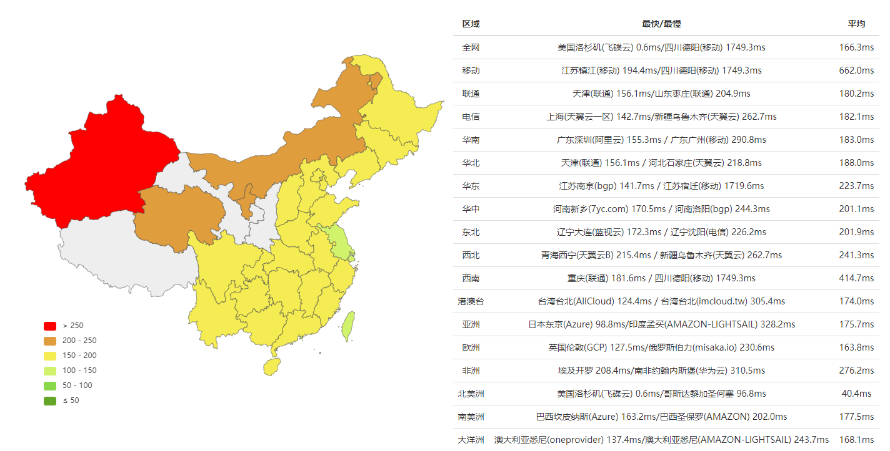

# 疑似GN大陸多地可直连

作者：zhangxiyan

TID：28477

<title>1</title> <link href="../Styles/Style.css" type="text/css" rel="stylesheet">

# 1

偶然发现直连成功，测了下，大陸许多地方可以直连了

<ignore_js_op>

**gn.PNG** *(137.31 KB, 下載次數: 0)*

[下載附件](forum.php?mod=attachment&aid=ODIzNjh8YTg3YWM5MGZ8MTY3NDA2ODYwNnwxODIzMHwyODQ3Nw%3D%3D&nothumb=yes)

2020-4-12 03:49 上傳

灰色地区无法直连，颜色代表连接延时
<title>2</title> <link href="../Styles/Style.css" type="text/css" rel="stylesheet">

# 2

这么秀的吗？666啊  不过为啥突然又能直连了？ <title>3</title> <link href="../Styles/Style.css" type="text/css" rel="stylesheet">

# 3

防火墙变低了？。。。。。。 <title>4</title> <link href="../Styles/Style.css" type="text/css" rel="stylesheet">

# 4

卧槽别吓我？
我搬走梯子试试看233 <title>5</title> <link href="../Styles/Style.css" type="text/css" rel="stylesheet">

# 5

我也测了一下，感觉不太星的样子？墙君变松大概率是不可能的事情，只会随着一次又一次的事件变严。 <title>6</title> <link href="../Styles/Style.css" type="text/css" rel="stylesheet">

# 6

我用私人DNS防劫持，访问起来没压力，还有几个网站也是
<title>7</title> <link href="../Styles/Style.css" type="text/css" rel="stylesheet">

# 7

> [[数据删除] 發表於 2020-4-12 09:53](https://giantessnight.cf/gnforum2012/forum.php?mod=redirect&goto=findpost&pid=432914&ptid=28477)
> 卧槽别吓我？
> 我搬走梯子试试看233

当然不行。。。
坐标山东。。。
<title>8</title> <link href="../Styles/Style.css" type="text/css" rel="stylesheet">

# 8

不是改下HOST就能上么 <title>9</title> <link href="../Styles/Style.css" type="text/css" rel="stylesheet">

# 9

170+ping的话可能比较困难 <title>10</title> <link href="../Styles/Style.css" type="text/css" rel="stylesheet">

# 10

改host似乎一直可以直连( <title>11</title> <link href="../Styles/Style.css" type="text/css" rel="stylesheet">

# 11

貌似成功了？？？坐标浙江 宁波 <title>12</title> <link href="../Styles/Style.css" type="text/css" rel="stylesheet">

# 12

坐标湖南湘潭，可以直连！
感谢（虽然有梯子 <title>13</title> <link href="../Styles/Style.css" type="text/css" rel="stylesheet">

# 13

还是改host更高效直接，不管墙变高变矮都能直连，论坛里就有人分享方法 <title>14</title> <link href="../Styles/Style.css" type="text/css" rel="stylesheet">

# 14

作为灰色区域，我还是老老实实的买VPN吧，尴尬，有时候偶尔会回光返照连接上 <title>15</title> <link href="../Styles/Style.css" type="text/css" rel="stylesheet">

# 15

> [宇宙巨娘大和号 發表於 2020-4-27 20:15](https://giantessnight.cf/gnforum2012/forum.php?mod=redirect&goto=findpost&pid=434720&ptid=28477)
> 还是改host更高效直接，不管墙变高变矮都能直连，论坛里就有人分享方法

问题是非越狱/root的手机，是不能改hosts的
<title>16</title> <link href="../Styles/Style.css" type="text/css" rel="stylesheet">

# 16

好像并不行。难受 <title>17</title> <link href="../Styles/Style.css" type="text/css" rel="stylesheet">

# 17

不行啊，是不是系统升级的间隙</ignore_js_op>