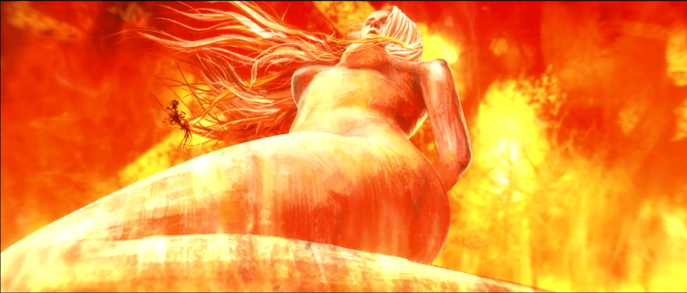

# 疯味英雄第十一话出现了GTS

作者：Mannheim

TID：21090

<title>1</title> <link href="../Styles/Style.css" type="text/css" rel="stylesheet">

# 1

如题，顺便来张预览。

就算没有GTS也是一部国产良心番，现在喜欢的理由又多了一个(`・ω・´

<ignore_js_op>

**無名の QQ スクリーンショット20160516214333.png** *(754.56 KB, 下載次數: 0)*

[下載附件](forum.php?mod=attachment&aid=NjEzNDR8NjE0Mzg3ZjJ8MTY3NDA2NzQ5MXwxODIzMHwyMTA5MA%3D%3D&nothumb=yes)

2016-5-16 21:49 上傳

<title>2</title> <link href="../Styles/Style.css" type="text/css" rel="stylesheet">

# 2

没看过唉，新番吗？
可以给出地址吗？ <title>3</title> <link href="../Styles/Style.css" type="text/css" rel="stylesheet">

# 3

国不国产没什么，只是不喜欢3d <title>4</title> <link href="../Styles/Style.css" type="text/css" rel="stylesheet">

# 4

哇……怎么可以这么骚气
<title>5</title> <link href="../Styles/Style.css" type="text/css" rel="stylesheet">

# 5

不知道为什么，感觉怪怪的 <title>6</title> <link href="../Styles/Style.css" type="text/css" rel="stylesheet">

# 6

新番吗？回去搜一搜，看起来还不错的样子的说。感谢楼主分享。</ignore_js_op>