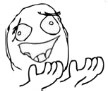

# 病嬌屬性的巨大娘

作者：huhuhu

TID：22029

<title>1</title> <link href="../Styles/Style.css" type="text/css" rel="stylesheet">

# 1

*本帖最後由 BAss926 於 2016-10-21 19:24 編輯*

如題，我預想的巨大娘約略是一般人十倍左右的大小
在不至於讓整個故事走向大虐殺劇情的前提下 ( 可以死人，但是不要死一大堆人 )
你們會用怎樣的方式去描述一個擁有病嬌屬性的巨大娘？
我粗淺的腦袋只覺得她好像會把任何膽敢接近男主角的人的手腳一根一根的拆下來...
而且男主角大概也沒有能力阻止身為巨大娘的女主角吧 
這個嘛，我理解中的 ( 或者該說是「我想像中的」) 病嬌是指...
1.女主角對男主角有著極為強烈的佔有慾，只要有人接近男主角就會覺得很不高興
2.女主角本身心理方面很脆弱，沒有男主角依靠的話會變的很鬱悶、膽小
3.會不擇手段地在各方面儘可能地幫助自己喜歡的男主角
4.男方會對女主角的表現和言論感到不自在甚至害怕

<title>2</title> <link href="../Styles/Style.css" type="text/css" rel="stylesheet">

# 2

楼主，你玩过i-raf-you的姐姐大人是魔女吗那里有一条分支就是病娇属性巨大娘，妹妹把男主哥哥缩小然后玩猫抓（踩）老鼠，女仆抓男主放鞋子里清洁，再有就是内衣地狱，妹妹把男主放到盒子里然后把每天换下来的胖次和bra放到里面.....然后有一段剧情是让男主在内衣（旧）海里翻出她喜欢的一件短裤.......虽然是缩小但是算符合楼主要求吧，，无大量虐杀，单纯玩男主一个，病娇妹妹+女仆。。。楼主如果没玩过还感兴趣的话可以上甜瓜（melon）上面买，GN好像不让放i-raf-you的版权物，所以还是不发了，，，或者我放到游戏区里看看允不允许？ <title>3</title> <link href="../Styles/Style.css" type="text/css" rel="stylesheet">

# 3

呃……大概会用指甲给男主角做了宫刑，把男主角扔进穿着的连裤袜里跷二郎腿碾压，丢进盒子里缸子里喂蜘蛛，用针从肛门扎入口腔扎出，一手攥住男主角身体一手捏住脑袋转一圈什么的。【以上都过于残暴，还请勿作想象】 <title>4</title> <link href="../Styles/Style.css" type="text/css" rel="stylesheet">

# 4

> [luffyoo 發表於 2016-10-21 17:59](https://giantessnight.cf/gnforum2012/forum.php?mod=redirect&goto=findpost&pid=312147&ptid=22029)
> 楼主，你玩过i-raf-you的姐姐大人是魔女吗那里有一条分支就是病娇属性巨大娘，妹妹把男主哥哥缩小然后玩猫 ...

于是到了游戏区看到了14年的禁止游戏列表...还是匿了吧
<title>5</title> <link href="../Styles/Style.css" type="text/css" rel="stylesheet">

# 5

病嬌這屬性我覺得多數人想得太簡單.我覺得病嬌是可以分軟.硬的
硬病嬌就是像樓主說得那樣單純用外力讓主角區服.多數這種光看外表就不太正常.心裡描寫又很弱.加上搞你的方法又很沒品(格調).老實說這種病嬌我萌不太起來.基本就是個長得比較好看的瘋子(耶?病嬌不就是這樣嗎?)

軟病嬌就很高竿了.因為他的方法五花八門.簡單舉例.她會把你身邊朋友.親人.老師.乃至你工作上的同志.通通拉到他自己這邊來.變相得就孤立了你.你可以想像一下你如果討厭一個女的.偏偏身邊所有人都跟你說你跟他最速配.你怎麼解釋都沒用.那種無力感.加上被24小時洗腦的"教育".我覺得不比你斷他手腳來的輕.

更何況獵奇手法久了只會讓人沒生存意志.要傷人也是讓他知道違反他會很痛苦.不用真的要讓她承受過.例如在他眼前把肉塊丟進絞碎機絞碎.再用言語威脅他.基本上一留下那種陰影.他想反抗就很難了(絞殺小人也可.但我覺得沒必要(←畢竟本人是溫柔系的).不然縮小他.故意放他在巨人世界活一陣子.讓他了解到除了自己以外.沒人可以救他.那種主角本人不知道你是病嬌.還會感謝你.愛你的才是高竿.軟病嬌我看過幾乎都是品學兼優的大小姐.外表看似人畜無害.但心裡滿是變態的獨佔慾.這種反差才讚!!
除了以上這些.像演戲的方法.自導自演讓你認為他救了你.在培養好感度這種也很常見.

間單的說病嬌你可寫得很簡單.你也可寫得很複雜(前戲要很多.結尾要有爆點).端看作者的功力
說真的軟殘酷這種戲碼.GTS中真的很少見.多數都是直接開殺比較快跟速成.看久真的挺沒勁的
(就跟你說這角色可以一拳打爆銀河系一樣沒有真實感 <title>6</title> <link href="../Styles/Style.css" type="text/css" rel="stylesheet">

# 6

感觉像是从巨大娘与正常体型的人类正常恋爱……变成完全视为蝼蚁……奴役主角……之类的 <title>7</title> <link href="../Styles/Style.css" type="text/css" rel="stylesheet">

# 7

病娇，我喜欢病娇 <title>8</title> <link href="../Styles/Style.css" type="text/css" rel="stylesheet">

# 8

病娇的巨大娘会很恐怖的吧，被各种残忍的方法折磨致死... <title>9</title> <link href="../Styles/Style.css" type="text/css" rel="stylesheet">

# 9

看上面的回复都好恐怖，病娇不是虐杀，病娇也是有爱的好么
 <title>10</title> <link href="../Styles/Style.css" type="text/css" rel="stylesheet">

# 10

*本帖最後由 葬儀社 於 2016-10-21 21:32 編輯*

1.女主角對男主角有著極為強烈的佔有慾，只要有人接近男主角就會覺得很不高興
>這是基本要素.不過也有認為對方沒有威脅就無所謂的存在(這種病嬌氣質比較好.也比較會演) 2.女主角本身心理方面很脆弱，沒有男主角依靠的話會變的很鬱悶、膽小
>個人看過的類似情節.很多都是小時候插旗.導致女主角病嬌化(長大之後要跟妳結婚之類的).
不然就是一直處於弱勢的女主被幫助後.就獻身的老梗劇情.不過你說的鬱悶、膽小不是絕對就是
3.會不擇手段地在各方面儘可能地幫助自己喜歡的男主角
>病嬌所謂的幫忙方法跟一般類型女角不同.基本上這是很好的描寫點
4.男方會對女主角的表現和言論感到不自在甚至害怕
不一定.就像我有說到軟病嬌.有些是故事結束男主還傻傻不知道自己被算計了.不然就是故事結局才告訴你
那種後勁比一開始就跟你說我是病嬌來的強烈

我覺得樓主你還是多看一些作品比較好.病嬌不單是那種個性自閉幽暗或像個瘋婆子亂咬的類型
能見度高的都是這種沒錯.可是當你看的類型多了.硬病嬌就沒什麼有趣的了.
你角色要寫得還是要用心去描寫他到底為什麼這麼做.他這麼做時在想什麼.以及故事要怎麼搭配

如果只是寫個病嬌女把縮小男關在房間裡折磨的話.那誰都寫得出來...

<title>11</title> <link href="../Styles/Style.css" type="text/css" rel="stylesheet">

# 11

> [葬儀社 發表於 2016-10-21 21:04](https://giantessnight.cf/gnforum2012/forum.php?mod=redirect&goto=findpost&pid=312169&ptid=22029)
> 1.女主角對男主角有著極為強烈的佔有慾，只要有人接近男主角就會覺得很不高興>這是基本要素.不過也有認為對 ...

独到见解....阁下口中的病娇真是有魅力..只是听你说出来我的内心就有点酥痒的感受..好萌的病娇 <title>12</title> <link href="../Styles/Style.css" type="text/css" rel="stylesheet">

# 12

*本帖最後由 TANGLUNG 於 2016-10-21 16:21 編輯*

病娇很有爱啊！我个人比较喜欢那种对自己喜欢的人很温柔，不会伤害他/她，但会想方设法的排除掉他/她周围的一切的那种类型……作为巨大娘的话要做到这个也更容易，而且还可以有一些平常没法做到的play，不过对于mega/giga控的我来说十倍大小可能稍微少了一点，为了能和喜欢的人单独在一起把整个城市甚至世界都破坏掉什么的不是也很萌吗？（不过这也仅限于二次元里了，在现实中不管是出现巨大娘还是病娇估计都没几个人吃得消吧，我一同学就是被他的病娇女友害惨了，还好我的女朋友不是这类型的）我现在在写的小说里的女主在中后期也会慢慢病娇化，只是还没想好要怎么样才能让转变稍微自然一点……
<title>13</title> <link href="../Styles/Style.css" type="text/css" rel="stylesheet">

# 13

弄成人棍扔到鞋子里 <title>14</title> <link href="../Styles/Style.css" type="text/css" rel="stylesheet">

# 14

病娇，其实就是极端的【美少女】、【萌】系角色性格的代名词 <title>15</title> <link href="../Styles/Style.css" type="text/css" rel="stylesheet">

# 15

FATE EXTRA贤妻狐篇里13话以后的算么 <title>16</title> <link href="../Styles/Style.css" type="text/css" rel="stylesheet">

# 16

> [luffyoo 發表於 2016-10-21 17:59](https://giantessnight.cf/gnforum2012/forum.php?mod=redirect&goto=findpost&pid=312147&ptid=22029)
> 楼主，你玩过i-raf-you的姐姐大人是魔女吗那里有一条分支就是病娇属性巨大娘，妹妹把男主哥哥缩小然后玩猫 ...

我知道MM是有数字编号的，哪个姐姐大人是魔女吗是哪个数字编号啊？