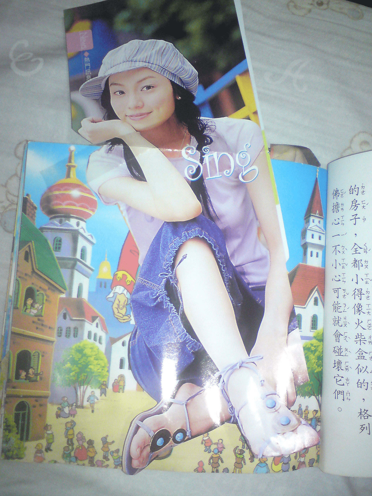
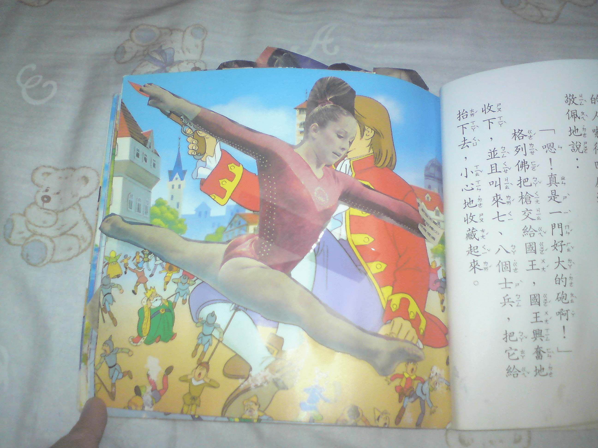
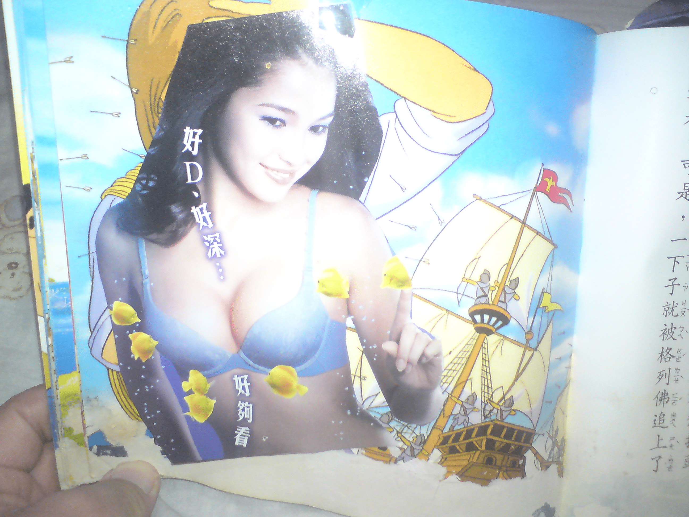

# 發個可愛的東西,你一定會喚起記憶的...

作者：Solexight

TID：6407

<title>1</title> <link href="../Styles/Style.css" type="text/css" rel="stylesheet">

# 1

在資訊還不發達的時候

或是在我們這些GTS偏好的GROUPS還沒出現之前......

可能你也做過這些事吧...

這是我用童話書-格列佛遊記+上報章雜誌混合的

我那時大概才剛上小學吧= =

其實很氣為什麼主角不是女的......

所以就自己改啦...

整理書櫃的時候發現的,來給同好分享哈哈

純粹是小弟的回憶 <title>2</title> <link href="../Styles/Style.css" type="text/css" rel="stylesheet">

# 2

 <ignore_js_op>[DSC03968.JPG](forum.php?mod=attachment&aid=MTY2NzV8ZTQ1MThjZGV8MTY3NDA2ODk0NXwxODIzMHw2NDA3&nothumb=yes) *(1.42 MB, 下載次數: 0)*

[下載附件](forum.php?mod=attachment&aid=MTY2NzV8ZTQ1MThjZGV8MTY3NDA2ODk0NXwxODIzMHw2NDA3&nothumb=yes)

2010-1-22 23:30 上傳  

</ignore_js_op> <ignore_js_op>[DSC03967.JPG](forum.php?mod=attachment&aid=MTY2NzZ8MjVmZmZkNDd8MTY3NDA2ODk0NXwxODIzMHw2NDA3&nothumb=yes) *(1.4 MB, 下載次數: 0)*

[下載附件](forum.php?mod=attachment&aid=MTY2NzZ8MjVmZmZkNDd8MTY3NDA2ODk0NXwxODIzMHw2NDA3&nothumb=yes)

2010-1-22 23:30 上傳  

</ignore_js_op> <ignore_js_op>[DSC03973.JPG](forum.php?mod=attachment&aid=MTY2Nzd8OGY4OWQxYjJ8MTY3NDA2ODk0NXwxODIzMHw2NDA3&nothumb=yes) *(1.37 MB, 下載次數: 0)*

[下載附件](forum.php?mod=attachment&aid=MTY2Nzd8OGY4OWQxYjJ8MTY3NDA2ODk0NXwxODIzMHw2NDA3&nothumb=yes)

2010-1-22 23:30 上傳  

</ignore_js_op> <title>3</title> <link href="../Styles/Style.css" type="text/css" rel="stylesheet">

# 3

呃...如果是這樣的話,我建議幻想去。 <title>4</title> <link href="../Styles/Style.css" type="text/css" rel="stylesheet">

# 4

SF,这个...汗 我都没有向这个方面去想... <title>5</title> <link href="../Styles/Style.css" type="text/css" rel="stylesheet">

# 5

楼上的楼上霸了我的SF <title>6</title> <link href="../Styles/Style.css" type="text/css" rel="stylesheet">

# 6

我沒用過這方法XDD <title>7</title> <link href="../Styles/Style.css" type="text/css" rel="stylesheet">

# 7

我小时候经常到学校旁的书店租漫画回家看，偶尔发现GTS桥段时，便偷偷把那几页剪下来，装订成册……

--------------------------------------

我错了。 <title>8</title> <link href="../Styles/Style.css" type="text/css" rel="stylesheet">

# 8

樓主這種""純""手工的方式，我還真的沒試過 <title>9</title> <link href="../Styles/Style.css" type="text/css" rel="stylesheet">

# 9

直接看大人国游记不就ok了吗？ <title>10</title> <link href="../Styles/Style.css" type="text/css" rel="stylesheet">

# 10

0.0...
還真的沒看過純手工的
樓主猛人
XDD <title>11</title> <link href="../Styles/Style.css" type="text/css" rel="stylesheet">

# 11

楼主人才。。。 <title>12</title> <link href="../Styles/Style.css" type="text/css" rel="stylesheet">

# 12

好說好說..

因為那時候年紀真的太小

家裡連電腦都沒有啊....

哈哈 這種行為 當然就是自然而然的摟..... <title>13</title> <link href="../Styles/Style.css" type="text/css" rel="stylesheet">

# 13

楼主果然是人才
其实我也这么玩过 <title>14</title> <link href="../Styles/Style.css" type="text/css" rel="stylesheet">

# 14

我小時候有這本格列佛遊記!!
真令人懷念