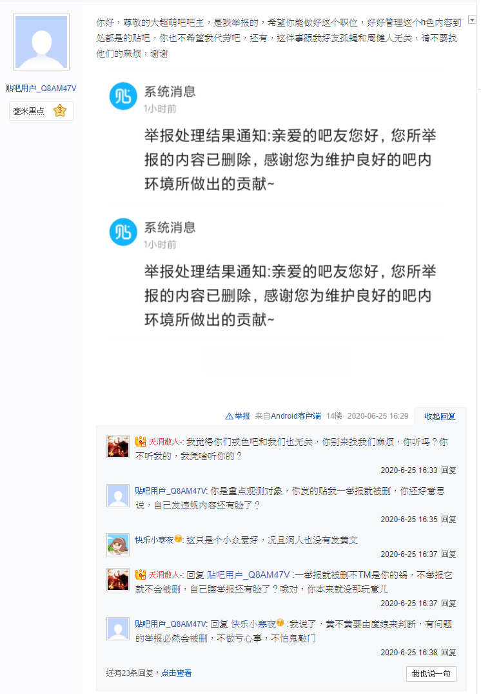

# 百度贴吧为什么老是喜欢删帖啊？前天发的文今天再找就...

作者：罗绘尼發

TID：28978

<title>1</title> <link href="../Styles/Style.css" type="text/css" rel="stylesheet">

# 1

*本帖最後由 神父桑 於 2020-6-26 20:26 編輯*

前天有点灵感顺便先在百度贴吧（国内百度的一款社交软体，跟台湾的ptt交流论坛类似）发篇短文，（原本打算是在大超萌吧更完了再搬gn来）刚发了开头六百多字，今天再准备更新下就被删掉了。。。搞得我写文的热情一下子熄灭了，（反正每次写文都只有三天热度，无所谓了）因为我根本没留备份。。。也不知道是吧务还是系统删的，反正百度的环境确实是越来越苛刻了。以前的巨大少女，巨大少女2，gts，gtss，gtsss，gtssss现在全没了，剩下个阉割版的大超萌，有点莫名怀念12年那段时候。 <title>2</title> <link href="../Styles/Style.css" type="text/css" rel="stylesheet">

# 2

百度贴吧现在只要举报文章，基本上第二天就会被删......
我手机贴吧客户端现在还留着gtsss...（好像是六个还是八个“s”，忘了）里的帖子，不过点开就是文章不存在或者被删除。当初在贴吧看文比上gn要方便，对于大陆苹果用户来说gn要梯子还是不那么方便（尤其是gj打击梯子之后）。 <title>3</title> <link href="../Styles/Style.css" type="text/css" rel="stylesheet">

# 3

国内的环境是这样的。
都默认大家是纯洁不得半点污染的小孩子，结果只能一刀切，前几年之前传的沸沸扬扬的游戏分级也根本没有任何用，游戏不能见血，不能映射政治，不能映射社会热点问题，不能沾色情......完全不知道这个游戏分级有什么用。
其他地方也是一样的，完全的一刀切政策，像在youtube上面就有视频的提示，18岁以下不能观看之类的，国内也可以学一下啊，反正国内网络实名一直在推进，这样做不是正好吗。
结果搞到现在人不人鬼不鬼，非常无奈。 <title>4</title> <link href="../Styles/Style.css" type="text/css" rel="stylesheet">

# 4

*本帖最後由 rainodog 於 2020-6-26 22:08 編輯*

ＯＯＯ說這個佛像可以保留，所以佛像就保留了
ＯＯＯ說不行，所以你就不能行
<title>5</title> <link href="../Styles/Style.css" type="text/css" rel="stylesheet">

# 5

因为他是度娘，度娘饿了 <title>6</title> <link href="../Styles/Style.css" type="text/css" rel="stylesheet">

# 6

gtss时代已经一去不复返了，当年的小孩们也都长大了 <title>7</title> <link href="../Styles/Style.css" type="text/css" rel="stylesheet">

# 7

> [jack369605 發表於 2020-6-26 21:57](https://giantessnight.cf/gnforum2012/forum.php?mod=redirect&goto=findpost&pid=440385&ptid=28978)
> gtss时代已经一去不复返了，当年的小孩们也都长大了

朋友，请不要这么悲观，哪怕我们gts圈受到打压，gts的文化和灵魂仍然永存，在我看来，gts不仅是种文化，更是我们的信仰！！！哪怕我们老了，但是gts仍然会像火炬那样一代接一代的传承下去！哪怕在最黑暗的时候也不要放弃未来，朋友，向主祈祷便好，全世界的gts同好与我们同在，只要信仰gts，便是兄弟姐妹
<title>8</title> <link href="../Styles/Style.css" type="text/css" rel="stylesheet">

# 8

*本帖最後由 phone2345 於 2020-6-26 22:48 編輯*

真實情況是有舉報鬼在百度大超萌吧內瘋狂舉報帖子，每天都把舉報次數用完
吧務快被煩死了，刪帖的不是他們，卻總是倒霉被問被罵。

詳細可看這幾個討論串
[http://c.tieba.baidu.com/p/6767311464](http://c.tieba.baidu.com/p/6767311464)

[http://c.tieba.baidu.com/p/6769775952](http://c.tieba.baidu.com/p/6769775952)

[http://c.tieba.baidu.com/p/6770794341](http://c.tieba.baidu.com/p/6770794341)

目前從信息上來看是戒色吧的用戶來大超萌吧搞事，而其中一為可能就是舉報GN官方QQ群與GN、GL論壇的人。
三個不斷舉報的貼吧帳號分別是：
贴吧用户_Q8AM47V
勤奋的周建人
孤独的-苍蝇

建議現在貼吧發文一定要備份，完全不知道這些人什麼時候會盯上新帖子，甚至她們昨晚還發動一波挖墳操作搞的吧主熬夜刪帖對抗(這ˋ些被挖起來的墳帖之後吧主會復原)。

<title>9</title> <link href="../Styles/Style.css" type="text/css" rel="stylesheet">

# 9

 <ignore_js_op>[貼吧舉報鬼.png](forum.php?mod=attachment&aid=ODM2Mzh8OThjZTc0OGF8MTY3NDA2NjQxNnwxODIzMHwyODk3OA%3D%3D&nothumb=yes) *(229.87 KB, 下載次數: 0)*

[下載附件](forum.php?mod=attachment&aid=ODM2Mzh8OThjZTc0OGF8MTY3NDA2NjQxNnwxODIzMHwyODk3OA%3D%3D&nothumb=yes)

2020-6-26 22:43 上傳  

</ignore_js_op> <title>10</title> <link href="../Styles/Style.css" type="text/css" rel="stylesheet">

# 10

建议不要使用贴吧，就这样
感谢依然在管理贴吧的管理层的无私奉献

也是经历gtss吧内繁荣的景象，gts吧复活的快乐的 <title>11</title> <link href="../Styles/Style.css" type="text/css" rel="stylesheet">

# 11

> [phone2345 發表於 2020-6-26 22:43](https://giantessnight.cf/gnforum2012/forum.php?mod=redirect&goto=findpost&pid=440391&ptid=28978)
> 真實情況是有舉報鬼在百度大超萌吧內瘋狂舉報帖子，每天都把舉報次數用完
> 吧務快被煩死了，刪帖的不是他們 ...

不禁让人感叹，我们gts圈真是多灾多难，好多接踵而至的麻烦和恶意都是对准我们的，实在是搞不懂国内网络某部分人的阴暗心里，举报我们gts小圈子对他们又有什么好处呢？他们举报我们生活就会变好吗？还是说工资就能多加钱？干嘛要干这些损人不利己的事呢？利用举报贴吧的空挡多去学习玩耍或者做些有意义的事多好，最近国内不是多提倡大家外去摆地摊吗？他们有空举报，还不如去摆摆地摊体验下生活的不易也好啊，这些人到底是压抑久了还是心里阴暗？我向来都是以善意来揣测陌生人，因为主劝导我们要与人为善，，，但是图片中这些人...唉，还是祈祷吧，主会帮助他们的，他们也是迷途的羔羊。
<title>12</title> <link href="../Styles/Style.css" type="text/css" rel="stylesheet">

# 12

> [jack369605 發表於 2020-6-26 21:57](https://giantessnight.cf/gnforum2012/forum.php?mod=redirect&goto=findpost&pid=440385&ptid=28978)
> gtss时代已经一去不复返了，当年的小孩们也都长大了

这话引发了我强烈的共鸣然后我看了眼id
好久不见
<title>13</title> <link href="../Styles/Style.css" type="text/css" rel="stylesheet">

# 13

建议不要在任何墙内的网站上发表东西，没有红线的审核、随意的封号和删帖、还有大举报成为风气的环境，恶臭不可闻
贴吧在4年前就退了，微博今年被炸了10多年的大号和刚注册的小号也再也不打算玩了 <title>14</title> <link href="../Styles/Style.css" type="text/css" rel="stylesheet">

# 14

*本帖最後由 神父桑 於 2020-6-27 01:03 編輯*

> [wxy112300 發表於 2020-6-27 00:20](https://giantessnight.cf/gnforum2012/forum.php?mod=redirect&goto=findpost&pid=440400&ptid=28978)
> 建议不要在任何墙内的网站上发表东西，没有红线的审核、随意的封号和删帖、还有大举报成为风气的环境，恶臭 ...

朋友，谢谢你的建议，我也是这样想的。回首看看12年的时候，我那时还生活在国内，那时候我们百度贴吧gts圈可真是百花齐放啊，各路gts大神齐聚一吧，印象让我最深的是巨大少女吧的马克姐，唉～ 才过几年，我们国内的gts圈就落魄成这样了，可能跟国内网路大环境也有很大关系吧，现在只剩个残疾版的大超萌，还有多出来的各路莫名其妙的举报人士，呜呼
<title>15</title> <link href="../Styles/Style.css" type="text/css" rel="stylesheet">

# 15

贴吧除了部分游戏和资源有关注之外，剩下的乱哄哄的吧都没关注过，垃圾太多，动不动就爱人身攻击嘴臭 <title>16</title> <link href="../Styles/Style.css" type="text/css" rel="stylesheet">

# 16

> [814067812 發表於 2020-6-26 21:03](https://giantessnight.cf/gnforum2012/forum.php?mod=redirect&goto=findpost&pid=440380&ptid=28978)
> 国内的环境是这样的。
> 都默认大家是纯洁不得半点污染的小孩子，结果只能一刀切，前几年之前传的沸沸扬扬的 ...

分级制度什么的应该都是有在推进的，别太着急，未来环境会变好的
这种东西还是需要缓图的，毕竟一步错步步错的风险摆在那呢
<title>17</title> <link href="../Styles/Style.css" type="text/css" rel="stylesheet">

# 17

贴吧啊 说删就删 说封就封

我之前一个3000多层的图楼就被删了

然后申诉就是机器人自动回复
过了三次就变成了永久封号 无语了 <title>18</title> <link href="../Styles/Style.css" type="text/css" rel="stylesheet">

# 18

> [Q神 發表於 2020-6-27 00:15](https://giantessnight.cf/gnforum2012/forum.php?mod=redirect&goto=findpost&pid=440398&ptid=28978)
> 这话引发了我强烈的共鸣然后我看了眼id
> 好久不见

这么多年了还能认出来感动
<title>19</title> <link href="../Styles/Style.css" type="text/css" rel="stylesheet">

# 19

举报是墙内惯例，就这样……
我根本都不敢用大号在墙内说任何带立场的话 <title>20</title> <link href="../Styles/Style.css" type="text/css" rel="stylesheet">

# 20

> [phone2345 發表於 2020-6-26 22:43](https://giantessnight.cf/gnforum2012/forum.php?mod=redirect&goto=findpost&pid=440391&ptid=28978)
> 真實情況是有舉報鬼在百度大超萌吧內瘋狂舉報帖子，每天都把舉報次數用完
> 吧務快被煩死了，刪帖的不是他們 ...

那个贴吧用户还疯狂对线……这种人真是没事做的吗……

真希望有天这些人封账号
<title>21</title> <link href="../Styles/Style.css" type="text/css" rel="stylesheet">

# 21

百度贴吧就是一个辣鸡网站，我也不是很懂为什么很多人非要执着于把百度当成gts据点 <title>22</title> <link href="../Styles/Style.css" type="text/css" rel="stylesheet">

# 22

百度贴吧也是我最早活跃的地方，可惜我14年才正式入坑，连gtss吧都没赶上，后来我关注的新gtss吧被封后看到别人的推荐贴就来了gn了。贴吧上总会有人举报，图片发不出来，发文也会变星号