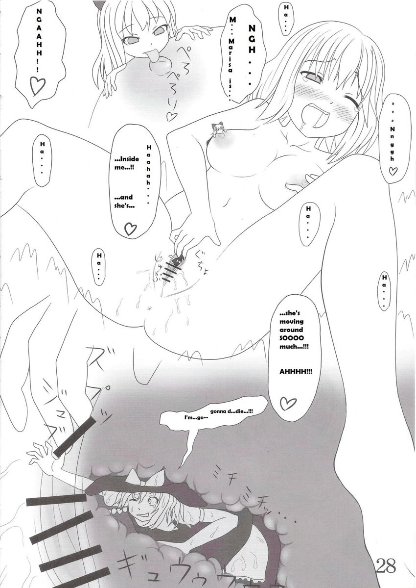

# 看m系资源的人说我们都是一群非常隐秘的人呢

作者：wayfarer123

TID：13050

<title>1</title> <link href="../Styles/Style.css" type="text/css" rel="stylesheet">

# 1

除了同好，很难有人发现我们的爱好。大家平常都隐藏自己的爱好吗？ <ignore_js_op>

**sample_fe4632cdd19c51eba53c35b866ee550c.jpg** *(143.55 KB, 下載次數: 0)*

[下載附件](forum.php?mod=attachment&aid=MzAyMzV8NzhkMDljZDZ8MTY3NDA2ODQ2MXwxODIzMHwxMzA1MA%3D%3D&nothumb=yes)

2012-8-13 17:46 上傳

<title>2</title> <link href="../Styles/Style.css" type="text/css" rel="stylesheet">

# 2

当然隐藏了啊......话说M系的人都四处告诉别人他是个M吗- - <title>3</title> <link href="../Styles/Style.css" type="text/css" rel="stylesheet">

# 3

特意在自己收藏的资源加了个锁  是不是被看到了反而更加明显 <title>4</title> <link href="../Styles/Style.css" type="text/css" rel="stylesheet">

# 4

之所以隐秘其实某种意义上来讲，也并非我们刻意。

只不过太多圈外人理解不了我们的爱好，会对我们产生误解，这才是我们要避免直接接触的根本原因。

为什么会理解不了？因为GTS这种性癖好属性太杂，前提条件太高，不是谁都具备此幻想力的，所以不用跟谁解释，彼此尊重，喜欢就好。 <title>5</title> <link href="../Styles/Style.css" type="text/css" rel="stylesheet">

# 5

还不如改名字好比如线性规划，杠杆运动原理，马克思哲学什么的。正常人都不会点这东西的 <title>6</title> <link href="../Styles/Style.css" type="text/css" rel="stylesheet">

# 6

和宅就不隐藏- -......同是宅的朋友都知道....如果有人觉得奇怪就给他看这个- -[http://wiki.moegirl.org/%E5%B7%A8%E5%A4%A7%E5%A8%98](http://wiki.moegirl.org/%E5%B7%A8%E5%A4%A7%E5%A8%98)然后鄙视他 <title>7</title> <link href="../Styles/Style.css" type="text/css" rel="stylesheet">

# 7

其實現在M已經逐漸開始不再隱藏了耶
至於GTS愛好……我個人覺得其實也是M領域的東西，只是程度上已經超過現在為人知的抖M了而已 <title>8</title> <link href="../Styles/Style.css" type="text/css" rel="stylesheet">

# 8

这个一般都得隐藏吧，毕竟时常会和性取向扯上关系。日常生活中，随便向别人暴露性取向，怎么想都是不可能的吧。

即使是宅友，我也不会对他们透露任何GTS的信息的。社会大众对宅持否定态度的一大原因就在于他们认为人沉迷于二次元里是不可取的，活在幻想之中是人生的失败。类似的，GTS是实实在在的幻想呢，想让没有沉浸其中的人理解我们的想法，甚至认可我们，实在是困难重重。

上次我在一个youku上，就看见有人在巨大娘视频下面留言“真恶心”。巨大娘在践踏城市，对我们而言是残酷系的GTS，但是很可爱，对其他人而言只是残酷的。

我可不想背负上“有奇怪性取向的人”这么沉重的东西。 <title>9</title> <link href="../Styles/Style.css" type="text/css" rel="stylesheet">

# 9

我曾在网上看到过恋腹系的团体，虽然妹子的小蛮腰是很可爱的存在，但是对腹部的喜好到极致也不是我们能理解的吧。在这里的各位谁会认为妹子的腹部比胸部更性感呢？

这也是隐蔽的存在呢。 <title>10</title> <link href="../Styles/Style.css" type="text/css" rel="stylesheet">

# 10

大多数的人应该都隐藏 <title>11</title> <link href="../Styles/Style.css" type="text/css" rel="stylesheet">

# 11

m系已經走向世界了

一個足的鏡頭下面一排人刷舔屏幕的 <title>12</title> <link href="../Styles/Style.css" type="text/css" rel="stylesheet">

# 12

网上隐藏的太多了 各种奇怪癖都见过 没什么 每个人有自己的癖好 不过爱好高妹和恋足这2个癖好 是最广为人知的 人也最多 M癖好的人也非常多 这是3大比较有规模的了 GTS其实好多人有 就是没觉醒 我都忘了当初怎么搜到GTS的了 之前只是自己幻想变小而已 <title>13</title> <link href="../Styles/Style.css" type="text/css" rel="stylesheet">

# 13

我是幻想被人吃掉啊！很小就这样啊。可是找到志同道合的才一年 <title>14</title> <link href="../Styles/Style.css" type="text/css" rel="stylesheet">

# 14

唉 我現實也會隱藏呢......
好想找個GTS的同好 一起討論 交流呢......(長嘆) <title>15</title> <link href="../Styles/Style.css" type="text/css" rel="stylesheet">

# 15

當然得隱藏囉
畢竟GTS控算是小眾
就算別人能接受這愛好
我等也很難跟他們聊起來 <title>16</title> <link href="../Styles/Style.css" type="text/css" rel="stylesheet">

# 16

确实，很多人在聊天中都无意表达过GTS倾向，只是他们没有意识到罢了，或许是没有觉醒罢了。 <title>17</title> <link href="../Styles/Style.css" type="text/css" rel="stylesheet">

# 17

> YINDANG 發表於 2012-8-19 09:20 
> 确实，很多人在聊天中都无意表达过GTS倾向，只是他们没有意&#3 ...

唉 感慨啊 > <
我超愛的說~~T^T

巨大娘是我最愛的呢><
<title>18</title> <link href="../Styles/Style.css" type="text/css" rel="stylesheet">

# 18

現實中隱藏起來
只能回家上網到相關論壇找同好交流 <title>19</title> <link href="../Styles/Style.css" type="text/css" rel="stylesheet">

# 19

m是长大才看的，我幼儿园就有想要被缩小的想法，小学还叫一个画画女生帮我画了个巨大爱丽丝，我还趁着年幼摸过众多阿姨姐姐的丝袜脚和腿，，真是幸福啊，可惜快18拉现在。。。我的幸福时光啊 <title>20</title> <link href="../Styles/Style.css" type="text/css" rel="stylesheet">

# 20

> 邪非 發表於 2012-8-13 18:33
> 还不如改名字好比如线性规划，杠杆运动原理，马克思哲学什么的 ...

让那些考试的时候查答案的同学查到了。。。。。。不是耽误他们考试么 <title>21</title> <link href="../Styles/Style.css" type="text/css" rel="stylesheet">

# 21

不可能在三次元表現出自己的真正喜好，就算平時和朋友談論宅文化，一般也是偽裝成機戰粉中二粉之類。絕對不能在基友面前暴漏自己是M的事實！</ignore_js_op>