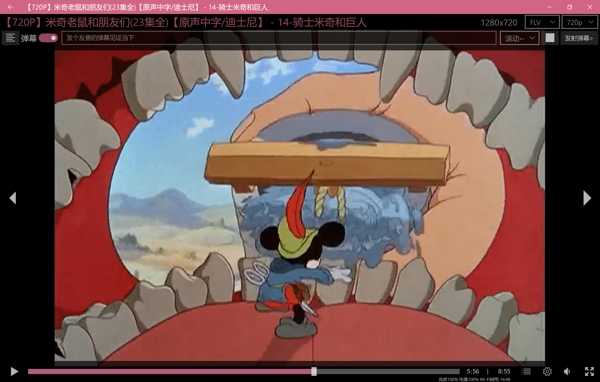
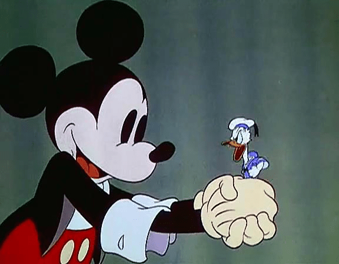

# 看了一集米老鼠产生了想法

作者：NextdoorPink

TID：27411

<title>1</title> <link href="../Styles/Style.css" type="text/css" rel="stylesheet">

# 1

觉得关于 巨人 的元素可以追溯到好久之前了啊，这集还有Vore要素
emmmm...不过现在倒是换了个性别

<title>2</title> <link href="../Styles/Style.css" type="text/css" rel="stylesheet">

# 2

 <ignore_js_op>[QQ截图20190921164634.png](forum.php?mod=attachment&aid=Nzk3MTV8MTQ5NWQzZDJ8MTY3NDA2NjY5MHwxODIzMHwyNzQxMQ%3D%3D&nothumb=yes) *(2.67 MB, 下載次數: 15)*

[下載附件](forum.php?mod=attachment&aid=Nzk3MTV8MTQ5NWQzZDJ8MTY3NDA2NjY5MHwxODIzMHwyNzQxMQ%3D%3D&nothumb=yes)

2019-9-21 16:46 上傳  

</ignore_js_op> <title>3</title> <link href="../Styles/Style.css" type="text/css" rel="stylesheet">

# 3

<ignore_js_op> [魔术师米奇.mp4](forum.php?mod=attachment&aid=Nzk3MTZ8Yjk0NjgzZWR8MTY3NDA2NjY5MHwxODIzMHwyNzQxMQ%3D%3D) *(7.17 MB, 下載次數: 9)* 2019-9-21 20:34 上傳點擊文件名下載附件
<ignore_js_op>

**暴风截图201992141187742.jpg** *(25.03 KB, 下載次數: 0)*

[下載附件](forum.php?mod=attachment&aid=Nzk3MTh8MjY1ZDc2Mjd8MTY3NDA2NjY5MHwxODIzMHwyNzQxMQ%3D%3D&nothumb=yes)

2019-9-21 20:35 上傳

如此说来，我也有个类似的念头
<title>4</title> <link href="../Styles/Style.css" type="text/css" rel="stylesheet">

# 4

人不能........至少不应该...........哦不对应该可以 <title>5</title> <link href="../Styles/Style.css" type="text/css" rel="stylesheet">

# 5

*本帖最後由 spacewolves 於 2019-9-22 02:34 編輯*

米奇演去裁缝对付巨人还有米奇与神豆以前看了蛮多遍，以至于第一次做gts梦也是史高治一家被小学时的班长踩。 <title>6</title> <link href="../Styles/Style.css" type="text/css" rel="stylesheet">

# 6

> [斯佳摩妮 發表於 2019-9-21 20:36](https://giantessnight.cf/gnforum2012/forum.php?mod=redirect&goto=findpost&pid=415271&ptid=27411)
> 如此说来，我也有个类似的念头

这不会就是GTS元素源头的某些暗示吧！
<title>7</title> <link href="../Styles/Style.css" type="text/css" rel="stylesheet">

# 7

> [weikesi 發表於 2019-9-21 23:41](https://giantessnight.cf/gnforum2012/forum.php?mod=redirect&goto=findpost&pid=415280&ptid=27411)
> 人不能........至少不应该...........哦不对应该可以

咦，我竟然没能理解这句话的意思！
<title>8</title> <link href="../Styles/Style.css" type="text/css" rel="stylesheet">

# 8

> [spacewolves 發表於 2019-9-22 02:33](https://giantessnight.cf/gnforum2012/forum.php?mod=redirect&goto=findpost&pid=415288&ptid=27411)
> 米奇演去裁缝对付巨人还有米奇与神豆以前看了蛮多遍，以至于第一次做gts梦也是史高治一家被小学时的班长踩 ...

是的吧！我就觉得有一种这样的暗示
<title>9</title> <link href="../Styles/Style.css" type="text/css" rel="stylesheet">

# 9

> [NextdoorPink 發表於 2019-9-22 21:04](https://giantessnight.cf/gnforum2012/forum.php?mod=redirect&goto=findpost&pid=415338&ptid=27411)
> 这不会就是GTS元素源头的某些暗示吧！

也许吧，头一次看时感觉唐纳好可怜，但又好可爱
<title>10</title> <link href="../Styles/Style.css" type="text/css" rel="stylesheet">

# 10

嗯嗯。小时候看到这一集。确实有那么点想。 <title>11</title> <link href="../Styles/Style.css" type="text/css" rel="stylesheet">

# 11

> [景界 發表於 2019-9-23 13:16](https://giantessnight.cf/gnforum2012/forum.php?mod=redirect&goto=findpost&pid=415369&ptid=27411)
> 嗯嗯。小时候看到这一集。确实有那么点想。

我当时看的时候没想法，但是后来不知道怎么就产生了兴趣</ignore_js_op></ignore_js_op>