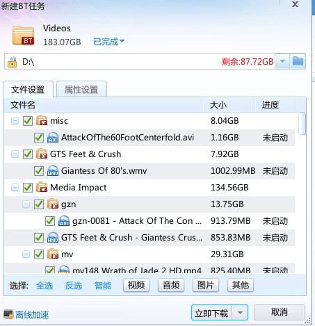

# 看到有人放种子没事。

作者：田棒棒

TID：13926

<title>1</title> <link href="../Styles/Style.css" type="text/css" rel="stylesheet">

# 1

*本文章最後由 xsdzlz 於 2013-2-1 21:05 編輯*

我也放一个，已有好心人离线加速完成。太凶残了
<ignore_js_op>

**种子截图.jpg** *(61.15 KB, 下載次數: 8)*

[下載附件](forum.php?mod=attachment&aid=MzI5NDZ8YjBlZWJhMDl8MTY3NDA3MjIyN3wxODIzMHwxMzkyNg%3D%3D&nothumb=yes)

2013-2-1 21:02 上傳

<ignore_js_op> [Videos.torrent](forum.php?mod=attachment&aid=MzI5NDV8OWEwMzIwMTF8MTY3NDA3MjIyN3wxODIzMHwxMzkyNg%3D%3D) *(658.79 KB, 下載次數: 3207)* 2013-2-1 20:59 上傳點擊文件名下載附件

<title>2</title> <link href="../Styles/Style.css" type="text/css" rel="stylesheet">

# 2

以前是177G,不知為何愈來愈大(一定是有人不停更新 <title>3</title> <link href="../Styles/Style.css" type="text/css" rel="stylesheet">

# 3

183个G,吓到了，去买个移动硬盘先，笔记本的硬盘不够用了，感谢LZ了，年前发福利，来年有好报 <title>4</title> <link href="../Styles/Style.css" type="text/css" rel="stylesheet">

# 4

硬盘空间不够，只能下一半先了，太凶残了 <title>5</title> <link href="../Styles/Style.css" type="text/css" rel="stylesheet">

# 5

求迅雷VIP账号，不然下到啥时候啊 <title>6</title> <link href="../Styles/Style.css" type="text/css" rel="stylesheet">

# 6

重新下載把舊有一文件一次吞掉,原來是同一個種還廢到我之前的收藏。 <title>7</title> <link href="../Styles/Style.css" type="text/css" rel="stylesheet">

# 7

这么大呀，我到现在才收藏了40多个G左右，看来还得努力找呀 <title>8</title> <link href="../Styles/Style.css" type="text/css" rel="stylesheet">

# 8

正好刚换了一个1T的硬盘  太感谢 <title>9</title> <link href="../Styles/Style.css" type="text/css" rel="stylesheet">

# 9

好大...这个有的下了 <title>10</title> <link href="../Styles/Style.css" type="text/css" rel="stylesheet">

# 10

砸下不了呢 <title>11</title> <link href="../Styles/Style.css" type="text/css" rel="stylesheet">

# 11

感谢LZ无私奉献  本人正在努力下载中~~ <title>12</title> <link href="../Styles/Style.css" type="text/css" rel="stylesheet">

# 12

分享率是0求人在线做个种吧  感谢感谢 <title>13</title> <link href="../Styles/Style.css" type="text/css" rel="stylesheet">

# 13

天哪、这也太大了、这要下多久啊、 <title>14</title> <link href="../Styles/Style.css" type="text/css" rel="stylesheet">

# 14

超想看但動不了阿 <title>15</title> <link href="../Styles/Style.css" type="text/css" rel="stylesheet">

# 15

太大太凶残了 只能希望楼主或者下载好的大神整理一下。。拿点精华出来分享吧~ <title>16</title> <link href="../Styles/Style.css" type="text/css" rel="stylesheet">

# 16

看着170G的资源，笑了
再看着网速只有200kb/s，哭了
坑爹呢 <title>17</title> <link href="../Styles/Style.css" type="text/css" rel="stylesheet">

# 17

我也是好心人之一~ <title>18</title> <link href="../Styles/Style.css" type="text/css" rel="stylesheet">

# 18

表示亚历山大 <title>19</title> <link href="../Styles/Style.css" type="text/css" rel="stylesheet">

# 19

如果大家没有迅雷会员的话，去淘宝买吧，1块钱24小时，6M的宽带花几元差不多就可以下完了 <title>20</title> <link href="../Styles/Style.css" type="text/css" rel="stylesheet">

# 20

速度为0…………………… <title>21</title> <link href="../Styles/Style.css" type="text/css" rel="stylesheet">

# 21

怎么能向里面加东西？？求技术指导。。另··giantess gloria和giantess deeane的有人放吗？？
<title>22</title> <link href="../Styles/Style.css" type="text/css" rel="stylesheet">

# 22

打不开，求解，电脑毫无反应 <title>23</title> <link href="../Styles/Style.css" type="text/css" rel="stylesheet">

# 23

太凶残了，电脑清理一遍总算有182g <title>24</title> <link href="../Styles/Style.css" type="text/css" rel="stylesheet">

# 24

谢谢lZ~~~ <title>25</title> <link href="../Styles/Style.css" type="text/css" rel="stylesheet">

# 25

哎呦我勒个去，这凶残的大小…… <title>26</title> <link href="../Styles/Style.css" type="text/css" rel="stylesheet">

# 26

楼主真好人！ 183个G  瞬间有点小激动！ <title>27</title> <link href="../Styles/Style.css" type="text/css" rel="stylesheet">

# 27

卧槽，这凶残的大小 <title>28</title> <link href="../Styles/Style.css" type="text/css" rel="stylesheet">

# 28

是地區關係嗎...   我這每次到一半就完全沒速度了   迅雷根BITCOMET都一樣阿
跪求解 <title>29</title> <link href="../Styles/Style.css" type="text/css" rel="stylesheet">

# 29

这个俺下载了，不过有很多迅雷也下载失败了，我是迅雷的VIP6啊。。。。 <title>30</title> <link href="../Styles/Style.css" type="text/css" rel="stylesheet">

# 30

感谢楼主
就是不动弹
求共享资源啊~！ <title>31</title> <link href="../Styles/Style.css" type="text/css" rel="stylesheet">

# 31

183G?擦...硬盘危机了... <title>32</title> <link href="../Styles/Style.css" type="text/css" rel="stylesheet">

# 32

183GB ummm thats huge... <title>33</title> <link href="../Styles/Style.css" type="text/css" rel="stylesheet">

# 33

呜呜……等了半天了，速度还是0，速度啥时候变成1M啊？哈哈，感谢楼主的无私分享 <title>34</title> <link href="../Styles/Style.css" type="text/css" rel="stylesheet">

# 34

*本文章最後由 changeheart 於 2013-2-10 11:16 編輯*

这个看上去很不错啊，多谢分享啊啊！

…一看183G晕过去了……硬盘倒地了…… <title>35</title> <link href="../Styles/Style.css" type="text/css" rel="stylesheet">

# 35

。。。186G。。。硬盘不给力啊。。 <title>36</title> <link href="../Styles/Style.css" type="text/css" rel="stylesheet">

# 36

太讚啦  謝LZ <title>37</title> <link href="../Styles/Style.css" type="text/css" rel="stylesheet">

# 37

好这才是好玩意 多谢 <title>38</title> <link href="../Styles/Style.css" type="text/css" rel="stylesheet">

# 38

 <title>39</title> <link href="../Styles/Style.css" type="text/css" rel="stylesheet">

# 39

1T硬盘因此入手，但是下载速度不给力哈
<title>40</title> <link href="../Styles/Style.css" type="text/css" rel="stylesheet">

# 40

建议各位弄个迅雷云播，上千个视频先浏览一遍，再挑喜欢的下载。 <title>41</title> <link href="../Styles/Style.css" type="text/css" rel="stylesheet">

# 41

放些有速度的中子嘛
0kb怎么下啊 <title>42</title> <link href="../Styles/Style.css" type="text/css" rel="stylesheet">

# 42

这大小表示下载完我都要跪了啊~~~
<title>43</title> <link href="../Styles/Style.css" type="text/css" rel="stylesheet">

# 43

硬盘空间不够啊 <title>44</title> <link href="../Styles/Style.css" type="text/css" rel="stylesheet">

# 44

迅雷白金会员的路过。。啊。。还有1T移动硬盘一个。。。哈哈·~美哉
感谢楼主，一生平安~ <title>45</title> <link href="../Styles/Style.css" type="text/css" rel="stylesheet">

# 45

比我硬盘还大，这得下多少个小时... <title>46</title> <link href="../Styles/Style.css" type="text/css" rel="stylesheet">

# 46

好老的片子 <title>47</title> <link href="../Styles/Style.css" type="text/css" rel="stylesheet">

# 47

= =不要一次性这么凶残的放出啊承受不了啊 <title>48</title> <link href="../Styles/Style.css" type="text/css" rel="stylesheet">

# 48

迅雷离线空间这辈子都用不完啊 <title>49</title> <link href="../Styles/Style.css" type="text/css" rel="stylesheet">

# 49

说真的 我最不喜欢下载种子 但是谁让我喜欢GTS了  辛苦下载吧  希望LZ能有高速下载的方法 <title>50</title> <link href="../Styles/Style.css" type="text/css" rel="stylesheet">

# 50

非常感谢LZ分享，我全下完了 <title>51</title> <link href="../Styles/Style.css" type="text/css" rel="stylesheet">

# 51

装不下啊，怎么破！ <title>52</title> <link href="../Styles/Style.css" type="text/css" rel="stylesheet">

# 52

TMD 800kb/s 下了半小时还没1% <title>53</title> <link href="../Styles/Style.css" type="text/css" rel="stylesheet">

# 53

感谢楼主分享 <title>54</title> <link href="../Styles/Style.css" type="text/css" rel="stylesheet">

# 54

恕我知的我问下，种子是什么 <title>55</title> <link href="../Styles/Style.css" type="text/css" rel="stylesheet">

# 55

> 六六六 發表於 2013-9-19 02:38 
> 恕我知的我问下，种子是什么

(￣y▽￣)百度百科第六条，简单说就是文件形式的下载链接之类的。
<title>56</title> <link href="../Styles/Style.css" type="text/css" rel="stylesheet">

# 56

> shendanxiaogui 發表於 2013-9-19 02:59 
> (￣y▽￣)百度百科第六条，简单说就是文件形式的下载链接之类的。

去查查

<title>57</title> <link href="../Styles/Style.css" type="text/css" rel="stylesheet">

# 57

好像在哪看到过 <title>58</title> <link href="../Styles/Style.css" type="text/css" rel="stylesheet">

# 58

本来认为像魔兽世界这种算大了⋯今天算见识到了 <title>59</title> <link href="../Styles/Style.css" type="text/css" rel="stylesheet">

# 59

还真是够大的，下载速度忽快忽慢，快的时候1M/s，慢的时候都没速度 <title>60</title> <link href="../Styles/Style.css" type="text/css" rel="stylesheet">

# 60

太NB了  感谢楼主   <title>61</title> <link href="../Styles/Style.css" type="text/css" rel="stylesheet">

# 61

总硬盘达到5T的无压力 <title>62</title> <link href="../Styles/Style.css" type="text/css" rel="stylesheet">

# 62

哦哦哦这个好 <title>63</title> <link href="../Styles/Style.css" type="text/css" rel="stylesheet">

# 63

感謝樓主  這太NB了
<title>64</title> <link href="../Styles/Style.css" type="text/css" rel="stylesheet">

# 64

我去，这里面有多少部啊，先下下来看看</ignore_js_op></ignore_js_op>