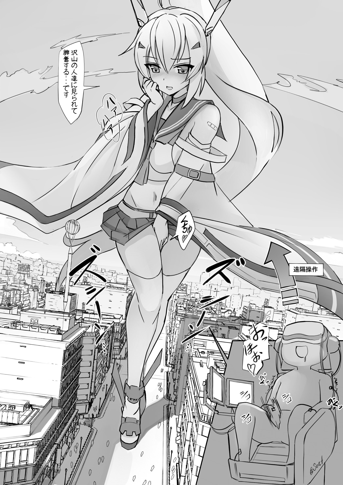

# 看到濑尾的新图，有点好奇为啥tsf+gts的作品那么少

作者：咕咕的攸栗

TID：32449

<title>1</title> <link href="../Styles/Style.css" type="text/css" rel="stylesheet">

# 1

老实说，这种幻想自己变成GTS的设定还挺带感的，特别是对有些许mtf倾向的人来说更是如此。

不过这么多年来，却很少见到tsf+gts的作品，以第一人称写的就更少了。或许大家更倾向于把自己代入小人方，而把GTS作为性幻想对象？
<title>2</title> <link href="../Styles/Style.css" type="text/css" rel="stylesheet">

# 2

 <ignore_js_op>[20220119_020629.jpg](forum.php?mod=attachment&aid=OTMzNzZ8YWY5Y2QyZTV8MTY3NDA2NTY5MXwxODIzMHwzMjQ0OQ%3D%3D&nothumb=yes) *(668.9 KB, 下載次數: 12)*

[下載附件](forum.php?mod=attachment&aid=OTMzNzZ8YWY5Y2QyZTV8MTY3NDA2NTY5MXwxODIzMHwzMjQ0OQ%3D%3D&nothumb=yes)

2022-1-19 02:09 上傳  

</ignore_js_op> <title>3</title> <link href="../Styles/Style.css" type="text/css" rel="stylesheet">

# 3

想想自己一觉醒来变成萌妹，然后grow成gts的设定，忽然感觉很兴奋…… <title>4</title> <link href="../Styles/Style.css" type="text/css" rel="stylesheet">

# 4

> [诸君我喜欢 發表於 2022-1-19 08:07](https://giantessnight.cf/gnforum2012/forum.php?mod=redirect&goto=findpost&pid=491182&ptid=32449)
> 跨性别人士比同性恋数量都要少多了，而同性恋群体数量也就5%左右，所以跨性别倾向有多少见也就不奇怪了，就 ...

不需要跨性别者的程度吧，更多是出于对异性的憧憬，比如现在越来越大众的女装。而且和gts相对的不一定就是男性啊，为什么gts一定要喜欢男人呢。我是偶尔会把自己代入gts，幻想自己是个萌妹，还是蛮带感的 <title>5</title> <link href="../Styles/Style.css" type="text/css" rel="stylesheet">

# 5

我现在或许有点跨性别了、、时而想自己是个女生，但仍然会想自己是个男生 <title>6</title> <link href="../Styles/Style.css" type="text/css" rel="stylesheet">

# 6

希望在未來的某一天換自己坐在圖片中的椅子上  開啟幻想之旅 <title>7</title> <link href="../Styles/Style.css" type="text/css" rel="stylesheet">

# 7

感觉一方面是因为两个圈子都不大吧，尤其是gts圈，再重合一下就更小了。另一方面要把这两个属性结合起来也不太容易，个人理解，tsf向作品的一大看点就是心理和身体的不兼容造成的反差感，在作品里既要体现出这种男性心理造成的反差感，又要体现出巨大娘“萌”的一面，感觉就有点难度了，搞不好还容易成为扣分项
不过濑尾大大的这张图的想法我感觉就挺好的，能够在巨大娘和小人形态之间来回切换，两种视角下的心态、观念以及对同一件事的看法势必不会完全一致，由此而产生的内心矛盾、纠结，在迷茫中的一些混乱行为，最后的抉择以及带来的结果，我觉得都是值得一写的点 <title>8</title> <link href="../Styles/Style.css" type="text/css" rel="stylesheet">

# 8

小圈子里的东西，所以这个样也是没有办法的 <title>9</title> <link href="../Styles/Style.css" type="text/css" rel="stylesheet">

# 9

这就涉及了接不接受伪娘的领域了，反正我是接受不了……除了2次元！哎嘿嘿~~~ <title>10</title> <link href="../Styles/Style.css" type="text/css" rel="stylesheet">

# 10

就我个人来讲，我确实会时常将自己带入到gts中，享受别样的乐趣
也有很多同时描写 gts 视角和小人视角的问题
不过问题来了，假设我将 tsf 跟 gts 重合到一起写，那么文章会怎么样呢
像是 gts + 漏尿play，漏尿的加入能使得 gts 破坏的花样变多，或者出现"不想破坏的心愿"和"因为生理原因不得不破坏"的反差
我个人认为ts的看点是在性转过后所会产生的各种反差(如如何上厕所，洗澡时的抵触等等)
而 gts，以 gts 的视角来看，就是 gts 本身因为变大产生的对破坏的欲望(就是有点偏s)
当变成 gts 的时候，ts 所带来的反差基本不会出现(你所考虑肯定先是"我这么大怎么办"而不是"我变成女的怎么办")。然后，不管是 ts 还是本身就是♀，你后面所采取的行动基本上都会是"破坏"，除了台词可能不太一样之外，剩下的可能基本差不多。
不过，以上分析可能更多是是以"涩涩"的方面进行的想法，gts + ts 也是能写出一些故事的，比如

"一个男女身高比例1:xxxx的世界，男主从男生变成女生，然后为了保护他的同学们不会变成女生们的玩具而发生的一系列故事"什么的

说白了，就涩涩方面，没必要在设定里加上 ts，我直接把我自己带入到 gts 里面然后涩涩就可以了

<title>11</title> <link href="../Styles/Style.css" type="text/css" rel="stylesheet">

# 11

至于这种嘛，只能说人的内心都是具有潜在的暴戾