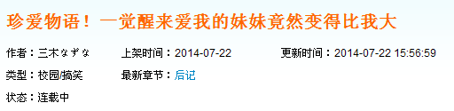

# 看到这个标题的瞬间我是多么的激动啊

作者：Cate

TID：17374

<title>1</title> <link href="../Styles/Style.css" type="text/css" rel="stylesheet">

# 1

结果内容一点关系都没有
<title>2</title> <link href="../Styles/Style.css" type="text/css" rel="stylesheet">

# 2

 <ignore_js_op>[QQ截图20140723084603.png](forum.php?mod=attachment&aid=NDQ3MDh8MjZmYWEwMzh8MTY3NDA2NzQ2N3wxODIzMHwxNzM3NA%3D%3D&nothumb=yes) *(8.31 KB, 下載次數: 54)*

[下載附件](forum.php?mod=attachment&aid=NDQ3MDh8MjZmYWEwMzh8MTY3NDA2NzQ2N3wxODIzMHwxNzM3NA%3D%3D&nothumb=yes)

2014-7-23 08:46 上傳  

</ignore_js_op> <title>3</title> <link href="../Styles/Style.css" type="text/css" rel="stylesheet">

# 3

。。。这个大估计是年长不是尺寸大吧。。。 <title>4</title> <link href="../Styles/Style.css" type="text/css" rel="stylesheet">

# 4

當初看到時有看下內容,確實是年長
印象是哥哥被妹妹冰凍兩年導致小一歲的妹妹變成大一歲 <title>5</title> <link href="../Styles/Style.css" type="text/css" rel="stylesheet">

# 5

好渣的設定...
一覺醒來我的姐姐竟然也比我大！（廢話！）
我可以這麼換位麼思考麼... <title>6</title> <link href="../Styles/Style.css" type="text/css" rel="stylesheet">

# 6

应该先翻一下后面的回复的QAQ
兴冲冲找来看了简介才发现这个大原来不是指体型啊

不认真审题的坏毛病至今未改= =
<title>7</title> <link href="../Styles/Style.css" type="text/css" rel="stylesheet">

# 7

标题很有意思，然后我就被骗进来了！
这完全是欺骗感情啊UP！大和“大”！ <title>8</title> <link href="../Styles/Style.css" type="text/css" rel="stylesheet">

# 8

期望越大
失望越大
by被類似標題騙過的人 <title>9</title> <link href="../Styles/Style.css" type="text/css" rel="stylesheet">

# 9

lz被标题党骗了之后也转职成标题党了 <title>10</title> <link href="../Styles/Style.css" type="text/css" rel="stylesheet">

# 10

.
這作品完全就是來教訓標題黨的，話說這主題根本也與GTS無關啊！頂多是幫助別人避開陷阱。

好吧，多少聊一點與主題相關的，這輕小說的作者是台灣人。
據說本來是去日本念聲優學校想當配音員，沒想到竟然變成輕小說作者，該說是命運弄人還是適才適所.... <title>11</title> <link href="../Styles/Style.css" type="text/css" rel="stylesheet">

# 11

看到标题结果就去找了竟然是年龄大。。 <title>12</title> <link href="../Styles/Style.css" type="text/css" rel="stylesheet">

# 12

果断被骗，果然标题不可信 <title>13</title> <link href="../Styles/Style.css" type="text/css" rel="stylesheet">

# 13

难道只是年龄比哥哥大而已么？ <title>14</title> <link href="../Styles/Style.css" type="text/css" rel="stylesheet">

# 14

哦，那本被妹妹关进冷冻库的哥哥啊，不从gts考虑，单纯剧情的话还是很有趣的 <title>15</title> <link href="../Styles/Style.css" type="text/css" rel="stylesheet">

# 15

騙一下我門純真的心也好啦(...) <title>16</title> <link href="../Styles/Style.css" type="text/css" rel="stylesheet">

# 16

完完全全的标题党啊，总有被坑的感觉 <title>17</title> <link href="../Styles/Style.css" type="text/css" rel="stylesheet">

# 17

看了半天才发现我理解错了 <title>18</title> <link href="../Styles/Style.css" type="text/css" rel="stylesheet">

# 18

说不定有MINI系可以参考的地方 <title>19</title> <link href="../Styles/Style.css" type="text/css" rel="stylesheet">

# 19

额，有一种被骗的感觉 白高兴了一场。。。 <title>20</title> <link href="../Styles/Style.css" type="text/css" rel="stylesheet">

# 20

被坑+1啊，还好不是我一个。 <title>21</title> <link href="../Styles/Style.css" type="text/css" rel="stylesheet">

# 21

看到标题就想着是不是男主出意外导致几年身体没变化，然后妹妹（外观年龄）更大了。
毕竟外面的网站GTS内容好少~ <title>22</title> <link href="../Styles/Style.css" type="text/css" rel="stylesheet">

# 22

这情节就算是标题党也比这好吧 <title>23</title> <link href="../Styles/Style.css" type="text/css" rel="stylesheet">

# 23

標題黨在此，遭到教訓了。。。 <title>24</title> <link href="../Styles/Style.css" type="text/css" rel="stylesheet">

# 24

反正进来的都是标题党+1，虽然看到这标题第一想到体型，第二想到吊（滑稽）