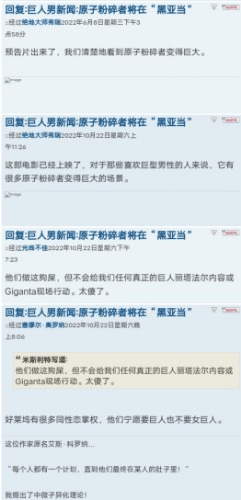

# 看来国外圈的同好也开始发现了这个现实性的问题

作者：田棒棒

TID：34320

<title>1</title> <link href="../Styles/Style.css" type="text/css" rel="stylesheet">

# 1

越来越多的gt元素开始出现在这几年的电影美剧中，就连dc这部本来原剧本设定是女巨人瑞塔的剧情也被砍了，全部替换成男巨人的剧情，而且还是更巨大化级别的男巨人（笑）
其实这已经是半公开的秘密了，一些同性恋已经在好莱坞决策层中占有影响力了，他们决定很多电影剧情剧本的走向，所以也不难解释这个原因了。
<title>2</title> <link href="../Styles/Style.css" type="text/css" rel="stylesheet">

# 2

 <ignore_js_op>[IMG_20221024_224331.jpg](forum.php?mod=attachment&aid=MTAwMTQzfGU0Yjk0MmM0fDE2NzQwNjUyOTd8MTgyMzB8MzQzMjA%3D&nothumb=yes) *(28.12 KB, 下載次數: 3)*

[下載附件](forum.php?mod=attachment&aid=MTAwMTQzfGU0Yjk0MmM0fDE2NzQwNjUyOTd8MTgyMzB8MzQzMjA%3D&nothumb=yes)

2022-10-24 22:50 上傳  

</ignore_js_op> <title>3</title> <link href="../Styles/Style.css" type="text/css" rel="stylesheet">

# 3

虽然好莱坞导演或掌权者中有男同性恋必然不假，但主流社会因为长期男性掌权所以男巨人就是主流啊。体型在某种意义上就是权力的象征，各种文化作品中写得好的强大的正常体型女性都少，指望写得好的女巨人角色出现简直可以算奢望。 <title>4</title> <link href="../Styles/Style.css" type="text/css" rel="stylesheet">

# 4

为啥gt和男男/fury绑定那么深啊？

为啥喜欢和女性互动的gt的人那么少？ <title>5</title> <link href="../Styles/Style.css" type="text/css" rel="stylesheet">

# 5

> [nub7091 發表於 2022-10-25 10:37](https://giantessnight.cf/gnforum2012/forum.php?mod=redirect&goto=findpost&pid=518389&ptid=34320)
> 为啥gt和男男/fury绑定那么深啊？
> 
> 为啥喜欢和女性互动的gt的人那么少？

你说的应该是喜欢缩小女的一类同好吧？其实是有的，之前这个论坛的老人不是说gn曾经就有一个缩小女分区吗？那个中文之许做那个版主来着，后来因为那个板块太容易和gt沾边而且还和gts没什么关系，所以就被取缔了
<title>6</title> <link href="../Styles/Style.css" type="text/css" rel="stylesheet">

# 6

我真希望是女同掌权，可惜现实是同性恋男性的社会地位也比较高 <title>7</title> <link href="../Styles/Style.css" type="text/css" rel="stylesheet">

# 7

不不不最主要的原因是现在欧美那边但凡是个稍微大点的作，都得来那一套政治正确，就是又不能搞涩涩来“物化女性”，搞不好了又说丑化女性，哪怕全部依着那群人所愿，像之前搞了个黑美人鱼，直接被正常人喷。在巨人巨物这一个如此显眼的前提下，索性能少碰女性就少碰 <title>8</title> <link href="../Styles/Style.css" type="text/css" rel="stylesheet">

# 8

可惜，连同性恋阶层里女性都比不过男性 <title>9</title> <link href="../Styles/Style.css" type="text/css" rel="stylesheet">

# 9

 大可不必为无法在电影院线满足癖好而烦恼
迪士尼制片人对大众喜好可是清清楚楚的 <title>10</title> <link href="../Styles/Style.css" type="text/css" rel="stylesheet">

# 10

那这种事情，属实不是我们可以决定的了... <title>11</title> <link href="../Styles/Style.css" type="text/css" rel="stylesheet">

# 11

这种gt太恶心了，一点也不可爱…… <title>12</title> <link href="../Styles/Style.css" type="text/css" rel="stylesheet">

# 12

还以为在政治正确的环境下厂商会更注重彰显女性力量的女巨人呢。话说把女角色改成男的难道不会引起女权反对吗？毕竟美人鱼都改成黑的了，女换成男岂不是逆着来。 <title>13</title> <link href="../Styles/Style.css" type="text/css" rel="stylesheet">

# 13

反对gt爱好者！他们是异端！是敌人！ <title>14</title> <link href="../Styles/Style.css" type="text/css" rel="stylesheet">

# 14

这种东西大概和同性恋的关系不大吧…应该是收视群体的问题 <title>15</title> <link href="../Styles/Style.css" type="text/css" rel="stylesheet">

# 15

国外不允许女性那么大，地位都是底下的。
只有cn的女性地位那么高。
<title>16</title> <link href="../Styles/Style.css" type="text/css" rel="stylesheet">

# 16

全世界可能只有中日韩有巨大女存在的空间，其他国家应该是不允许的，至少不会变成女生主宰世界的想象
<title>17</title> <link href="../Styles/Style.css" type="text/css" rel="stylesheet">

# 17

> [飛鳥 發表於 2022-10-26 08:14](https://giantessnight.cf/gnforum2012/forum.php?mod=redirect&goto=findpost&pid=518434&ptid=34320)
> 这种gt太恶心了，一点也不可爱……

我也觉得 唉 真的感觉没法理解 想想都辣眼睛