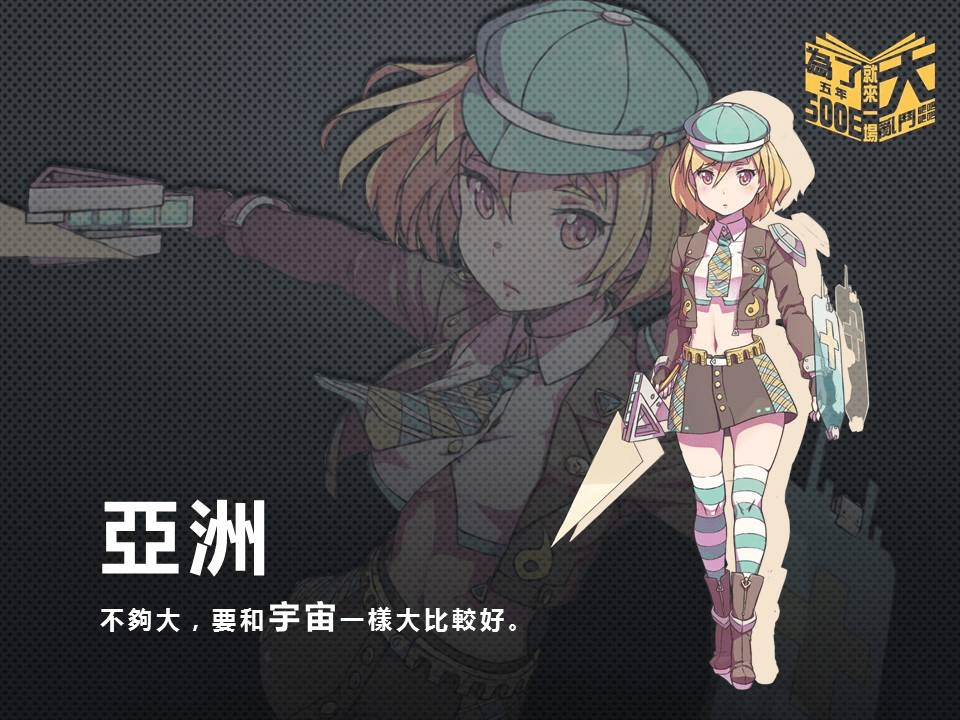
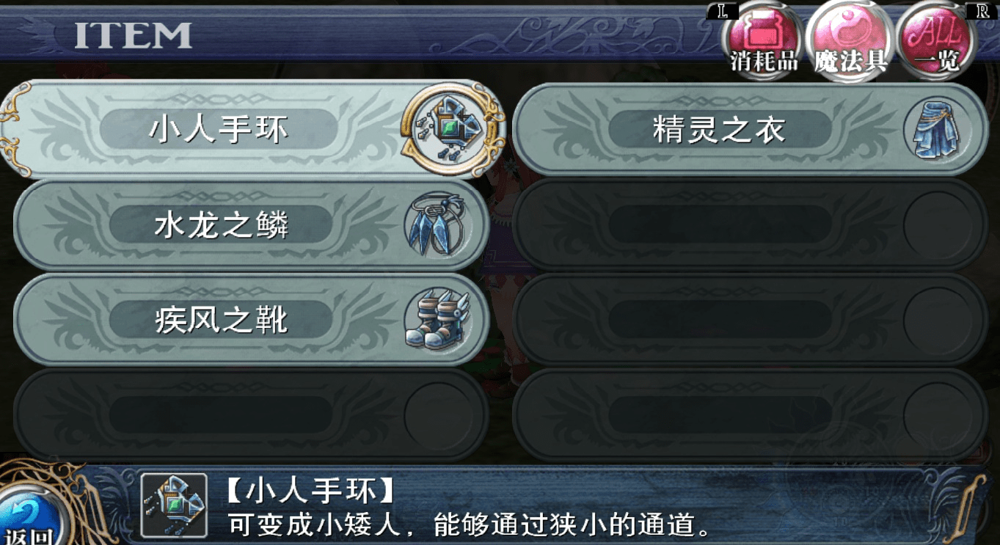
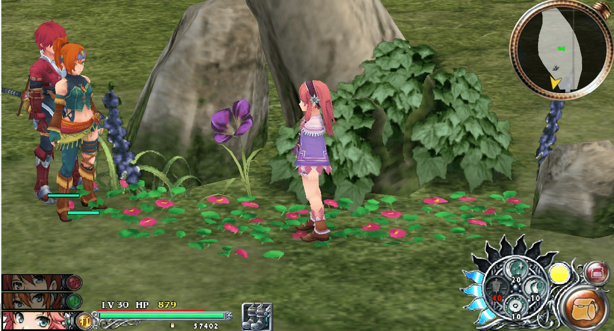
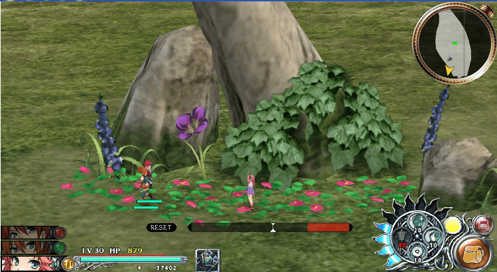
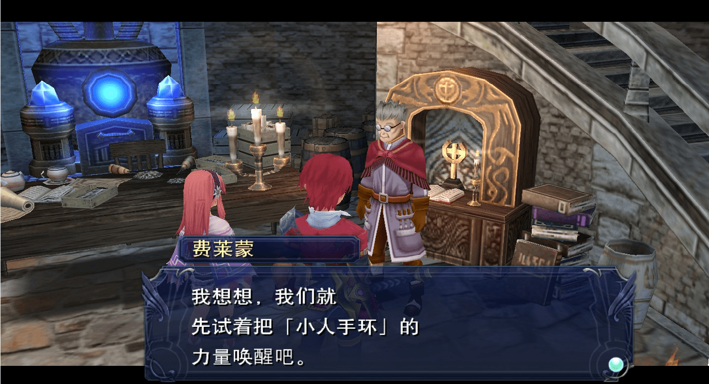
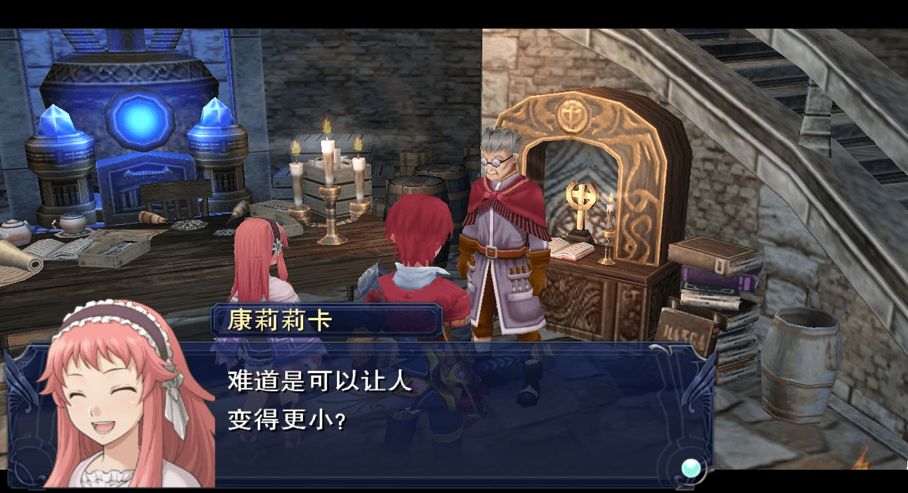
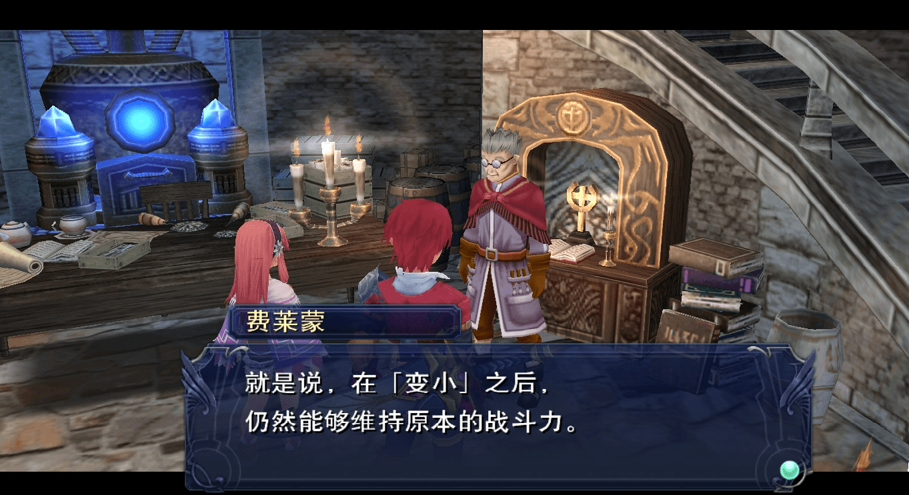
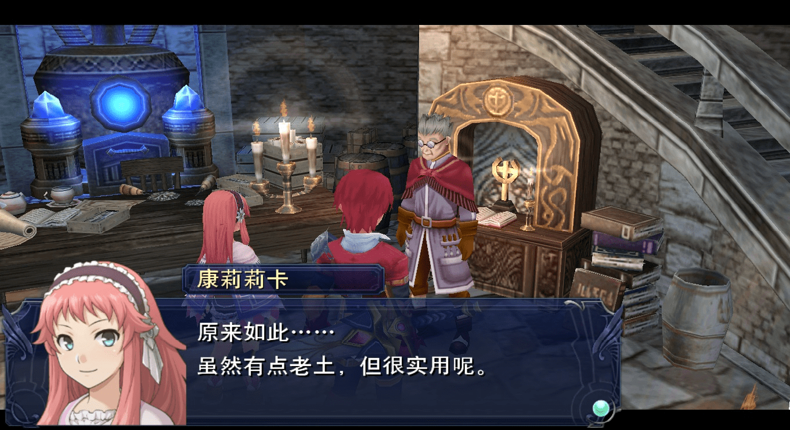
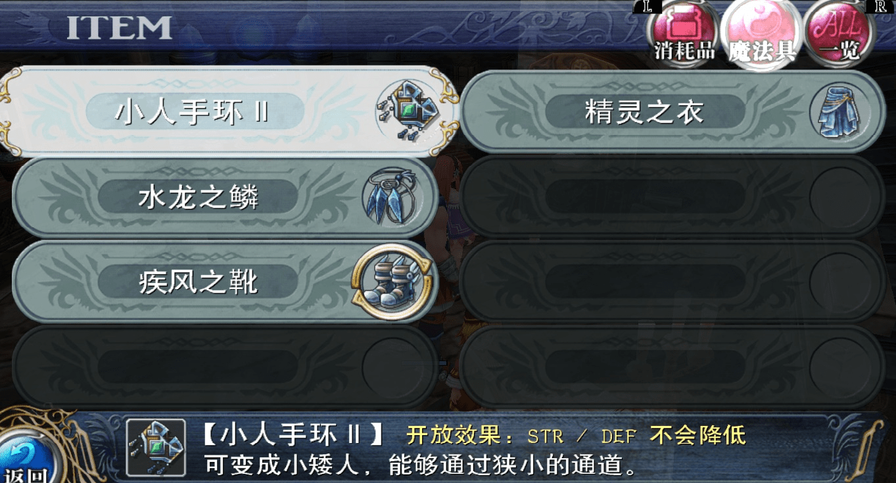

# 真是引人遐想的一句話呢

作者：baoluhu

TID：21154

<title>1</title> <link href="../Styles/Style.css" type="text/css" rel="stylesheet">

# 1

<ignore_js_op>

**13319835_1143914128993064_6250734997074108199_n.jpg** *(108.17 KB, 下載次數: 0)*

[下載附件](forum.php?mod=attachment&aid=NjE1NDB8MDAzYmVlNDR8MTY3NDA2NzU2MnwxODIzMHwyMTE1NA%3D%3D&nothumb=yes)

2016-5-31 23:03 上傳

雖然這完全不是這樣的遊戲
不過還是引人遐想阿
<title>2</title> <link href="../Styles/Style.css" type="text/css" rel="stylesheet">

# 2

LZ的脑洞已经突破天际 <title>3</title> <link href="../Styles/Style.css" type="text/css" rel="stylesheet">

# 3

.=3=要理解到这个层次需要相当程度的脑洞吧...但这是什么游戏呢0 0？ <title>4</title> <link href="../Styles/Style.css" type="text/css" rel="stylesheet">

# 4

上面两个...游戏名...右上角...
《总之为了五年五百亿就来一场大乱斗吧》
台湾学院拟人？手游？嘛大家加油我放弃♪₍₍ ᕕ(  ᐛ  )ᕗ⁾⁾ <title>5</title> <link href="../Styles/Style.css" type="text/css" rel="stylesheet">

# 5

*本帖最後由 克里亞 於 2016-6-1 18:57 編輯*

最初覺得只是一點點就略過了
既然如題就來回覆下.

來源: 伊蘇 塞爾塞塔的樹海
這作有一個魔法具是小人手環(下面那雙鞋子是神物!!!)
<ignore_js_op>

**001.jpg** *(282.56 KB, 下載次數: 0)*

[下載附件](forum.php?mod=attachment&aid=NjE1NTB8YzhlNWIzNjN8MTY3NDA2NzU2MnwxODIzMHwyMTE1NA%3D%3D&nothumb=yes)

2016-6-1 18:40 上傳

因為只能在戰鬥場所用.所以只能看到小怪變大型BOSS...
(想練技術可以玩玩.因為有防禦可用)

尺寸比較圖:
使用前
<ignore_js_op>

**002.jpg** *(360.11 KB, 下載次數: 0)*

[下載附件](forum.php?mod=attachment&aid=NjE1NDl8NDQ2MTVmNDh8MTY3NDA2NzU2MnwxODIzMHwyMTE1NA%3D%3D&nothumb=yes)

2016-6-1 18:40 上傳

使用後(視角有拉遠)
<ignore_js_op>

**003.jpg** *(358.66 KB, 下載次數: 0)*

[下載附件](forum.php?mod=attachment&aid=NjE1NDh8NmZjNGVkNjR8MTY3NDA2NzU2MnwxODIzMHwyMTE1NA%3D%3D&nothumb=yes)

2016-6-1 18:40 上傳

剛好有一個任務是要強化魔法具
<ignore_js_op>

**004.jpg** *(323.27 KB, 下載次數: 0)*

[下載附件](forum.php?mod=attachment&aid=NjE1NDd8NjFlYjcyZWZ8MTY3NDA2NzU2MnwxODIzMHwyMTE1NA%3D%3D&nothumb=yes)

2016-6-1 18:40 上傳

<ignore_js_op>

**005.jpg** *(333.35 KB, 下載次數: 0)*

[下載附件](forum.php?mod=attachment&aid=NjE1NDZ8OGFjMWRmODR8MTY3NDA2NzU2MnwxODIzMHwyMTE1NA%3D%3D&nothumb=yes)

2016-6-1 18:40 上傳

<ignore_js_op>

**006.jpg** *(328.13 KB, 下載次數: 0)*

[下載附件](forum.php?mod=attachment&aid=NjE1NDV8YjFjMzRhMGZ8MTY3NDA2NzU2MnwxODIzMHwyMTE1NA%3D%3D&nothumb=yes)

2016-6-1 18:40 上傳

<ignore_js_op>

**007.jpg** *(322.7 KB, 下載次數: 0)*

[下載附件](forum.php?mod=attachment&aid=NjE1NDR8OWQwYjY1YmZ8MTY3NDA2NzU2MnwxODIzMHwyMTE1NA%3D%3D&nothumb=yes)

2016-6-1 18:40 上傳

<ignore_js_op>

**008.jpg** *(333.8 KB, 下載次數: 0)*

[下載附件](forum.php?mod=attachment&aid=NjE1NDN8OWQ5YzI3M2N8MTY3NDA2NzU2MnwxODIzMHwyMTE1NA%3D%3D&nothumb=yes)

2016-6-1 18:40 上傳

強化後附加效果
<ignore_js_op>

**009.jpg** *(288.65 KB, 下載次數: 0)*

[下載附件](forum.php?mod=attachment&aid=NjE1NDJ8Yjk0MzFkM2J8MTY3NDA2NzU2MnwxODIzMHwyMTE1NA%3D%3D&nothumb=yes)

2016-6-1 18:40 上傳

雖說只是變小後能維持原本的戰鬥力..

但某方面的確是很實用
<title>6</title> <link href="../Styles/Style.css" type="text/css" rel="stylesheet">

# 6

好奇怪的撸点啊........ <title>7</title> <link href="../Styles/Style.css" type="text/css" rel="stylesheet">

# 7

这说的是韩国吧！嘻嘻嘻嘻！！！ <title>8</title> <link href="../Styles/Style.css" type="text/css" rel="stylesheet">

# 8

这会不会是下一个的地球OL？ <title>9</title> <link href="../Styles/Style.css" type="text/css" rel="stylesheet">

# 9

这里的不够大是指的胸部吗....想宇宙一样大的胸部.....嘿嘿嘿【手不觉得伸进裤子里】
<title>10</title> <link href="../Styles/Style.css" type="text/css" rel="stylesheet">

# 10

这也是混这里的人独特的想法2333 <title>11</title> <link href="../Styles/Style.css" type="text/css" rel="stylesheet">

# 11

图片不错，很有吸引力 <title>12</title> <link href="../Styles/Style.css" type="text/css" rel="stylesheet">

# 12

当妄想成为执念时，一切都不显过 <title>13</title> <link href="../Styles/Style.css" type="text/css" rel="stylesheet">

# 13

lz的想法....好吧，我跟你一样（滑稽）</ignore_js_op></ignore_js_op></ignore_js_op></ignore_js_op></ignore_js_op></ignore_js_op></ignore_js_op></ignore_js_op></ignore_js_op></ignore_js_op>